# Moss 架构

本文档详细描述了 Moss 项目的系统架构、核心流程和模块交互。

## 目录

- [Moss 架构](#moss-架构)
  - [目录](#目录)
  - [一、项目概述](#一项目概述)
    - [技术栈](#技术栈)
  - [二、系统架构总览](#二系统架构总览)
  - [三、启动流程](#三启动流程)
    - [3.1 启动时序图](#31-启动时序图)
    - [3.2 启动流程图](#32-启动流程图)
  - [四、Chat 请求处理流程](#四chat-请求处理流程)
    - [4.1 完整时序图](#41-完整时序图)
    - [4.2 Chat Handler 流程图](#42-chat-handler-流程图)
  - [五、MCP 工具调用流程](#五mcp-工具调用流程)
    - [5.1 时序图](#51-时序图)
    - [5.2 流程图](#52-流程图)
    - [5.3 MCP 服务器类型](#53-mcp-服务器类型)
    - [5.4 MCP Stdio 传输](#54-mcp-stdio-传输)
  - [六、内存系统](#六内存系统)
    - [6.1 架构图](#61-架构图)
    - [6.2 消息存储流程](#62-消息存储流程)
    - [6.3 数据模型](#63-数据模型)
  - [七、服务器管理与健康检查](#七服务器管理与健康检查)
    - [7.1 服务器注册流程](#71-服务器注册流程)
    - [7.2 健康检查流程](#72-健康检查流程)
    - [7.3 健康检查时序图](#73-健康检查时序图)
  - [八、负载均衡](#八负载均衡)
    - [8.1 流程图](#81-流程图)
    - [8.2 ServerGroup 结构](#82-servergroup-结构)
  - [九、数据流向](#九数据流向)
    - [9.1 请求数据流](#91-请求数据流)
    - [9.2 内存数据流](#92-内存数据流)
  - [十、核心模块交互](#十核心模块交互)
    - [10.1 AppState 结构](#101-appstate-结构)
    - [10.2 MCP 服务注册表](#102-mcp-服务注册表)
    - [10.3 完整模块关系图](#103-完整模块关系图)
  - [十一、脚本执行器系统](#十一脚本执行器系统)
    - [11.1 架构概览](#111-架构概览)
    - [11.2 执行器类型对比](#112-执行器类型对比)
    - [11.3 隔离级别](#113-隔离级别)
    - [11.4 执行流程](#114-执行流程)
    - [11.5 资源限制配置](#115-资源限制配置)
    - [11.6 Deno 执行器](#116-deno-执行器)
    - [11.7 Docker 执行器](#117-docker-执行器)
    - [11.8 Wasmtime 执行器](#118-wasmtime-执行器)
    - [11.9 全局管理器初始化](#119-全局管理器初始化)
    - [11.10 错误处理](#1110-错误处理)
    - [11.11 类型定义](#1111-类型定义)
  - [十二、Skills 系统](#十二skills-系统)
    - [12.1 架构概览](#121-架构概览)
    - [12.2 模块结构](#122-模块结构)
    - [12.3 两阶段加载流程](#123-两阶段加载流程)
    - [12.4 技能检测与注入](#124-技能检测与注入)
    - [12.5 核心类型](#125-核心类型)
  - [十三、CLI 子命令系统](#十三cli-子命令系统)
    - [13.1 命令结构](#131-命令结构)
    - [13.2 技能管理命令](#132-技能管理命令)
    - [13.3 安装流程](#133-安装流程)
  - [十四、反思系统](#十四反思系统)
    - [14.1 架构概览](#141-架构概览)
    - [14.2 模块结构](#142-模块结构)
    - [14.3 反思流程](#143-反思流程)
    - [14.4 动态重规划](#144-动态重规划)
    - [14.5 核心类型](#145-核心类型)
  - [十五、SubAgent 子代理系统](#十五subagent-子代理系统)
    - [15.1 架构概览](#151-架构概览)
    - [15.2 核心类型](#152-核心类型)
    - [15.3 执行流程](#153-执行流程)
  - [十六、HITL 人在回路系统](#十六hitl-人在回路系统)
    - [16.1 架构概览](#161-架构概览)
    - [16.2 请求处理流程](#162-请求处理流程)
  - [十七、Artifacts 工件系统](#十七artifacts-工件系统)
    - [17.1 架构概览](#171-架构概览)
    - [17.2 核心类型](#172-核心类型)
  - [十八、Session 会话历史系统](#十八session-会话历史系统)
    - [18.1 架构概览](#181-架构概览)
    - [18.2 存储格式](#182-存储格式)
    - [18.3 与 Plan 模式集成](#183-与-plan-模式集成)
  - [十九、Config API 配置管理](#十九config-api-配置管理)
    - [19.1 功能概览](#191-功能概览)
    - [19.2 配置结构](#192-配置结构)
  - [二十、Lantai 知识库系统](#二十lantai-知识库系统)
    - [20.1 架构概览](#201-架构概览)
    - [20.2 自动记忆配置](#202-自动记忆配置)
  - [附录：API 端点一览](#附录api-端点一览)
  - [文档版本](#文档版本)

---

## 一、项目概述

**Moss** 是一个为 LlamaEdge API 服务器设计的智能 AI Agent 网关服务，主要功能包括：

- **统一网关接口**：为多个 LlamaEdge AI 服务提供单一入口
- **API 服务编排**：管理和路由多类 AI 服务（Chat、Embeddings、Audio、Image）
- **OpenAI API 兼容**：提供与 OpenAI API 格式兼容的接口
- **Plan 模式执行**：采用智能任务规划模式，将复杂请求分解为子任务并按依赖顺序执行
- **对话内存管理**：支持对话历史存储、自动总结和上下文管理
- **会话历史**：基于 JSONL 的多轮对话持久化，支持历史上下文注入到规划器
- **MCP 集成**：支持与外部 MCP 工具服务器集成（SSE、StreamHTTP、Stdio 三种传输方式）
- **Skills 系统**：可扩展的技能模块，遵循 Agent Skills Standard 规范
- **SubAgent 子代理**：支持动态创建子代理执行独立子任务，支持嵌套和并发控制
- **HITL 人在回路**：关键操作前暂停执行，请求人类确认后继续
- **Artifacts 工件管理**：存储和管理 Agent 生成的各类制品（代码、文档、图表等）
- **Lantai 知识库**：自动记忆系统，支持向量搜索和 BM25 混合检索
- **Config API 配置热更新**：运行时配置修改，支持敏感字段隐藏和服务重载
- **健康检查**：对下游服务器进行定期健康监控
- **脚本执行器**：为 Skills 提供沙盒化脚本执行环境（支持 Deno/Docker/Wasmtime）
- **反思系统**：LLM 驱动的结果评估、自动重试和动态重规划能力
- **隐私检测**：自动识别和保护对话中的敏感信息

### 技术栈

| 组件 | 技术 |
|------|------|
| Web 框架 | Axum 0.8 |
| 异步运行时 | Tokio |
| 数据库 | SQLite + SQLx 0.8 |
| MCP 支持 | rmcp 0.6.4 |
| 知识库 | Lantai（本地 crate，向量 + BM25 混合搜索） |
| 配置管理 | TOML |
| CLI 框架 | Clap 4.5 |
| 容器运行时 | Bollard 0.19 (Docker API) |
| JS/TS 运行时 | Deno |
| WASM 运行时 | Wasmtime v41 |

---

## 二、系统架构总览

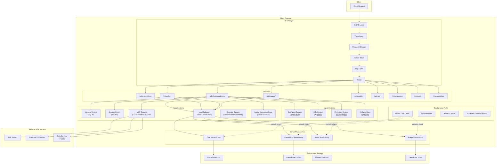
```mermaid
graph TB
    subgraph Client
        C[Client Request]
    end

    subgraph "Moss Gateway"
        subgraph "HTTP Layer"
            CORS[CORS Layer]
            TRACE[Trace Layer]
            REQID[Request ID Layer]
            CANCEL[Cancel Token]
            LOG[Log Layer]
            ROUTER[Router]
        end

        subgraph "Handlers"
            CHAT["/v1/chat/completions"]
            EMBED["/v1/embeddings"]
            AUDIO["/v1/audio/*"]
            IMAGE["/v1/images/*"]
            MODELS["/v1/models"]
            ADMIN["/admin/*"]
            RESP["/v1/responses"]
            CONFIG_API["/v1/config"]
            CAP["/v1/capabilities"]
        end

        subgraph "Core Systems"
            MEMORY["Memory System<br/>(SQLite)"]
            SESSION["Session History<br/>(JSONL)"]
            MCP["MCP System<br/>(SSE/StreamHTTP/Stdio)"]
            LB["Load Balancer<br/>(Least Connections)"]
            EXECUTOR["Executor System<br/>(Deno/Docker/Wasmtime)"]
            LANTAI["Lantai Knowledge Base<br/>(Vector + BM25)"]
        end

        subgraph "Agent Systems"
            SUBAGENT["SubAgent System<br/>(子代理编排)"]
            HITL["HITL System<br/>(人在回路)"]
            REFLECT["Reflection System<br/>(反思与重规划)"]
            ARTIFACTS["Artifacts Store<br/>(工件管理)"]
        end

        subgraph "Server Management"
            SG_CHAT["Chat ServerGroup"]
            SG_EMBED["Embedding ServerGroup"]
            SG_AUDIO["Audio ServerGroup"]
            SG_IMAGE["Image ServerGroup"]
        end

        subgraph "Background Tasks"
            HEALTH["Health Check Task"]
            SIGNAL["Signal Handler"]
            ARTIFACT_CLEAN["Artifact Cleaner"]
            SUBAGENT_MONITOR["SubAgent Timeout Monitor"]
        end
    end

    subgraph "Downstream Services"
        DS1["LlamaEdge Chat"]
        DS2["LlamaEdge Embed"]
        DS3["LlamaEdge Audio"]
        DS4["LlamaEdge Image"]
    end

    subgraph "External MCP Servers"
        MCP_SSE["SSE Servers"]
        MCP_HTTP["StreamHTTP Servers"]
        MCP_STDIO["Stdio Servers<br/>(子进程)"]
    end

    C --> CORS --> TRACE --> REQID --> CANCEL --> LOG --> ROUTER

    ROUTER --> CHAT
    ROUTER --> EMBED
    ROUTER --> AUDIO
    ROUTER --> IMAGE
    ROUTER --> MODELS
    ROUTER --> ADMIN
    ROUTER --> RESP
    ROUTER --> CONFIG_API
    ROUTER --> CAP

    CHAT --> MEMORY
    CHAT --> SESSION
    CHAT --> MCP
    CHAT --> LB
    CHAT --> SUBAGENT
    CHAT --> HITL
    CHAT --> REFLECT
    CHAT --> LANTAI
    CHAT --> ARTIFACTS

    EMBED --> LB
    AUDIO --> LB
    IMAGE --> LB

    LB --> SG_CHAT --> DS1
    LB --> SG_EMBED --> DS2
    LB --> SG_AUDIO --> DS3
    LB --> SG_IMAGE --> DS4

    MCP --> MCP_SSE
    MCP --> MCP_HTTP
    MCP --> MCP_STDIO

    HEALTH -.->|periodic check| SG_CHAT
    HEALTH -.->|periodic check| SG_EMBED
    HEALTH -.->|periodic check| SG_AUDIO
    HEALTH -.->|periodic check| SG_IMAGE
```

---

## 三、启动流程

### 3.1 启动时序图

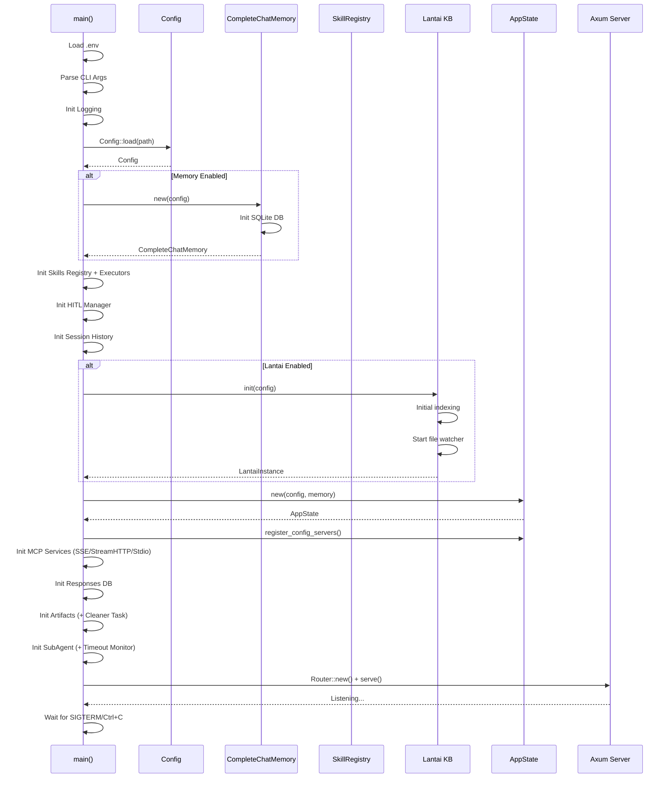
```mermaid
sequenceDiagram
    participant Main as main()
    participant Config as Config
    participant Memory as CompleteChatMemory
    participant Skills as SkillRegistry
    participant Lantai as Lantai KB
    participant AppState as AppState
    participant Axum as Axum Server

    Main->>Main: Load .env
    Main->>Main: Parse CLI Args
    Main->>Main: Init Logging

    Main->>Config: Config::load(path)
    Config-->>Main: Config

    alt Memory Enabled
        Main->>Memory: new(config)
        Memory->>Memory: Init SQLite DB
        Memory-->>Main: CompleteChatMemory
    end

    Main->>Main: Init Skills Registry + Executors
    Main->>Main: Init HITL Manager
    Main->>Main: Init Session History

    alt Lantai Enabled
        Main->>Lantai: init(config)
        Lantai->>Lantai: Initial indexing
        Lantai->>Lantai: Start file watcher
        Lantai-->>Main: LantaiInstance
    end

    Main->>AppState: new(config, memory)
    AppState-->>Main: AppState

    Main->>AppState: register_config_servers()
    Main->>Main: Init MCP Services (SSE/StreamHTTP/Stdio)
    Main->>Main: Init Responses DB
    Main->>Main: Init Artifacts (+ Cleaner Task)
    Main->>Main: Init SubAgent (+ Timeout Monitor)

    Main->>Axum: Router::new() + serve()
    Axum-->>Main: Listening...

    Main->>Main: Wait for SIGTERM/Ctrl+C
```

### 3.2 启动流程图


```mermaid
flowchart TD
    START([Start]) --> LOAD_ENV[Load .env]
    LOAD_ENV --> PARSE_CLI[Parse CLI Args]
    PARSE_CLI --> INIT_LOG[Init Logging]
    INIT_LOG --> LOAD_CONFIG[Load config.toml]

    LOAD_CONFIG --> CHECK_MEMORY{Memory Enabled?}

    CHECK_MEMORY -->|Yes| INIT_SQLITE[Init SQLite DB]
    INIT_SQLITE --> CREATE_MEMORY[Create CompleteChatMemory]
    CREATE_MEMORY --> INIT_SKILLS

    CHECK_MEMORY -->|No| SET_NONE[memory = None]
    SET_NONE --> INIT_SKILLS

    INIT_SKILLS[Init Skills Registry + Executors] --> INIT_HITL[Init HITL Manager]
    INIT_HITL --> INIT_SESSION{Session Enabled?}

    INIT_SESSION -->|Yes| CREATE_SESSION[Init Session History]
    INIT_SESSION -->|No| CHECK_LANTAI

    CREATE_SESSION --> CHECK_LANTAI{Lantai Enabled?}

    CHECK_LANTAI -->|Yes| INIT_LANTAI[Init Lantai KB + File Watcher]
    CHECK_LANTAI -->|No| CREATE_STATE

    INIT_LANTAI --> CREATE_STATE[Create AppState]

    CREATE_STATE --> REG_SERVERS[Register Config Servers]
    REG_SERVERS --> INIT_MCP[Init MCP Services]
    INIT_MCP --> INIT_RESP[Init Responses DB]
    INIT_RESP --> INIT_ARTIFACTS{Artifacts Enabled?}

    INIT_ARTIFACTS -->|Yes| CREATE_ARTIFACTS[Init Artifacts + Cleaner Task]
    INIT_ARTIFACTS -->|No| INIT_SUBAGENT

    CREATE_ARTIFACTS --> INIT_SUBAGENT{SubAgent Enabled?}

    INIT_SUBAGENT -->|Yes| CREATE_SUBAGENT[Init SubAgent + Timeout Monitor]
    INIT_SUBAGENT -->|No| START_HEALTH

    CREATE_SUBAGENT --> START_HEALTH[Start Health Check Task]
    START_HEALTH --> BUILD_ROUTER[Build Router + Middleware]
    BUILD_ROUTER --> SERVE[axum::serve on Port]
    SERVE --> WAIT_SIGNAL[Wait for Signal]
    WAIT_SIGNAL --> SHUTDOWN([Graceful Shutdown])
```

---

## 四、Chat 请求处理流程

### 4.1 完整时序图

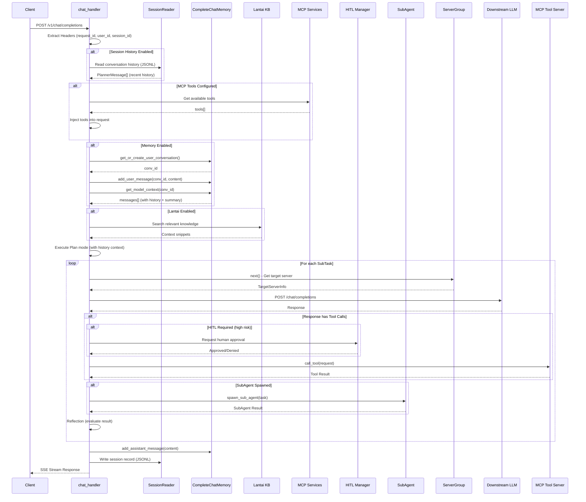
```mermaid
sequenceDiagram
    participant Client
    participant Handler as chat_handler
    participant Session as SessionReader
    participant Memory as CompleteChatMemory
    participant Lantai as Lantai KB
    participant MCP as MCP Services
    participant HITL as HITL Manager
    participant SubAgent as SubAgent
    participant LB as ServerGroup
    participant Downstream as Downstream LLM
    participant MCPServer as MCP Tool Server

    Client->>Handler: POST /v1/chat/completions

    Handler->>Handler: Extract Headers (request_id, user_id, session_id)

    alt Session History Enabled
        Handler->>Session: Read conversation history (JSONL)
        Session-->>Handler: PlannerMessage[] (recent history)
    end

    alt MCP Tools Configured
        Handler->>MCP: Get available tools
        MCP-->>Handler: tools[]
        Handler->>Handler: Inject tools into request
    end

    alt Memory Enabled
        Handler->>Memory: get_or_create_user_conversation()
        Memory-->>Handler: conv_id
        Handler->>Memory: add_user_message(conv_id, content)
        Handler->>Memory: get_model_context(conv_id)
        Memory-->>Handler: messages[] (with history + summary)
    end

    alt Lantai Enabled
        Handler->>Lantai: Search relevant knowledge
        Lantai-->>Handler: Context snippets
    end

    Handler->>Handler: Execute Plan mode (with history context)

    loop For each SubTask
        Handler->>LB: next() - Get target server
        LB-->>Handler: TargetServerInfo

        Handler->>Downstream: POST /chat/completions
        Downstream-->>Handler: Response

        alt Response has Tool Calls
            alt HITL Required (high risk)
                Handler->>HITL: Request human approval
                HITL-->>Handler: Approved/Denied
            end
            Handler->>MCPServer: call_tool(request)
            MCPServer-->>Handler: Tool Result
        end

        alt SubAgent Spawned
            Handler->>SubAgent: spawn_sub_agent(task)
            SubAgent-->>Handler: SubAgent Result
        end

        Handler->>Handler: Reflection (evaluate result)
    end

    Handler->>Memory: add_assistant_message(content)
    Handler->>Session: Write session record (JSONL)

    Handler-->>Client: SSE Stream Response
```

### 4.2 Chat Handler 流程图


```mermaid
flowchart TD
    START([POST /v1/chat/completions]) --> EXTRACT[Extract Headers]
    EXTRACT --> CHECK_SESSION{Session Enabled?}

    CHECK_SESSION -->|Yes| LOAD_HIST[Load conversation history from JSONL]
    CHECK_SESSION -->|No| CHECK_MCP

    LOAD_HIST --> CHECK_MCP{MCP Tools Configured?}

    CHECK_MCP -->|Yes| INJECT[Inject MCP Tools + Skills]
    CHECK_MCP -->|No| CHECK_MEM

    INJECT --> CHECK_MEM{Memory Enabled?}

    CHECK_MEM -->|Yes| GET_CONV[Get/Create Conversation]
    GET_CONV --> STORE_USER[Store User Message]
    STORE_USER --> GET_CTX[Get Model Context]
    GET_CTX --> CHECK_LANTAI

    CHECK_MEM -->|No| USE_REQ[Use Request Messages As-Is]
    USE_REQ --> CHECK_LANTAI

    CHECK_LANTAI{Lantai Enabled?}
    CHECK_LANTAI -->|Yes| INJECT_KB[Inject Knowledge Context]
    CHECK_LANTAI -->|No| PLAN_CHAT

    INJECT_KB --> PLAN_CHAT

    PLAN_CHAT[plan::chat with history context] --> SUBTASK_LOOP

    SUBTASK_LOOP[Execute SubTasks] --> GET_SERVER[Get Target Server via LB]
    GET_SERVER --> FORWARD[Forward to Downstream]
    FORWARD --> CHECK_TOOLS{Has Tool Calls?}

    CHECK_TOOLS -->|Yes| CHECK_HITL{HITL Required?}
    CHECK_HITL -->|Yes| WAIT_APPROVAL[Wait for Human Approval]
    CHECK_HITL -->|No| CALL_MCP
    WAIT_APPROVAL -->|Approved| CALL_MCP[call_mcp_server]
    WAIT_APPROVAL -->|Denied| SKIP_TOOL[Skip Tool Call]

    CALL_MCP --> CHECK_SUBAGENT
    SKIP_TOOL --> CHECK_SUBAGENT

    CHECK_TOOLS -->|No| CHECK_SUBAGENT{SubAgent Needed?}

    CHECK_SUBAGENT -->|Yes| SPAWN_SA[Spawn SubAgent]
    SPAWN_SA --> REFLECT
    CHECK_SUBAGENT -->|No| REFLECT

    REFLECT[Reflection: Evaluate Result] --> MORE_TASKS{More SubTasks?}
    MORE_TASKS -->|Yes| SUBTASK_LOOP
    MORE_TASKS -->|No| STORE_ASST

    STORE_ASST[Store Assistant Message + Session Record] --> SSE[Return SSE Stream]
    SSE --> END([End])
```

---

## 五、MCP 工具调用流程

### 5.1 时序图

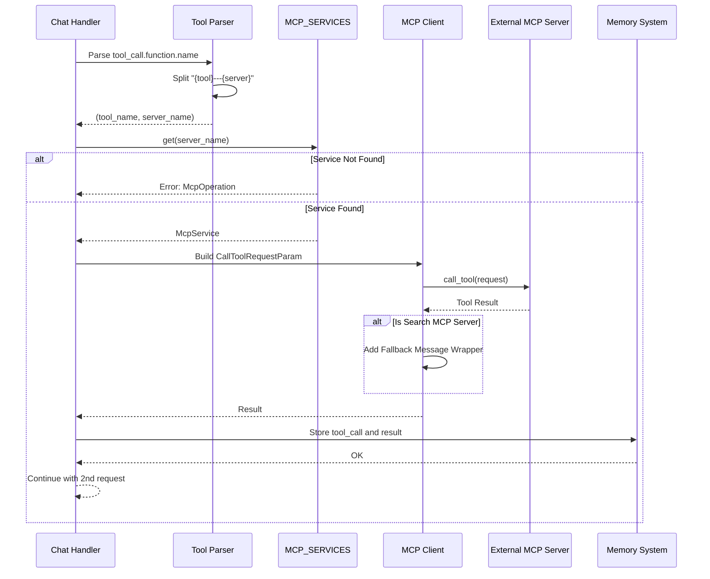
```mermaid
sequenceDiagram
    participant Handler as Chat Handler
    participant Parser as Tool Parser
    participant Registry as MCP_SERVICES
    participant MCPClient as MCP Client
    participant MCPServer as External MCP Server
    participant Memory as Memory System

    Handler->>Parser: Parse tool_call.function.name
    Parser->>Parser: Split "{tool}---{server}"
    Parser-->>Handler: (tool_name, server_name)

    Handler->>Registry: get(server_name)
    alt Service Not Found
        Registry-->>Handler: Error: McpOperation
    else Service Found
        Registry-->>Handler: McpService

        Handler->>MCPClient: Build CallToolRequestParam
        MCPClient->>MCPServer: call_tool(request)
        MCPServer-->>MCPClient: Tool Result

        alt Is Search MCP Server
            MCPClient->>MCPClient: Add Fallback Message Wrapper
        end

        MCPClient-->>Handler: Result

        Handler->>Memory: Store tool_call and result
        Memory-->>Handler: OK

        Handler-->>Handler: Continue with 2nd request
    end
```

### 5.2 流程图

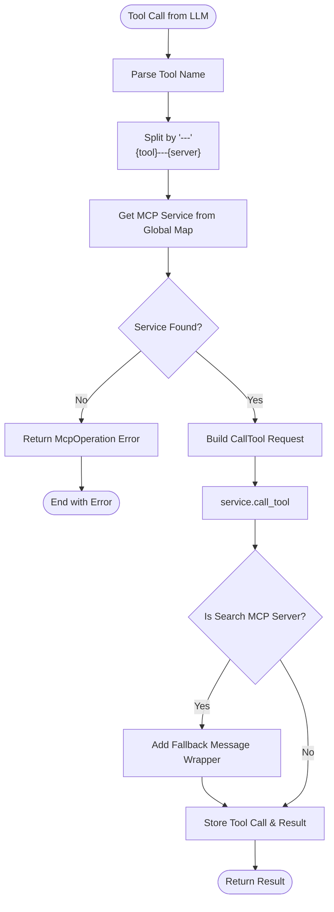
```mermaid
flowchart TD
    START([Tool Call from LLM]) --> PARSE[Parse Tool Name]
    PARSE --> SPLIT["Split by '---'<br/>{tool}---{server}"]
    SPLIT --> GET_SVC[Get MCP Service from Global Map]

    GET_SVC --> FOUND{Service Found?}

    FOUND -->|No| ERROR[Return McpOperation Error]
    ERROR --> END_ERR([End with Error])

    FOUND -->|Yes| BUILD[Build CallTool Request]
    BUILD --> CALL[service.call_tool]
    CALL --> CHECK_SEARCH{Is Search MCP Server?}

    CHECK_SEARCH -->|Yes| ADD_FALLBACK[Add Fallback Message Wrapper]
    ADD_FALLBACK --> STORE

    CHECK_SEARCH -->|No| STORE[Store Tool Call & Result]

    STORE --> RETURN([Return Result])
```

### 5.3 MCP 服务器类型

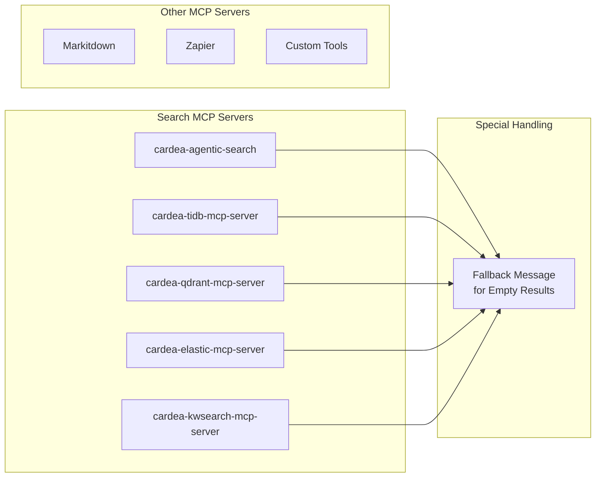
```mermaid
graph LR
    subgraph "Search MCP Servers"
        S1["cardea-agentic-search"]
        S2["cardea-tidb-mcp-server"]
        S3["cardea-qdrant-mcp-server"]
        S4["cardea-elastic-mcp-server"]
        S5["cardea-kwsearch-mcp-server"]
    end

    subgraph "Other MCP Servers"
        O1["Markitdown"]
        O2["Zapier"]
        O3["Custom Tools"]
    end

    subgraph "Special Handling"
        FALLBACK["Fallback Message<br/>for Empty Results"]
    end

    S1 --> FALLBACK
    S2 --> FALLBACK
    S3 --> FALLBACK
    S4 --> FALLBACK
    S5 --> FALLBACK
```

### 5.4 MCP Stdio 传输

除 SSE 和 StreamHTTP 外，Moss 还支持通过 stdio 子进程方式启动和管理 MCP 服务器。所有传输方式的服务统一注册到 `MCP_SERVICES` 全局注册表。

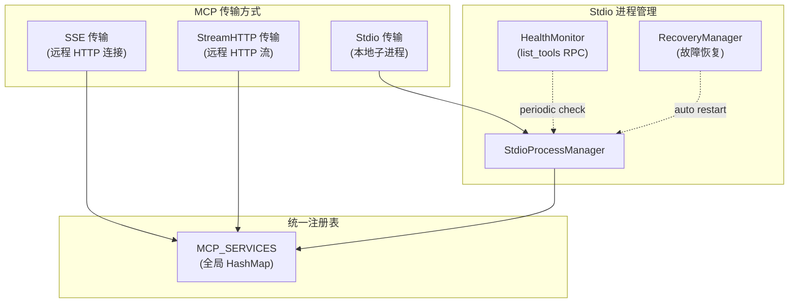
```mermaid
graph TB
    subgraph "MCP 传输方式"
        SSE["SSE 传输<br/>(远程 HTTP 连接)"]
        HTTP["StreamHTTP 传输<br/>(远程 HTTP 流)"]
        STDIO["Stdio 传输<br/>(本地子进程)"]
    end

    subgraph "Stdio 进程管理"
        MGR["StdioProcessManager"]
        HEALTH["HealthMonitor<br/>(list_tools RPC)"]
        RECOVERY["RecoveryManager<br/>(故障恢复)"]
    end

    subgraph "统一注册表"
        REGISTRY["MCP_SERVICES<br/>(全局 HashMap)"]
    end

    SSE --> REGISTRY
    HTTP --> REGISTRY
    STDIO --> MGR
    MGR --> REGISTRY
    HEALTH -.->|periodic check| MGR
    RECOVERY -.->|auto restart| MGR
```

**Stdio 传输特点**：

| 特性     | 说明                                 |
| -------- | ------------------------------------ |
| 启动时机 | 配置加载时启动（非懒加载）           |
| 进程管理 | 使用 rmcp `TokioChildProcess`        |
| 健康检查 | 定期调用 `list_tools` RPC            |
| 故障恢复 | 自动重启崩溃的进程                   |
| 安全模型 | 以 Moss Agent 权限运行（用户责任）   |

---

## 六、内存系统

### 6.1 架构图

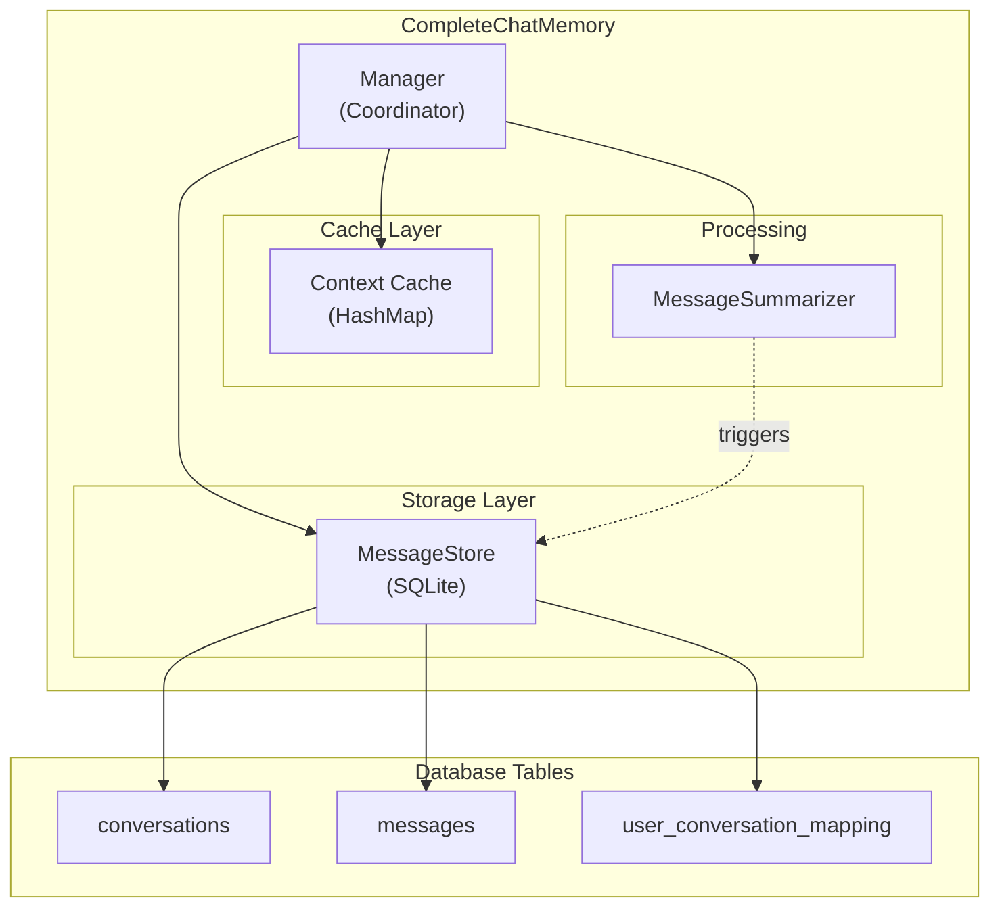
```mermaid
graph TB
    subgraph "CompleteChatMemory"
        MGR["Manager<br/>(Coordinator)"]

        subgraph "Storage Layer"
            STORE["MessageStore<br/>(SQLite)"]
        end

        subgraph "Cache Layer"
            CACHE["Context Cache<br/>(HashMap)"]
        end

        subgraph "Processing"
            SUMM["MessageSummarizer"]
        end
    end

    subgraph "Database Tables"
        T1["conversations"]
        T2["messages"]
        T3["user_conversation_mapping"]
    end

    MGR --> STORE
    MGR --> CACHE
    MGR --> SUMM

    STORE --> T1
    STORE --> T2
    STORE --> T3

    SUMM -.->|triggers| STORE
```

### 6.2 消息存储流程

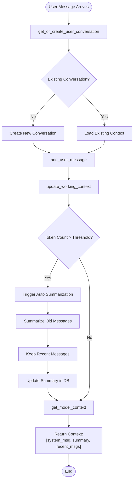
```mermaid
flowchart TD
    START([User Message Arrives]) --> GET_CONV[get_or_create_user_conversation]

    GET_CONV --> EXISTS{Existing Conversation?}

    EXISTS -->|No| CREATE[Create New Conversation]
    EXISTS -->|Yes| LOAD[Load Existing Context]

    CREATE --> ADD_MSG
    LOAD --> ADD_MSG

    ADD_MSG[add_user_message] --> UPDATE_CTX[update_working_context]

    UPDATE_CTX --> CHECK_TOKEN{Token Count > Threshold?}

    CHECK_TOKEN -->|Yes| SUMMARIZE[Trigger Auto Summarization]
    SUMMARIZE --> DO_SUMM[Summarize Old Messages]
    DO_SUMM --> KEEP_RECENT[Keep Recent Messages]
    KEEP_RECENT --> UPDATE_SUMM[Update Summary in DB]
    UPDATE_SUMM --> GET_CTX

    CHECK_TOKEN -->|No| GET_CTX[get_model_context]

    GET_CTX --> RETURN["Return Context:<br/>[system_msg, summary, recent_msgs]"]
    RETURN --> END([End])
```

### 6.3 数据模型

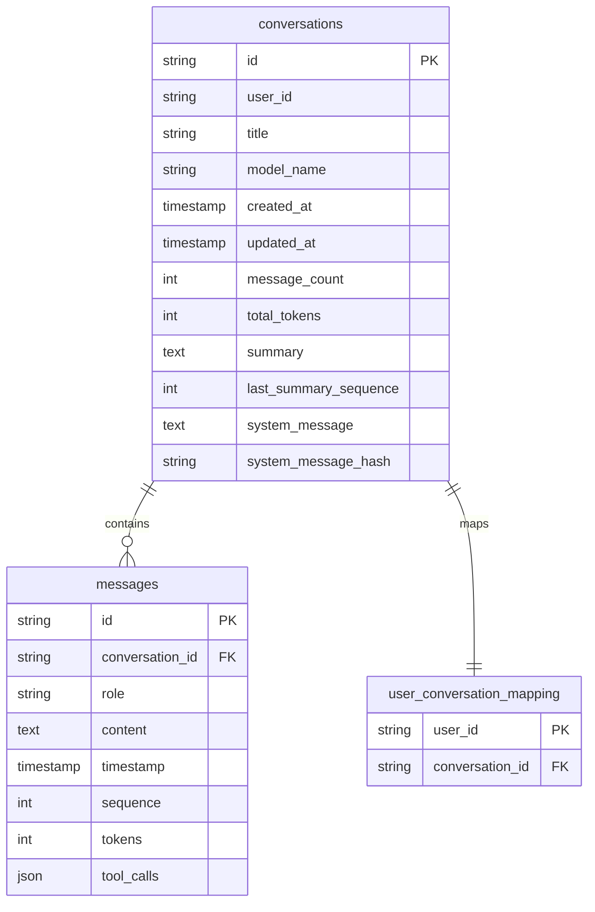
```mermaid
erDiagram
    conversations {
        string id PK
        string user_id
        string title
        string model_name
        timestamp created_at
        timestamp updated_at
        int message_count
        int total_tokens
        text summary
        int last_summary_sequence
        text system_message
        string system_message_hash
    }

    messages {
        string id PK
        string conversation_id FK
        string role
        text content
        timestamp timestamp
        int sequence
        int tokens
        json tool_calls
    }

    user_conversation_mapping {
        string user_id PK
        string conversation_id FK
    }

    conversations ||--o{ messages : contains
    conversations ||--|| user_conversation_mapping : maps
```

---

## 七、服务器管理与健康检查

### 7.1 服务器注册流程

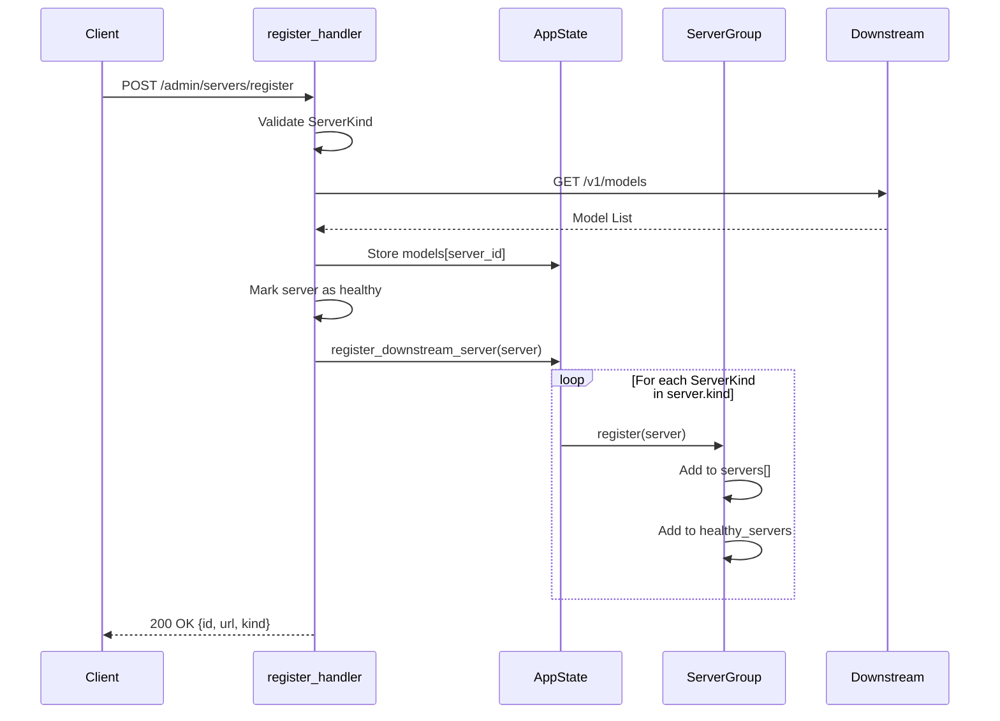
```mermaid
sequenceDiagram
    participant Client
    participant Handler as register_handler
    participant AppState
    participant ServerGroup
    participant Downstream

    Client->>Handler: POST /admin/servers/register

    Handler->>Handler: Validate ServerKind

    Handler->>Downstream: GET /v1/models
    Downstream-->>Handler: Model List

    Handler->>AppState: Store models[server_id]

    Handler->>Handler: Mark server as healthy

    Handler->>AppState: register_downstream_server(server)

    loop For each ServerKind in server.kind
        AppState->>ServerGroup: register(server)
        ServerGroup->>ServerGroup: Add to servers[]
        ServerGroup->>ServerGroup: Add to healthy_servers
    end

    Handler-->>Client: 200 OK {id, url, kind}
```

### 7.2 健康检查流程

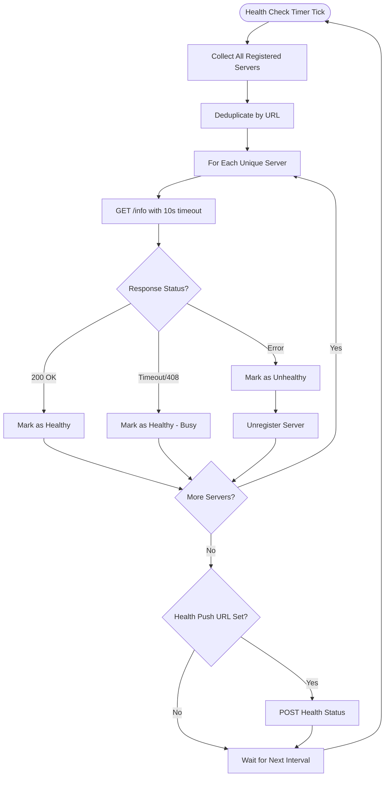
```mermaid
flowchart TD
    START([Health Check Timer Tick]) --> COLLECT[Collect All Registered Servers]
    COLLECT --> DEDUP[Deduplicate by URL]
    DEDUP --> LOOP[For Each Unique Server]

    LOOP --> CHECK[GET /info with 10s timeout]

    CHECK --> STATUS{Response Status?}

    STATUS -->|200 OK| HEALTHY[Mark as Healthy]
    STATUS -->|Timeout/408| BUSY[Mark as Healthy - Busy]
    STATUS -->|Error| UNHEALTHY[Mark as Unhealthy]

    HEALTHY --> NEXT
    BUSY --> NEXT

    UNHEALTHY --> UNREG[Unregister Server]
    UNREG --> NEXT

    NEXT{More Servers?}
    NEXT -->|Yes| LOOP
    NEXT -->|No| PUSH{Health Push URL Set?}

    PUSH -->|Yes| DO_PUSH[POST Health Status]
    PUSH -->|No| WAIT

    DO_PUSH --> WAIT[Wait for Next Interval]
    WAIT --> START
```

### 7.3 健康检查时序图

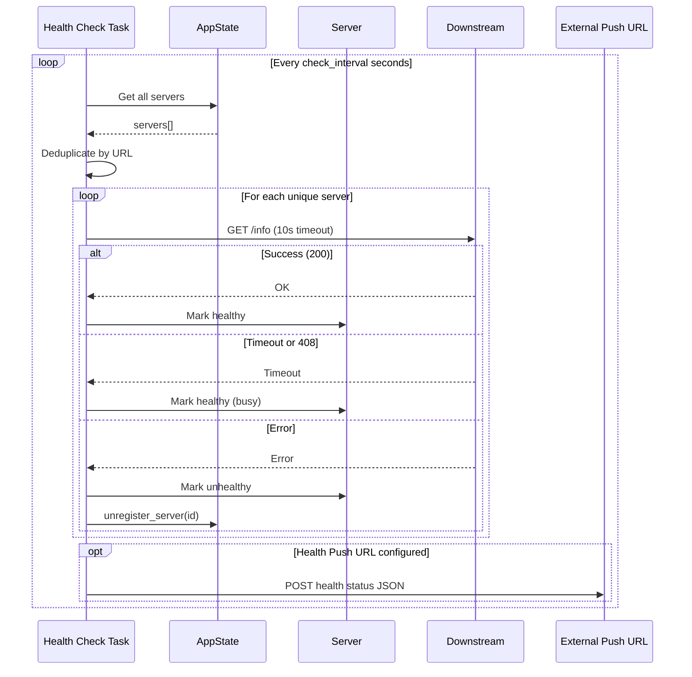
```mermaid
sequenceDiagram
    participant Task as Health Check Task
    participant AppState
    participant Server
    participant Downstream
    participant External as External Push URL

    loop Every check_interval seconds
        Task->>AppState: Get all servers
        AppState-->>Task: servers[]

        Task->>Task: Deduplicate by URL

        loop For each unique server
            Task->>Downstream: GET /info (10s timeout)

            alt Success (200)
                Downstream-->>Task: OK
                Task->>Server: Mark healthy
            else Timeout or 408
                Downstream-->>Task: Timeout
                Task->>Server: Mark healthy (busy)
            else Error
                Downstream-->>Task: Error
                Task->>Server: Mark unhealthy
                Task->>AppState: unregister_server(id)
            end
        end

        opt Health Push URL configured
            Task->>External: POST health status JSON
        end
    end
```

---

## 八、负载均衡

### 8.1 流程图

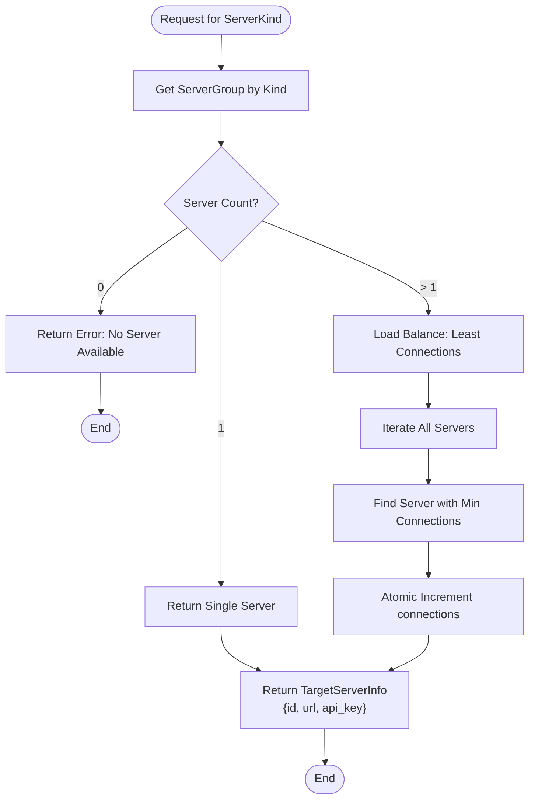
```mermaid
flowchart TD
    START([Request for ServerKind]) --> GET_GROUP[Get ServerGroup by Kind]
    GET_GROUP --> COUNT{Server Count?}

    COUNT -->|0| ERROR[Return Error: No Server Available]
    ERROR --> END_ERR([End])

    COUNT -->|1| SINGLE[Return Single Server]
    SINGLE --> RETURN

    COUNT -->|"> 1"| LB[Load Balance: Least Connections]

    LB --> ITERATE[Iterate All Servers]
    ITERATE --> FIND_MIN[Find Server with Min Connections]
    FIND_MIN --> ATOMIC[Atomic Increment connections]
    ATOMIC --> RETURN

    RETURN["Return TargetServerInfo<br/>{id, url, api_key}"]
    RETURN --> END([End])
```

### 8.2 ServerGroup 结构

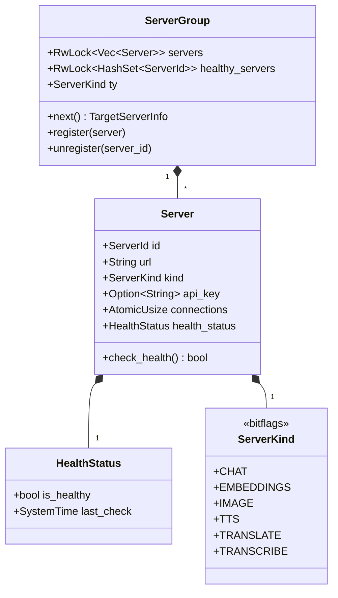
```mermaid
classDiagram
    class ServerGroup {
        +RwLock~Vec~Server~~ servers
        +RwLock~HashSet~ServerId~~ healthy_servers
        +ServerKind ty
        +next() TargetServerInfo
        +register(server)
        +unregister(server_id)
    }

    class Server {
        +ServerId id
        +String url
        +ServerKind kind
        +Option~String~ api_key
        +AtomicUsize connections
        +HealthStatus health_status
        +check_health() bool
    }

    class HealthStatus {
        +bool is_healthy
        +SystemTime last_check
    }

    class ServerKind {
        <<bitflags>>
        +CHAT
        +EMBEDDINGS
        +IMAGE
        +TTS
        +TRANSLATE
        +TRANSCRIBE
    }

    ServerGroup "1" *-- "*" Server
    Server *-- "1" HealthStatus
    Server *-- "1" ServerKind
```

---

## 九、数据流向

### 9.1 请求数据流

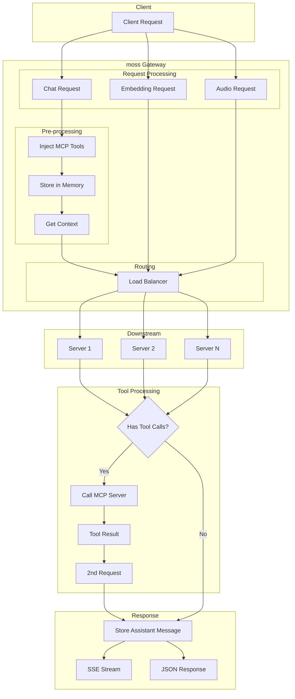
```mermaid
flowchart TD
    subgraph Client
        REQ[Client Request]
    end

    subgraph Gateway["moss Gateway"]
        subgraph "Request Processing"
            CHAT_REQ[Chat Request]
            EMBED_REQ[Embedding Request]
            AUDIO_REQ[Audio Request]
        end

        subgraph "Pre-processing"
            INJECT[Inject MCP Tools]
            STORE_MEM[Store in Memory]
            GET_CTX[Get Context]
        end

        subgraph "Routing"
            LB[Load Balancer]
        end
    end

    subgraph "Downstream"
        S1[Server 1]
        S2[Server 2]
        SN[Server N]
    end

    subgraph "Tool Processing"
        MCP_CHECK{Has Tool Calls?}
        MCP_CALL[Call MCP Server]
        TOOL_RESULT[Tool Result]
        SECOND_REQ[2nd Request]
    end

    subgraph "Response"
        STORE_ASST[Store Assistant Message]
        STREAM[SSE Stream]
        JSON[JSON Response]
    end

    REQ --> CHAT_REQ & EMBED_REQ & AUDIO_REQ

    CHAT_REQ --> INJECT --> STORE_MEM --> GET_CTX --> LB
    EMBED_REQ --> LB
    AUDIO_REQ --> LB

    LB --> S1 & S2 & SN

    S1 & S2 & SN --> MCP_CHECK

    MCP_CHECK -->|Yes| MCP_CALL --> TOOL_RESULT --> SECOND_REQ --> STORE_ASST
    MCP_CHECK -->|No| STORE_ASST

    STORE_ASST --> STREAM & JSON
```

### 9.2 内存数据流

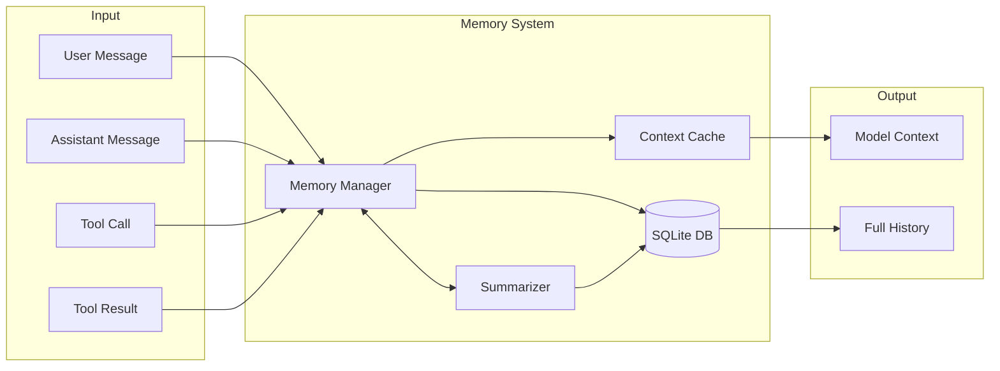
```mermaid
flowchart LR
    subgraph "Input"
        USER_MSG[User Message]
        ASST_MSG[Assistant Message]
        TOOL_CALL[Tool Call]
        TOOL_RESULT[Tool Result]
    end

    subgraph "Memory System"
        MGR[Memory Manager]
        CACHE[Context Cache]
        DB[(SQLite DB)]
        SUMM[Summarizer]
    end

    subgraph "Output"
        MODEL_CTX[Model Context]
        FULL_HIST[Full History]
    end

    USER_MSG --> MGR
    ASST_MSG --> MGR
    TOOL_CALL --> MGR
    TOOL_RESULT --> MGR

    MGR --> CACHE
    MGR --> DB
    MGR <--> SUMM

    CACHE --> MODEL_CTX
    DB --> FULL_HIST
    SUMM --> DB
```

---

## 十、核心模块交互

### 10.1 AppState 结构

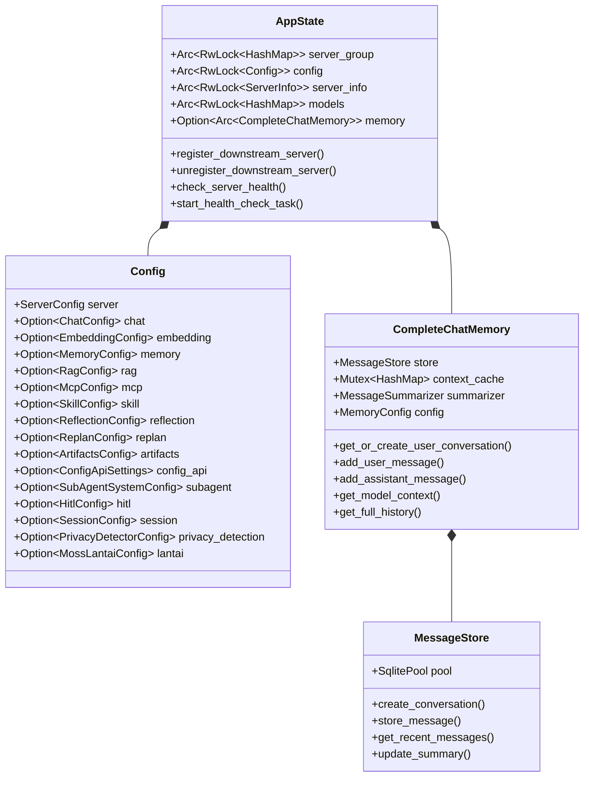
```mermaid
classDiagram
    class AppState {
        +Arc~RwLock~HashMap~~ server_group
        +Arc~RwLock~Config~~ config
        +Arc~RwLock~ServerInfo~~ server_info
        +Arc~RwLock~HashMap~~ models
        +Option~Arc~CompleteChatMemory~~ memory
        +register_downstream_server()
        +unregister_downstream_server()
        +check_server_health()
        +start_health_check_task()
    }

    class Config {
        +ServerConfig server
        +Option~ChatConfig~ chat
        +Option~EmbeddingConfig~ embedding
        +Option~MemoryConfig~ memory
        +Option~RagConfig~ rag
        +Option~McpConfig~ mcp
        +Option~SkillConfig~ skill
        +Option~ReflectionConfig~ reflection
        +Option~ReplanConfig~ replan
        +Option~ArtifactsConfig~ artifacts
        +Option~ConfigApiSettings~ config_api
        +Option~SubAgentSystemConfig~ subagent
        +Option~HitlConfig~ hitl
        +Option~SessionConfig~ session
        +Option~PrivacyDetectorConfig~ privacy_detection
        +Option~MossLantaiConfig~ lantai
    }

    class CompleteChatMemory {
        +MessageStore store
        +Mutex~HashMap~ context_cache
        +MessageSummarizer summarizer
        +MemoryConfig config
        +get_or_create_user_conversation()
        +add_user_message()
        +add_assistant_message()
        +get_model_context()
        +get_full_history()
    }

    class MessageStore {
        +SqlitePool pool
        +create_conversation()
        +store_message()
        +get_recent_messages()
        +update_summary()
    }

    AppState *-- Config
    AppState *-- CompleteChatMemory
    CompleteChatMemory *-- MessageStore
```

### 10.2 MCP 服务注册表

```mermaid
classDiagram
    class MCP_SERVICES {
        <<global>>
        +OnceCell~TokioRwLock~HashMap~~ instance
        +get() HashMap
        +init()
    }

    class McpService {
        +String name
        +RawMcpService raw
        +Vec~String~ tools
        +Option~String~ fallback_message
    }

    class RawMcpService {
        +call_tool(request) Result
        +list_tools() Vec~Tool~
    }

    MCP_SERVICES "1" *-- "*" McpService
    McpService *-- "1" RawMcpService
```

### 10.3 完整模块关系图

```mermaid
graph TB
    subgraph "Entry Point"
        MAIN[main.rs]
    end

    subgraph "HTTP Layer"
        HANDLERS[handlers.rs]
        MCP_HDLR[mcp_handlers.rs]
        CAPS[capabilities.rs]
        ROUTER[Router]
    end

    subgraph "Chat Processing"
        CHAT_MOD[chat/mod.rs]
        CHAT_PLAN[chat/plan.rs]
        CHAT_PLANNER[chat/planner.rs]
        CHAT_EVENTS[chat/events.rs]
        CHAT_EMITTER[chat/emitter.rs]
        CHAT_TRACE[chat/trace.rs]
        CHAT_XML[chat/xml_parser.rs]
        CHAT_SHARED[chat/shared.rs]
    end

    subgraph "Memory System"
        MEM_MOD[memory/mod.rs]
        MEM_MGR[memory/manager.rs]
        MEM_STORE[memory/store.rs]
        MEM_SUMM[memory/summarizer.rs]
    end

    subgraph "Session History"
        SESS_MOD[session/mod.rs]
        SESS_READER[session/reader.rs]
        SESS_WRITER[session/writer.rs]
        SESS_HANDLERS[session/handlers.rs]
    end

    subgraph "Server Management"
        SERVER[server.rs]
    end

    subgraph "MCP Integration"
        MCP[mcp/mod.rs]
        MCP_STDIO_MGR[mcp_stdio/manager.rs]
        MCP_STDIO_HEALTH[mcp_stdio/health.rs]
        MCP_STDIO_RECOVERY[mcp_stdio/recovery.rs]
    end

    subgraph "Configuration"
        CONFIG[config.rs]
        CONFIG_API[config_api/handlers.rs]
        CONFIG_SANITIZE[config_api/sanitize.rs]
        CONFIG_RELOAD[config_api/reload.rs]
    end

    subgraph "Responses Storage"
        RESP_MOD[responses/mod.rs]
        RESP_DB[responses/db.rs]
        RESP_HANDLERS[responses/handlers.rs]
    end

    subgraph "Executor System"
        EXEC_MOD[executor/mod.rs]
        EXEC_MGR[executor/manager.rs]
        EXEC_DENO[executor/deno.rs]
        EXEC_DOCKER[executor/docker.rs]
        EXEC_WASMTIME[executor/wasmtime.rs]
    end

    subgraph "Skills System"
        SKILLS_MOD[skills/mod.rs]
        SKILLS_REG[skills/registry.rs]
        SKILLS_PARSER[skills/parser.rs]
        SKILLS_DETECTOR[skills/detector.rs]
        SKILLS_INJECTOR[skills/injector.rs]
        SKILLS_HANDLERS[skills/handlers.rs]
    end

    subgraph "SubAgent System"
        SA_MOD[subagent/mod.rs]
        SA_MGR[subagent/manager.rs]
        SA_EXEC[subagent/executor.rs]
        SA_HANDLERS[subagent/handlers.rs]
        SA_TOOLS[subagent/tools.rs]
    end

    subgraph "HITL System"
        HITL_MOD[services/hitl/mod.rs]
        HITL_HANDLERS[services/hitl/handlers.rs]
    end

    subgraph "Artifacts System"
        ART_MOD[artifacts/mod.rs]
        ART_STORE[artifacts/store.rs]
        ART_HANDLERS[artifacts/handlers.rs]
        ART_CLEANER[artifacts/cleaner.rs]
    end

    subgraph "Reflection System"
        REFL_MOD[reflection/mod.rs]
        REFL_ENGINE[reflection/engine.rs]
        REFL_REPLANNER[reflection/replanner.rs]
    end

    subgraph "CLI System"
        CLI_MOD[cli/mod.rs]
        CLI_SKILL[cli/skill.rs]
    end

    MAIN --> CONFIG
    MAIN --> HANDLERS
    MAIN --> MEM_MOD
    MAIN --> SESS_MOD
    MAIN --> SERVER
    MAIN --> MCP
    MAIN --> MCP_STDIO_MGR
    MAIN --> SKILLS_MOD
    MAIN --> SA_MOD
    MAIN --> HITL_MOD
    MAIN --> ART_MOD
    MAIN --> CLI_MOD
    MAIN --> CONFIG_API

    HANDLERS --> CHAT_MOD
    HANDLERS --> SERVER
    HANDLERS --> MEM_MOD

    CHAT_MOD --> CHAT_PLAN
    CHAT_MOD --> CHAT_PLANNER
    CHAT_MOD --> CHAT_EVENTS
    CHAT_MOD --> CHAT_EMITTER
    CHAT_MOD --> CHAT_TRACE
    CHAT_MOD --> MCP
    CHAT_MOD --> SKILLS_DETECTOR
    CHAT_MOD --> SKILLS_INJECTOR

    CHAT_PLAN --> MEM_MOD
    CHAT_PLAN --> SESS_READER
    CHAT_PLAN --> SA_MOD
    CHAT_PLAN --> HITL_MOD
    CHAT_PLAN --> REFL_MOD
    CHAT_PLAN --> CHAT_PLANNER
    CHAT_PLAN --> CHAT_TRACE

    SESS_MOD --> SESS_READER
    SESS_MOD --> SESS_WRITER
    SESS_MOD --> SESS_HANDLERS

    MCP_STDIO_MGR --> MCP_STDIO_HEALTH
    MCP_STDIO_MGR --> MCP_STDIO_RECOVERY

    HANDLERS --> RESP_MOD
    RESP_MOD --> RESP_DB
    RESP_MOD --> RESP_HANDLERS

    EXEC_MOD --> EXEC_MGR
    EXEC_MOD --> EXEC_DENO
    EXEC_MOD --> EXEC_DOCKER
    EXEC_MOD --> EXEC_WASMTIME

    SKILLS_MOD --> SKILLS_REG
    SKILLS_MOD --> SKILLS_PARSER
    SKILLS_MOD --> SKILLS_DETECTOR
    SKILLS_MOD --> SKILLS_INJECTOR
    SKILLS_MOD --> SKILLS_HANDLERS
    SKILLS_REG --> EXEC_MOD

    SA_MOD --> SA_MGR
    SA_MOD --> SA_EXEC
    SA_MOD --> SA_HANDLERS
    SA_MOD --> SA_TOOLS

    ART_MOD --> ART_STORE
    ART_MOD --> ART_HANDLERS
    ART_MOD --> ART_CLEANER

    REFL_MOD --> REFL_ENGINE
    REFL_MOD --> REFL_REPLANNER

    CLI_MOD --> CLI_SKILL
```

---

## 十一、脚本执行器系统

### 11.1 架构概览

脚本执行器系统为 Skills 脚本提供沙盒化的执行环境，支持多种运行时后端。

```mermaid
graph TB
    subgraph "ScriptExecutorManager"
        MGR["Manager<br/>(路由调度)"]

        subgraph "Executor Backends"
            DENO["DenoExecutor<br/>(JS/TS)"]
            DOCKER["DockerExecutor<br/>(Python/Shell/Ruby)"]
            WASMTIME["WasmtimeExecutor<br/>(WASM/WAT)"]
        end

        subgraph "Extension Mapping"
            EXT_JS[".js/.ts/.mjs/.mts/.jsx/.tsx"]
            EXT_PY[".py/.sh/.bash/.rb"]
            EXT_WASM[".wasm/.wat"]
        end
    end

    subgraph "Resource Controls"
        LIMITS["ResourceLimits<br/>(内存/超时/网络)"]
        FS["FilesystemPolicy<br/>(文件系统访问)"]
    end

    MGR --> DENO
    MGR --> DOCKER
    MGR --> WASMTIME

    DENO --> EXT_JS
    DOCKER --> EXT_PY
    WASMTIME --> EXT_WASM

    LIMITS --> MGR
    FS --> MGR
```

### 11.2 执行器类型对比

| 特性 | DenoExecutor | DockerExecutor | WasmtimeExecutor |
|------|--------------|----------------|------------------|
| 支持格式 | .js/.ts/.mjs/.mts/.jsx/.tsx | .py/.sh/.bash/.rb | .wasm/.wat |
| 隔离级别 | Runtime (权限系统) | Container (容器隔离) | Runtime (WASM 沙盒) |
| WASI 支持 | — | — | Preview 1 + Preview 2 (自动检测) |
| 启动速度 | ~50ms | ~500ms-2s | ~1-5ms |
| 内存隔离 | 进程级 | 容器级 (cgroups) | WASM 线性内存（最强） |
| 网络控制 | `--allow-net` 标志 | 网络模式配置 | P1 天然隔离 / P2 可控 |
| CPU 限制 | 外部超时 | cgroups CPU quota | epoch 中断（原生） |
| 攻击面 | V8 + Deno 运行时 | 内核 + 容器运行时 | WASM 验证器 + wasmtime（最小） |
| 状态 | ✅ 已实现 | ✅ 已实现 | ✅ 已实现 |

### 11.3 隔离级别

```mermaid
graph LR
    subgraph "IsolationLevel"
        NONE["None<br/>(无隔离)"]
        RUNTIME["Runtime<br/>(运行时隔离)"]
        CONTAINER["Container<br/>(容器隔离)"]
        VM["VirtualMachine<br/>(虚拟机隔离)"]
    end

    NONE -->|"安全性增强"| RUNTIME
    RUNTIME -->|"安全性增强"| CONTAINER
    CONTAINER -->|"安全性增强"| VM

    RUNTIME -.->|Deno| DENO_IMPL["权限标志控制"]
    RUNTIME -.->|Wasmtime| WASM_IMPL["WASM 沙盒 + StoreLimits + epoch"]
    CONTAINER -.->|Docker| DOCKER_IMPL["容器 + 资源限制"]
```

### 11.4 执行流程

```mermaid
sequenceDiagram
    participant Caller as 调用方
    participant Manager as ScriptExecutorManager
    participant Executor as Executor (Deno/Docker/Wasmtime)
    participant Runtime as 运行时环境

    Caller->>Manager: execute(script, args, env, limits)
    Manager->>Manager: 解析脚本扩展名
    Manager->>Manager: 查找对应执行器

    alt 未找到执行器
        Manager-->>Caller: Error: NoExecutorFound
    else 找到执行器
        Manager->>Executor: execute(ExecuteRequest)

        Executor->>Executor: 构建命令参数
        Executor->>Executor: 配置资源限制
        Executor->>Executor: 设置安全策略

        Executor->>Runtime: 启动进程/容器

        alt 超时
            Runtime-->>Executor: Timeout
            Executor->>Runtime: 终止进程
            Executor-->>Manager: ScriptOutput{timed_out: true}
        else 正常完成
            Runtime-->>Executor: stdout, stderr, exit_code
            Executor-->>Manager: ScriptOutput
        end

        Manager-->>Caller: ScriptOutput
    end
```

### 11.5 资源限制配置

```mermaid
classDiagram
    class ResourceLimits {
        +u64 max_memory_bytes
        +Duration timeout
        +u64 max_output_bytes
        +bool network_access
        +FilesystemPolicy filesystem_access
        +default() ResourceLimits
        +strict() ResourceLimits
        +permissive() ResourceLimits
    }

    class FilesystemPolicy {
        <<enumeration>>
        None
        ReadOnly(Vec~PathBuf~)
        ReadWrite(Vec~PathBuf~)
        +allows_access() bool
        +allows_write() bool
    }

    ResourceLimits *-- FilesystemPolicy
```

**预设配置：**

| 配置 | 内存限制 | 超时 | 输出限制 | 网络访问 | 文件系统 |
|------|----------|------|----------|----------|----------|
| `default()` | 256MB | 30秒 | 1MB | 禁止 | None |
| `strict()` | 64MB | 10秒 | 256KB | 禁止 | None |
| `permissive()` | 1GB | 5分钟 | 10MB | 允许 | ReadWrite |

### 11.6 Deno 执行器

```mermaid
flowchart TD
    START([执行请求]) --> BUILD_FLAGS[构建权限标志]

    BUILD_FLAGS --> CHECK_FS{文件系统策略?}

    CHECK_FS -->|None| NO_FS[无文件访问权限]
    CHECK_FS -->|ReadOnly| READ_ONLY["--allow-read=paths"]
    CHECK_FS -->|ReadWrite| READ_WRITE["--allow-read=paths<br/>--allow-write=paths"]

    NO_FS --> CHECK_NET
    READ_ONLY --> CHECK_NET
    READ_WRITE --> CHECK_NET

    CHECK_NET{网络访问?}
    CHECK_NET -->|Yes| NET_FLAG["--allow-net"]
    CHECK_NET -->|No| CHECK_ENV
    NET_FLAG --> CHECK_ENV

    CHECK_ENV{环境变量?}
    CHECK_ENV -->|有指定| ENV_FLAG["--allow-env=vars"]
    CHECK_ENV -->|无| BUILD_CMD
    ENV_FLAG --> BUILD_CMD

    BUILD_CMD[构建 deno run 命令] --> SPAWN[启动子进程]
    SPAWN --> WAIT{等待完成}

    WAIT -->|超时| KILL[终止进程]
    WAIT -->|完成| COLLECT[收集输出]

    KILL --> TIMEOUT_OUT[返回超时结果]
    COLLECT --> RESULT[返回执行结果]
```

**DenoConfig 配置项：**

```toml
[skill.execution.deno]
deno_path = "deno"      # Deno 二进制路径
allow_net = false       # 默认网络访问
allow_env = false       # 默认环境变量访问
allow_hrtime = false    # 高精度时间
unstable = false        # 不稳定 API
cache = true            # 编译缓存
```

### 11.7 Docker 执行器

```mermaid
flowchart TD
    START([执行请求]) --> GET_IMAGE[获取对应镜像]
    GET_IMAGE --> CHECK_IMAGE{镜像存在?}

    CHECK_IMAGE -->|No| PULL{auto_pull?}
    PULL -->|Yes| DO_PULL[拉取镜像]
    PULL -->|No| ERROR[返回错误]
    DO_PULL --> CREATE

    CHECK_IMAGE -->|Yes| CREATE[创建容器]

    CREATE --> CONFIG[配置容器]

    subgraph "容器配置"
        CONFIG --> MOUNT["挂载脚本目录<br/>(只读)"]
        MOUNT --> MEMORY["内存限制<br/>(禁用 swap)"]
        MEMORY --> NETWORK["网络模式<br/>(默认 none)"]
        NETWORK --> SECURITY["安全选项<br/>(no-new-privileges)"]
    end

    SECURITY --> START_CONTAINER[启动容器]
    START_CONTAINER --> WAIT{等待完成}

    WAIT -->|超时| KILL[杀死容器]
    WAIT -->|完成| LOGS[收集日志]

    KILL --> LOGS
    LOGS --> REMOVE{auto_remove?}

    REMOVE -->|Yes| DO_REMOVE[删除容器]
    REMOVE -->|No| RESULT
    DO_REMOVE --> RESULT[返回结果]
```

**DockerConfig 配置项：**

```toml
[skill.execution.docker]
default_image = "alpine:latest"       # 默认镜像
auto_remove = true                    # 自动删除容器
read_only = true                      # 只读根文件系统
network_mode = "none"                 # 网络模式
container_prefix = "moss-exec" # 容器名前缀
auto_pull = true                      # 自动拉取镜像

[skill.execution.docker.images]       # 扩展名到镜像映射
py = "python:3.11-slim"
sh = "alpine:latest"
rb = "ruby:3.2-slim"
js = "node:20-slim"
```

### 11.8 Wasmtime 执行器

Wasmtime 执行器使用 Bytecode Alliance 的 wasmtime v41 运行时执行 WebAssembly 模块，提供所有执行器中最强的沙盒隔离。

**核心特性：**
- **双模式支持**：自动检测 WASI Preview 1（core module）和 Preview 2（component），无需手动配置
- **模块缓存**：编译后的模块缓存在内存中，重复执行几乎零开销
- **epoch 中断**：通过 wasmtime 原生的 epoch 机制实现精确超时控制
- **StoreLimits**：WASM 线性内存硬限制，防止内存耗尽
- **WASI 文件系统白名单**：仅通过 preopened dirs 暴露指定目录

```mermaid
flowchart TD
    START([ExecuteRequest]) --> LOAD[加载模块]
    LOAD --> CACHE{缓存命中?}
    CACHE -->|Yes| USE_CACHED[使用缓存模块]
    CACHE -->|No| DETECT{文件类型?}

    DETECT -->|.wat| CORE["Module::new<br/>(WAT → Core Module)"]
    DETECT -->|.wasm| AUTO[自动检测]
    AUTO -->|Component 格式| COMP["Component::from_binary"]
    AUTO -->|Core Module| CORE2["Module::from_binary"]

    USE_CACHED --> EXEC
    CORE --> EXEC
    CORE2 --> EXEC
    COMP --> EXEC

    EXEC{执行路径}
    EXEC -->|Core Module| P1["WASI P1 路径<br/>wasmtime::Linker + _start"]
    EXEC -->|Component| P2["WASI P2 路径<br/>component::Linker + CommandPre"]

    P1 --> RESULT[收集输出]
    P2 --> RESULT
    RESULT --> OUTPUT[ScriptOutput]
```

**WasmtimeConfig 配置项：**

```toml
[skill.execution.wasmtime]
enabled = true                # 启用/禁用
cache_enabled = true          # 模块编译缓存
max_memory_bytes = 268435456  # 最大 WASM 内存: 256MB
epoch_tick_ms = 10            # 超时检查间隔 (ms)
fuel_enabled = false          # CPU 指令级计量 (有性能开销)
fuel_amount = 1000000000      # ~10 亿条指令
```

### 11.9 全局管理器初始化

```mermaid
sequenceDiagram
    participant Main as main()
    participant Config as ExecutionConfig
    participant Manager as ScriptExecutorManager
    participant Deno as DenoExecutor
    participant Docker as DockerExecutor
    participant Wasmtime as WasmtimeExecutor
    participant Global as EXECUTOR_MANAGER

    Main->>Config: 加载执行配置
    Main->>Manager: new(limits)

    alt Deno 配置存在
        Manager->>Deno: new(deno_config)
        alt 初始化成功
            Deno-->>Manager: DenoExecutor
            Manager->>Manager: register(deno)
        else 初始化失败
            Deno-->>Manager: Error
            Manager->>Manager: warn("Failed to init Deno")
        end
    end

    alt Docker 配置存在
        Manager->>Docker: with_config(docker_config)
        Docker->>Docker: 连接 Docker daemon
        alt 连接成功
            Docker-->>Manager: DockerExecutor
            Manager->>Manager: register(docker)
        else 连接失败
            Docker-->>Manager: Error
            Manager->>Manager: warn("Failed to init Docker")
        end
    end

    alt Wasmtime 配置存在且 enabled
        Manager->>Wasmtime: new(wasmtime_config)
        Wasmtime->>Wasmtime: 创建 Engine + 启动 epoch ticker
        alt 初始化成功
            Wasmtime-->>Manager: WasmtimeExecutor
            Manager->>Manager: register(wasmtime)
        else 初始化失败
            Wasmtime-->>Manager: Error
            Manager->>Manager: warn("Failed to init Wasmtime")
        end
    end

    Manager->>Global: set(manager)
    Global-->>Main: &'static ScriptExecutorManager
```

### 11.10 错误处理

```mermaid
classDiagram
    class ExecutionError {
        <<enumeration>>
        ScriptNotFound(PathBuf)
        UnsupportedScript(String)
        NoExecutorFound(String)
        ExecutorUnavailable(String, String)
        Timeout(Duration)
        MemoryLimitExceeded
        OutputSizeLimitExceeded
        ExecutionFailed
        PermissionDenied(String)
        RuntimeError
        ConfigError(String)
        IoError
        Internal(String)
        +is_retryable() bool
        +is_resource_limit() bool
    }
```

**可重试错误：**
- `Timeout` - 超时错误
- `ExecutorUnavailable` - 执行器暂时不可用
- `IoError` - I/O 错误

**资源限制错误：**
- `Timeout` - 执行超时
- `MemoryLimitExceeded` - 内存超限
- `OutputSizeLimitExceeded` - 输出超限

### 11.11 类型定义

```mermaid
classDiagram
    class ExecuteRequest {
        +ScriptInfo script
        +Vec~String~ args
        +HashMap~String,String~ env
        +ResourceLimits limits
        +Option~PathBuf~ working_dir
        +Option~String~ stdin
        +new(script) ExecuteRequest
        +with_args(args) Self
        +with_env(env) Self
        +with_limits(limits) Self
    }

    class ScriptOutput {
        +String stdout
        +String stderr
        +i32 exit_code
        +Duration duration
        +ResourceUsage resource_usage
        +bool timed_out
        +success() bool
        +combined_output() String
    }

    class ResourceUsage {
        +u64 peak_memory_bytes
        +u64 cpu_time_ms
    }

    ExecuteRequest --> ScriptOutput : produces
    ScriptOutput *-- ResourceUsage
```

---

## 十二、Skills 系统

Skills 系统遵循 [Agent Skills Standard](https://agentskills.io/specification) 规范，为 LLM 提供可扩展的任务增强能力。

### 12.1 架构概览

```mermaid
graph TB
    subgraph "Skills System"
        REG["SkillRegistry<br/>(全局注册表)"]

        subgraph "Core Modules"
            LOADER["SkillLoader<br/>(文件系统加载)"]
            PARSER["SkillParser<br/>(SKILL.md 解析)"]
            DETECTOR["SkillDetector<br/>(请求检测)"]
            INJECTOR["SkillInjector<br/>(提示词注入)"]
        end

        subgraph "API Layer"
            HANDLERS["handlers.rs<br/>(REST API)"]
            MIDDLEWARE["middleware.rs<br/>(认证/限流)"]
        end

        subgraph "Support"
            VALIDATOR["validator.rs<br/>(名称验证)"]
            ERROR["error.rs<br/>(错误类型)"]
            TYPES["types.rs<br/>(类型定义)"]
        end
    end

    subgraph "Storage"
        LOCAL[".skills/<br/>(项目级)"]
        USER["~/.moss/skills/<br/>(用户级)"]
    end

    subgraph "External"
        MARKET["skillsmp.com<br/>(技能市场)"]
    end

    LOADER --> LOCAL
    LOADER --> USER
    LOADER --> REG
    PARSER --> LOADER

    HANDLERS --> REG
    MIDDLEWARE --> HANDLERS

    DETECTOR --> REG
    INJECTOR --> REG
```

### 12.2 模块结构

```mermaid
graph TB
    subgraph "skills/"
        MOD["mod.rs"]

        subgraph "Core"
            TYPES["types.rs"]
            PARSER["parser.rs"]
            LOADER["loader.rs"]
            REGISTRY["registry.rs"]
        end

        subgraph "Runtime"
            DETECTOR["detector.rs"]
            INJECTOR["injector.rs"]
        end

        subgraph "API"
            HANDLERS["handlers.rs"]
            MIDDLEWARE["middleware.rs"]
        end

        subgraph "Support"
            VALIDATOR["validator.rs"]
            ERROR["error.rs"]
        end
    end

    MOD --> TYPES
    MOD --> PARSER
    MOD --> LOADER
    MOD --> REGISTRY
    MOD --> DETECTOR
    MOD --> INJECTOR
    MOD --> HANDLERS
    MOD --> MIDDLEWARE
    MOD --> VALIDATOR
    MOD --> ERROR

    PARSER --> TYPES
    LOADER --> PARSER
    REGISTRY --> LOADER
    DETECTOR --> REGISTRY
    INJECTOR --> REGISTRY
    HANDLERS --> REGISTRY
```

### 12.3 两阶段加载流程

```mermaid
sequenceDiagram
    participant Client as 客户端
    participant Handler as Chat Handler
    participant Injector as SkillInjector
    participant Registry as SkillRegistry
    participant Detector as SkillDetector
    participant LLM as 下游 LLM

    Note over Handler,Registry: 阶段一：发现（Discovery）

    Handler->>Injector: inject_skills_discovery()
    Injector->>Registry: list_summaries()
    Registry-->>Injector: Vec<SkillSummary>
    Injector-->>Handler: 注入技能描述列表到系统提示词

    Handler->>LLM: 发送请求（含技能列表）
    LLM-->>Handler: 响应（可能含 <use_skill>）

    Note over Handler,Registry: 阶段二：激活（Activation）

    Handler->>Detector: detect_skill_request(response)
    Detector-->>Handler: Option<skill_name>

    alt 检测到技能请求
        Handler->>Registry: get_skill(name)
        Registry-->>Handler: LoadedSkill（完整内容）

        Handler->>Injector: inject_skill_content(skill)
        Injector-->>Handler: 注入完整技能内容

        Handler->>LLM: 发送请求（含完整技能）
        LLM-->>Handler: 最终响应
    end

    Handler-->>Client: 返回响应
```

### 12.4 技能检测与注入

```mermaid
flowchart TD
    START([LLM 响应]) --> DETECT[SkillDetector.detect]

    DETECT --> PARSE["解析 <use_skill> 标签"]
    PARSE --> FOUND{找到技能名?}

    FOUND -->|No| RETURN_NONE[返回 None]
    FOUND -->|Yes| VALIDATE[验证技能名格式]

    VALIDATE --> VALID{格式有效?}
    VALID -->|No| RETURN_NONE
    VALID -->|Yes| LOOKUP[查找注册表]

    LOOKUP --> EXISTS{技能存在?}
    EXISTS -->|No| RETURN_NONE
    EXISTS -->|Yes| INJECT[SkillInjector.inject]

    INJECT --> BUILD["构建注入内容：<br/>- 技能描述<br/>- 完整 SKILL.md<br/>- 脚本信息<br/>- 资源限制"]
    BUILD --> APPEND[追加到系统提示词]
    APPEND --> RETURN_SKILL[返回 LoadedSkill]

    RETURN_NONE --> END([继续处理])
    RETURN_SKILL --> END
```

### 12.5 核心类型

```mermaid
classDiagram
    class SkillRegistry {
        <<global>>
        +OnceCell~RwLock~HashMap~~ instance
        +load_from_directories(paths)
        +get_skill(name) Option~LoadedSkill~
        +list_summaries() Vec~SkillSummary~
        +reload_all()
    }

    class LoadedSkill {
        +SkillMetadata metadata
        +String content
        +PathBuf path
        +Vec~ScriptInfo~ scripts
        +execute_script(name, args) Result
    }

    class SkillMetadata {
        +String name
        +String description
        +Option~String~ license
        +Option~String~ compatibility
        +Option~HashMap~ metadata
        +Option~String~ allowed_tools
        +Option~String~ model
        +get_priority() Option~i32~
        +get_conflicts() Option~Vec~
        +get_execution_limits() Option~SkillResourceLimits~
    }

    class SkillSummary {
        +String name
        +String description
        +Vec~String~ allowed_tools
    }

    class ScriptInfo {
        +String name
        +PathBuf path
        +String extension
    }

    SkillRegistry "1" *-- "*" LoadedSkill
    LoadedSkill *-- SkillMetadata
    LoadedSkill *-- "*" ScriptInfo
    SkillRegistry ..> SkillSummary : produces
```

---

## 十三、CLI 子命令系统

### 13.1 命令结构

```mermaid
graph TB
    subgraph "CLI Entry"
        MAIN["main.rs"]
        CLI["Cli (clap)"]
    end

    subgraph "cli/"
        MOD["mod.rs"]
        SKILL_CMD["skill.rs"]

        subgraph "skill/"
            INSTALLER["installer.rs"]
            MARKETPLACE["marketplace.rs"]
            LOCKFILE["lockfile.rs"]
        end
    end

    MAIN --> CLI
    CLI --> MOD
    MOD --> SKILL_CMD
    SKILL_CMD --> INSTALLER
    SKILL_CMD --> MARKETPLACE
    SKILL_CMD --> LOCKFILE
```

```mermaid
classDiagram
    class Cli {
        +PathBuf config
        +Option~Command~ command
        +bool check_health
        +u64 check_health_interval
        +PathBuf web_ui
        +String log_destination
        +Option~String~ log_file
    }

    class Command {
        <<enumeration>>
        Skill(SkillCommand)
    }

    class SkillCommand {
        <<enumeration>>
        Install
        Search
        List
        Info
        Update
        Outdated
        Uninstall
    }

    Cli *-- Command
    Command *-- SkillCommand
```

### 13.2 技能管理命令

| 命令 | 说明 | 示例 |
|------|------|------|
| `skill install` | 安装技能 | `moss skill install skillsmp:code-review` |
| `skill search` | 搜索市场 | `moss skill search "code review"` |
| `skill list` | 列出已安装 | `moss skill list` |
| `skill list --remote` | 列出热门技能 | `moss skill list -r` |
| `skill info` | 查看详情 | `moss skill info code-review` |
| `skill update` | 更新技能 | `moss skill update --all` |
| `skill outdated` | 检查更新 | `moss skill outdated` |
| `skill uninstall` | 卸载技能 | `moss skill uninstall code-review` |

### 13.3 安装流程

```mermaid
sequenceDiagram
    participant User as 用户
    participant CLI as SkillCommand
    participant Installer as SkillInstaller
    participant Market as SkillsMarketplace
    participant FS as 文件系统

    User->>CLI: skill install skillsmp:code-review
    CLI->>CLI: 解析 SkillSource

    CLI->>Installer: install(source)

    alt skillsmp: 来源
        Installer->>Market: resolve_skill_id(name)
        Market-->>Installer: skill_id

        Installer->>Market: download_skill(id)
        Market-->>Installer: ZIP bytes
    else https:// 来源
        Installer->>Installer: download from URL
    end

    Installer->>Installer: 解压 ZIP
    Installer->>FS: 写入技能目录

    Installer->>FS: 创建 skill.lock
    Note over FS: skill.lock 包含：<br/>name, version, source,<br/>installed_at, checksum

    Installer-->>CLI: skill_name
    CLI-->>User: 安装成功
```

```mermaid
classDiagram
    class SkillSource {
        <<enumeration>>
        Skillsmp(name, version)
        Url(String)
        +parse(source) Result~SkillSource~
        +display_name() String
    }

    class SkillInstaller {
        +PathBuf install_dir
        +SkillsMarketplace marketplace
        +new(dir, config) Self
        +install(source) Result~String~
    }

    class SkillsMarketplace {
        +Client client
        +Option~String~ api_key
        +search(query, limit) Result~Vec~
        +get_skill_info(query) Result~MarketplaceSkill~
        +download_skill(id) Result~Bytes~
        +resolve_skill_id(name, version) Result~String~
    }

    class SkillLockFile {
        +String name
        +Option~String~ version
        +Option~String~ source
        +Option~String~ installed_at
        +Option~String~ checksum
        +new(name, source) Self
        +load(path) Result~Self~
        +save(path) Result
    }

    SkillInstaller --> SkillSource
    SkillInstaller --> SkillsMarketplace
    SkillInstaller --> SkillLockFile
```

---

## 十四、反思系统

反思系统为 Plan 模式提供自我纠错能力，通过 LLM 驱动的结果评估和动态重规划实现高质量任务执行。

### 14.1 架构概览

```mermaid
graph TB
    subgraph "Plan Mode Execution"
        EXEC[子任务执行]
        RESULT[执行结果]
    end

    subgraph "Reflection System"
        subgraph "Core Components"
            ENGINE[ReflectionEngine]
            CACHE[ReflectionCache]
            STRATEGY[AdaptiveStrategy]
        end

        subgraph "Validation"
            VALIDATOR[ResultValidator]
            JSON_V[JsonValidator]
            CODE_V[CodeValidator]
            SEMANTIC_V[SemanticValidator]
        end

        subgraph "Replanning"
            REPLANNER[DynamicReplanner]
            TRIGGER[ReplanTrigger]
        end

        subgraph "Reporting"
            REPORT[ReflectionReport]
            TRACE[反思追踪]
        end
    end

    EXEC --> RESULT
    RESULT --> CACHE
    CACHE -->|缓存命中| REPORT
    CACHE -->|缓存未命中| ENGINE

    ENGINE --> VALIDATOR
    VALIDATOR --> JSON_V
    VALIDATOR --> CODE_V
    VALIDATOR --> SEMANTIC_V

    ENGINE --> STRATEGY
    STRATEGY -->|调整参数| ENGINE

    ENGINE -->|评估结果| DECISION{决策}
    DECISION -->|Accept| REPORT
    DECISION -->|Retry| EXEC
    DECISION -->|Replan| TRIGGER

    TRIGGER --> REPLANNER
    REPLANNER -->|新计划| EXEC

    REPORT --> TRACE

    style ENGINE fill:#90EE90
    style CACHE fill:#90EE90
    style REPLANNER fill:#90EE90
```

### 14.2 模块结构

```mermaid
graph TB
    subgraph "src/reflection/"
        MOD["mod.rs<br/>(模块导出)"]

        ENGINE_RS["engine.rs<br/>(反思引擎)"]
        TYPES_RS["types.rs<br/>(核心类型)"]
        PROMPTS_RS["prompts.rs<br/>(LLM 提示词)"]
        CACHE_RS["cache.rs<br/>(反思缓存)"]
        STRATEGY_RS["strategy.rs<br/>(自适应策略)"]
        REPLANNER_RS["replanner.rs<br/>(动态重规划)"]
        REPORT_RS["report.rs<br/>(结构化报告)"]
        VALIDATOR_RS["validator.rs<br/>(验证框架)"]

        subgraph "validators/"
            V_MOD["mod.rs"]
            STRUCTURAL["structural.rs"]
            SEMANTIC["semantic.rs"]
        end
    end

    MOD --> ENGINE_RS
    MOD --> TYPES_RS
    MOD --> CACHE_RS
    MOD --> STRATEGY_RS
    MOD --> REPLANNER_RS
    MOD --> REPORT_RS
    MOD --> VALIDATOR_RS
    VALIDATOR_RS --> V_MOD
```

**代码统计：**

| 模块 | 代码行数 | 测试数量 |
|------|----------|----------|
| `engine.rs` | ~600 | 5 |
| `types.rs` | ~444 | 11 |
| `prompts.rs` | ~259 | 4 |
| `cache.rs` | ~834 | 22 |
| `strategy.rs` | ~760 | 17 |
| `replanner.rs` | ~1,418 | 35 |
| `report.rs` | ~827 | 22 |
| `validator.rs` | ~436 | 13 |
| `validators/*` | ~1,294 | 8 |
| **总计** | **~6,969** | **137** |

### 14.3 反思流程

```mermaid
sequenceDiagram
    participant Plan as Plan Mode
    participant Cache as ReflectionCache
    participant Engine as ReflectionEngine
    participant LLM as LLM Server
    participant Strategy as AdaptiveStrategy
    participant Trace as SubtaskTrace

    Plan->>Cache: get(task, result)

    alt 缓存命中
        Cache-->>Plan: cached ReflectionResult
        Plan->>Trace: set_reflection(summary, from_cache=true)
    else 缓存未命中
        Cache-->>Plan: None

        Plan->>Strategy: adapt_for_task(task)
        Strategy-->>Plan: AdaptedParams

        Plan->>Engine: reflect_on_subtask(subtask, result, trace, context)
        Engine->>LLM: 发送反思提示词
        LLM-->>Engine: 反思评估响应

        Engine->>Engine: 解析响应，生成 ReflectionResult

        Engine-->>Plan: ReflectionResult

        Plan->>Cache: put(task, result, reflection)
        Plan->>Strategy: record_outcome(task, passed, rounds, confidence)
        Plan->>Trace: set_reflection(summary, from_cache=false)
    end

    alt 结果通过
        Plan->>Plan: 继续执行下一子任务
    else 建议重试
        Plan->>Plan: 重试当前子任务
    else 触发重规划
        Plan->>Plan: 调用 DynamicReplanner
    end
```

### 14.4 动态重规划

```mermaid
flowchart TD
    START([子任务失败]) --> CHECK_TRIGGER[检查重规划触发条件]

    CHECK_TRIGGER --> TRIGGER_TYPE{触发类型?}

    TRIGGER_TYPE -->|连续失败| CONSECUTIVE["ConsecutiveFailures<br/>(count >= threshold)"]
    TRIGGER_TYPE -->|关键任务失败| CRITICAL["CriticalSubtaskFailed<br/>(影响多个依赖)"]
    TRIGGER_TYPE -->|反思建议| REFLECTION["ReflectionSuggested<br/>(RecommendedAction::Replan)"]
    TRIGGER_TYPE -->|时间超限| TIMEOUT["TimeBudgetExceeded<br/>(剩余时间不足)"]
    TRIGGER_TYPE -->|无触发| NO_TRIGGER[继续当前计划]

    CONSECUTIVE --> REPLAN
    CRITICAL --> REPLAN
    REFLECTION --> REPLAN
    TIMEOUT --> REPLAN

    REPLAN[调用 DynamicReplanner]
    REPLAN --> BUILD_CONTEXT[构建 ReplanContext]

    BUILD_CONTEXT --> LLM_CALL[LLM 生成新计划]
    LLM_CALL --> PARSE[解析 ReplanResult]

    PARSE --> APPLY[应用新计划]

    subgraph "ReplanResult"
        PRESERVED[保留的子任务]
        ADDED[新增的子任务]
        REMOVED[移除的子任务]
    end

    APPLY --> RECORD[记录 ReplanEvent 到 PlanTrace]
    RECORD --> CONTINUE[继续执行新计划]

    NO_TRIGGER --> END([结束])
    CONTINUE --> END
```

**重规划触发条件：**

| 触发器 | 条件 | 默认阈值 |
|--------|------|----------|
| `ConsecutiveFailures` | 连续失败次数达到阈值 | 2 次 |
| `CriticalSubtaskFailed` | 关键子任务失败（多个依赖） | 依赖数 > 2 |
| `ReflectionSuggested` | 反思系统建议重规划 | - |
| `TimeBudgetExceeded` | 剩余时间不足 | < 20% |

### 14.5 核心类型

```mermaid
classDiagram
    class ReflectionEngine {
        +Arc~RwLock~LlmServerInfo~~ server
        +ReflectionConfig config
        +reflect_on_subtask(subtask, result, trace, context) Result~ReflectionResult~
    }

    class ReflectionResult {
        +bool passed
        +f64 confidence
        +Vec~ReflectionIssue~ issues
        +Vec~String~ suggestions
        +RecommendedAction recommended_action
        +u32 reflection_rounds
        +passed() Self
        +failed(issues) Self
        +summary() String
    }

    class RecommendedAction {
        <<enumeration>>
        Accept
        AcceptWithFix(String)
        Retry
        RetryWithStrategy(String)
        Replan(ReplanRequest)
        RequestClarification(String)
        Abort(String)
    }

    class ReflectionCache {
        +CacheConfig config
        +HashMap entries
        +get(task, result) Option~ReflectionResult~
        +put(task, result, reflection)
        +cleanup_expired()
    }

    class AdaptiveStrategy {
        +AdaptiveConfig config
        +ReflectionStats stats
        +record_outcome(task, passed, rounds, confidence)
        +adapt_for_task(task, base_config) AdaptedParams
    }

    class DynamicReplanner {
        +ReplanConfig config
        +Arc~RwLock~LlmServerInfo~~ server
        +replan(context) Result~ReplanResult~
    }

    class ReplanTrigger {
        <<enumeration>>
        ConsecutiveFailures
        CriticalSubtaskFailed
        ReflectionSuggested
        TimeBudgetExceeded
        +should_replan(trace, config, graph) Option~Self~
        +description() String
    }

    ReflectionEngine --> ReflectionResult
    ReflectionResult --> RecommendedAction
    ReflectionCache --> ReflectionResult
    AdaptiveStrategy --> ReflectionResult
    DynamicReplanner --> ReplanTrigger
```

**追踪类型扩展（R5.5）：**

```mermaid
classDiagram
    class SubtaskTrace {
        +Option~SubtaskReflectionSummary~ reflection
        +set_reflection(summary)
        +get_reflection() Option
    }

    class SubtaskReflectionSummary {
        +bool passed
        +f64 confidence
        +usize issue_count
        +u32 reflection_rounds
        +String recommended_action
        +bool from_cache
        +from_result(result, from_cache) Self
    }

    class PlanTrace {
        +Option~PlanReflectionSummary~ reflection_report
        +Vec~ReplanEvent~ replan_history
        +compute_reflection_summary()
        +add_replan_event(event)
        +replan_count() usize
    }

    class PlanReflectionSummary {
        +u32 total_reflection_rounds
        +usize passed_subtasks
        +usize failed_subtasks
        +f64 avg_confidence
        +u32 replan_count
    }

    class ReplanEvent {
        +DateTime timestamp
        +String trigger
        +usize preserved_count
        +usize added_count
        +usize removed_count
    }

    SubtaskTrace --> SubtaskReflectionSummary
    PlanTrace --> PlanReflectionSummary
    PlanTrace --> ReplanEvent
```

---

## 十五、SubAgent 子代理系统

SubAgent 系统允许主 Agent 动态创建和管理多个子代理来执行独立子任务，支持嵌套、并发控制和限流。

### 15.1 架构概览

```mermaid
graph TB
    subgraph "SubAgent System"
        MGR["SubAgentManager<br/>(生命周期管理)"]
        EXEC["SubAgentExecutor<br/>(执行引擎)"]
        TOOLS["LLM Tools<br/>(spawn/get/cancel)"]
        HANDLERS["HTTP Handlers<br/>(REST API)"]
        CHANNEL["Channel<br/>(消息传递)"]
        LIMITER["RateLimiter<br/>(限流控制)"]
        CONTEXT["ContextBuilder<br/>(上下文管理)"]
    end

    subgraph "Integration"
        PLAN["chat/plan.rs<br/>(Plan 模式)"]
        CONFIG["SubAgentSystemConfig"]
    end

    PLAN --> TOOLS
    TOOLS --> MGR
    MGR --> EXEC
    MGR --> LIMITER
    EXEC --> CHANNEL
    CONTEXT --> EXEC
    CONFIG --> MGR
    HANDLERS --> MGR
```

### 15.2 核心类型

```mermaid
classDiagram
    class SubAgentManager {
        +spawn(task) Result~SubAgentId~
        +get_result(id) Option~SubAgentResult~
        +cancel(id) Result
        +list() Vec~SubAgentInfo~
        +stats() SubAgentStats
    }

    class SubAgentState {
        <<enumeration>>
        Pending
        Running
        Completed
        Failed
        Cancelled
    }

    class SubAgentSystemConfig {
        +bool enabled
        +ExecutionMode execution_mode
        +usize max_nesting_depth
        +usize max_concurrent
        +Duration default_timeout
    }

    class SubAgentMetrics {
        +u32 iterations
        +u32 tool_calls
        +u64 tokens_used
        +Duration execution_time
    }

    SubAgentManager --> SubAgentState
    SubAgentManager --> SubAgentMetrics
    SubAgentManager --> SubAgentSystemConfig
```

### 15.3 执行流程

```mermaid
sequenceDiagram
    participant Plan as Plan Mode
    participant Tools as LLM Tools
    participant MGR as SubAgentManager
    participant EXEC as SubAgentExecutor
    participant LLM as Downstream LLM

    Plan->>Tools: spawn_sub_agent(task)
    Tools->>MGR: create(task, config)
    MGR->>MGR: Check concurrency limits
    MGR->>EXEC: execute(task, context)

    EXEC->>LLM: POST /chat/completions
    LLM-->>EXEC: Response

    loop Tool Calls
        EXEC->>EXEC: Execute tool calls
        EXEC->>LLM: Continue with results
        LLM-->>EXEC: Next response
    end

    EXEC-->>MGR: SubAgentResult
    MGR-->>Tools: Result ready

    Plan->>Tools: get_sub_agent_result(id)
    Tools-->>Plan: SubAgentResult
```

---

## 十六、HITL 人在回路系统

HITL（Human-In-The-Loop）系统在执行关键或高风险操作前暂停 Agent，请求人类确认后继续。

### 16.1 架构概览

```mermaid
graph TB
    subgraph "HITL System"
        MGR["HitlManager<br/>(核心协调)"]
        ASSESSOR["RiskAssessor<br/>(风险评估)"]
        HANDLERS["HTTP Handlers<br/>(REST API)"]
        CONFIG["HitlConfig"]
    end

    subgraph "Integration"
        PLAN["chat/plan.rs"]
        EVENTS["chat/events.rs"]
        BUDGET["TimeBudget<br/>(暂停时间排除)"]
    end

    PLAN --> MGR
    MGR --> ASSESSOR
    HANDLERS --> MGR
    CONFIG --> MGR
    MGR --> EVENTS
    PLAN --> BUDGET
```

### 16.2 请求处理流程

```mermaid
sequenceDiagram
    participant Plan as Plan Mode
    participant HITL as HitlManager
    participant Client as Web UI
    participant Budget as TimeBudget

    Plan->>HITL: request_approval(operation, risk)
    HITL->>HITL: Assess risk level

    alt Risk below threshold
        HITL-->>Plan: Auto-approved
    else Risk above threshold
        HITL->>Client: SSE Event (hitl_request)
        Budget->>Budget: Start pause timer

        alt Human Approves
            Client->>HITL: POST /api/hitl/requests/{id}/respond (approve)
            HITL-->>Plan: Approved
        else Human Denies
            Client->>HITL: POST /api/hitl/requests/{id}/respond (deny)
            HITL-->>Plan: Denied
        else Timeout
            HITL-->>Plan: Timeout (auto-deny)
        end

        Budget->>Budget: End pause timer (exclude from time budget)
    end
```

---

## 十七、Artifacts 工件系统

Artifacts 系统存储和管理 Agent 生成的各类制品，支持文本和二进制类型。

### 17.1 架构概览

```mermaid
graph TB
    subgraph "Artifacts System"
        HANDLERS["HTTP Handlers"]
        SERVICE["ArtifactService"]
        STORE["ArtifactStore"]
        CACHE["ArtifactCache"]
        CLEANER["ArtifactCleaner<br/>(后台清理任务)"]
    end

    subgraph "Storage Backends"
        FS["FilesystemStorage"]
    end

    HANDLERS --> SERVICE
    SERVICE --> STORE
    SERVICE --> CACHE
    STORE --> FS
    CLEANER -.->|periodic cleanup| STORE
```

### 17.2 核心类型

```mermaid
classDiagram
    class ArtifactType {
        <<enumeration>>
        Code
        Html
        Svg
        Markdown
        Json
        Text
        Image
        Pdf
        Audio
        Video
        Binary
    }

    class ArtifactStore {
        +create(artifact) Result~String~
        +get(id) Result~Artifact~
        +update(id, artifact) Result
        +delete(id) Result
        +list_by_conversation(conv_id) Result~Vec~
    }

    class ArtifactCache {
        +get(id) Option~Artifact~
        +put(id, artifact)
        +invalidate(id)
    }

    ArtifactStore --> ArtifactType
    ArtifactStore --> ArtifactCache
```

---

## 十八、Session 会话历史系统

Session 系统使用 JSONL 格式持久化多轮对话历史，并支持将历史上下文注入到任务规划器。

### 18.1 架构概览

```mermaid
graph TB
    subgraph "Session System"
        WRITER["SessionWriter<br/>(JSONL 写入)"]
        READER["SessionReader<br/>(JSONL 读取)"]
        HANDLERS["HTTP Handlers"]
        TYPES["SessionRecord<br/>SessionMeta"]
    end

    subgraph "Integration"
        CHAT["chat/plan.rs<br/>(历史注入)"]
        PLANNER["TaskPlanner<br/>(规划上下文)"]
    end

    CHAT --> READER
    CHAT --> WRITER
    READER --> PLANNER
    HANDLERS --> READER
```

### 18.2 存储格式

```text
{base_dir}/
  {user_id}/
    {session_id}.jsonl
```

每个 JSONL 文件的结构：

```mermaid
classDiagram
    class SessionRecord {
        <<tagged enum>>
        SessionStart
        Message
    }

    class SessionStart {
        +String session_id
        +String user_id
        +String model
        +DateTime created_at
        +u32 format_version
    }

    class Message {
        +String role
        +String content
        +DateTime timestamp
        +String message_id
        +u64 sequence
        +Option~u64~ tokens
        +Option~Vec~ tool_calls
    }

    class SessionMeta {
        +String session_id
        +String user_id
        +String model
        +String title
        +DateTime created_at
        +DateTime updated_at
        +u64 message_count
    }

    SessionRecord --> SessionStart
    SessionRecord --> Message
```

### 18.3 与 Plan 模式集成

```mermaid
sequenceDiagram
    participant Chat as chat_handler
    participant Reader as SessionReader
    participant Planner as TaskPlanner
    participant Writer as SessionWriter

    Chat->>Reader: Read recent history (JSONL)
    Reader-->>Chat: Vec~SessionRecord~
    Chat->>Chat: Convert to PlannerMessage[]

    Chat->>Planner: plan(messages + history_context)
    Planner-->>Chat: TaskPlan

    Note over Chat: Execute plan...

    Chat->>Writer: Append user message
    Chat->>Writer: Append assistant message
    Note over Writer: Each record is one JSON line
```

---

## 十九、Config API 配置管理

Config API 提供运行时配置自检和修改能力，支持热更新和敏感字段隐藏。

### 19.1 功能概览

```mermaid
graph TB
    subgraph "Config API"
        GET_CFG["GET /v1/config<br/>(获取配置)"]
        POST_CFG["POST /v1/config<br/>(更新配置)"]
        SCHEMA["GET /v1/config/schema<br/>(获取 Schema)"]
        TEST["POST /v1/config/test-chat<br/>(测试连接)"]
    end

    subgraph "Processing"
        SANITIZE["Sanitizer<br/>(隐藏敏感字段)"]
        VALIDATE["Validator<br/>(验证字段值)"]
        RELOAD["Reloader<br/>(重载相关服务)"]
        DIFF["DiffEngine<br/>(计算变更差异)"]
    end

    GET_CFG --> SANITIZE
    POST_CFG --> VALIDATE
    POST_CFG --> DIFF
    DIFF --> RELOAD
```

**特性**：

- **敏感字段隐藏**：API 密钥永不暴露，返回布尔值表示是否已配置
- **热更新支持**：部分字段可不重启修改
- **验证机制**：更新前验证字段值合法性
- **副作用处理**：配置变更后自动重载相关服务
- **持久化**：配置更改可保存到磁盘

### 19.2 配置结构

```mermaid
classDiagram
    class Config {
        +ServerConfig server
        +Option~ChatConfig~ chat
        +Option~EmbeddingConfig~ embedding
        +Option~MemoryConfig~ memory
        +Option~RagConfig~ rag
        +Option~McpConfig~ mcp
        +Option~SkillConfig~ skill
        +Option~ReflectionConfig~ reflection
        +Option~ReplanConfig~ replan
        +Option~ArtifactsConfig~ artifacts
        +Option~ConfigApiSettings~ config_api
        +Option~SubAgentSystemConfig~ subagent
        +Option~HitlConfig~ hitl
        +Option~SessionConfig~ session
        +Option~PrivacyDetectorConfig~ privacy_detection
        +Option~MossLantaiConfig~ lantai
    }

    class SessionConfig {
        +bool enable
        +String storage_path
    }

    class HitlConfig {
        +bool enabled
        +Option~DeclaredRisk~ confirmation_threshold
    }

    class ArtifactsConfig {
        +bool enabled
        +String storage_path
        +Option~Duration~ cleanup_interval
    }

    Config --> SessionConfig
    Config --> HitlConfig
    Config --> ArtifactsConfig
```

---

## 二十、Lantai 知识库系统

Lantai 是 Moss 的自动记忆和知识库系统，作为独立 crate 集成，支持向量搜索和 BM25 混合检索。

### 20.1 架构概览

```mermaid
graph TB
    subgraph "Lantai Knowledge Base"
        INDEX["Indexer<br/>(文档索引)"]
        SEARCH["HybridSearch<br/>(向量 + BM25)"]
        WATCHER["FileWatcher<br/>(增量更新)"]
        CHUNKER["Chunker<br/>(文档分块)"]
        EMBED["EmbeddingService<br/>(向量化)"]
    end

    subgraph "Storage"
        DB[(SQLite)]
    end

    subgraph "Integration with Moss"
        MAIN["main.rs<br/>(初始化 + 文件监视)"]
        PLAN["chat/plan.rs<br/>(上下文注入)"]
        CONFIG["MossLantaiConfig"]
    end

    MAIN --> INDEX
    MAIN --> WATCHER
    CONFIG --> INDEX
    CONFIG --> SEARCH
    PLAN --> SEARCH
    INDEX --> CHUNKER
    CHUNKER --> EMBED
    EMBED --> DB
    SEARCH --> DB
    WATCHER -.->|file changed| INDEX
```

### 20.2 自动记忆配置

```mermaid
classDiagram
    class MossLantaiConfig {
        +bool enabled
        +String memory_dir
        +String database_path
        +LantaiEmbeddingSubConfig embedding
        +LantaiChunkingSubConfig chunking
        +LantaiSearchSubConfig search
        +LantaiWatchSubConfig watch
        +LantaiAutoMemoryConfig auto_memory
    }

    class LantaiAutoMemoryConfig {
        +bool context_injection
        +bool auto_summary
        +usize max_context_chars
        +f32 checkpoint_token_ratio
        +bool compaction_enabled
        +usize compaction_threshold
    }

    MossLantaiConfig --> LantaiAutoMemoryConfig
```

**关键特性**：

- **多格式支持**：Markdown、PDF 等文档格式
- **自动索引**：启动时初始索引，运行时增量更新
- **文件监视**：监听目录变化，自动重新索引
- **上下文注入**：将相关知识片段注入 Plan 模式上下文
- **自动摘要**：对话自动生成摘要存入知识库
- **压缩机制**：超过阈值时自动压缩上下文

---

## 附录：API 端点一览

```mermaid
graph LR
    subgraph "Chat API"
        A1["POST /v1/chat/completions"]
    end

    subgraph "Embedding API"
        B1["POST /v1/embeddings"]
    end

    subgraph "Audio API"
        C1["POST /v1/audio/transcriptions"]
        C2["POST /v1/audio/translations"]
        C3["POST /v1/audio/speech"]
    end

    subgraph "Image API"
        D1["POST /v1/images/generations"]
        D2["POST /v1/images/edits"]
    end

    subgraph "Info API"
        E1["GET /v1/models"]
        E2["GET /v1/info"]
        E3["GET /v1/capabilities"]
    end

    subgraph "Memory API"
        F1["GET /v1/memory/conversations/{id}/history"]
        F2["DELETE /v1/memory/conversations/{id}"]
        F3["PATCH /v1/memory/conversations/{id}"]
        F4["GET /v1/memory/users/{id}/history"]
        F5["GET /v1/memory/users/{id}/conversations"]
    end

    subgraph "Session API"
        S1["GET /v1/sessions"]
        S2["GET /v1/sessions/{id}"]
        S3["DELETE /v1/sessions/{id}"]
        S4["POST /v1/sessions/batch-delete"]
    end

    subgraph "Admin API"
        G1["POST /admin/servers/register"]
        G2["POST /admin/servers/unregister"]
        G3["GET /admin/servers"]
    end

    subgraph "Config API"
        CF1["GET /v1/config"]
        CF2["POST /v1/config"]
        CF3["GET /v1/config/schema"]
        CF4["POST /v1/config/test-chat"]
    end

    subgraph "MCP API"
        M1["GET /api/mcp/tools"]
        M2["GET /api/mcp/servers"]
        M3["POST /api/mcp/servers/{name}/toggle"]
        M4["POST /api/mcp/servers/{name}/api-key"]
    end

    subgraph "Skills API"
        I1["GET /api/skills"]
        I2["POST /api/skills/reload"]
        I3["GET /api/skills/{name}"]
        I4["PUT /api/skills/{name}/enabled"]
        I5["GET /api/skills/{name}/env"]
        I6["PUT /api/skills/{name}/env"]
        I7["POST /api/skills/{name}/reload"]
        I8["POST /api/skills/install"]
    end

    subgraph "Artifacts API"
        AR1["POST /v1/artifacts"]
        AR2["GET /v1/artifacts/{id}"]
        AR3["PUT /v1/artifacts/{id}"]
        AR4["DELETE /v1/artifacts/{id}"]
        AR5["GET /v1/artifacts/{id}/download"]
        AR6["POST /v1/artifacts/upload"]
        AR7["GET /v1/conversations/{id}/artifacts"]
    end

    subgraph "SubAgent API"
        SA1["GET /api/subagents"]
        SA2["GET /api/subagents/stats"]
        SA3["GET /api/subagents/{id}"]
        SA4["POST /api/subagents/{id}/cancel"]
    end

    subgraph "HITL API"
        H1["GET /api/hitl/pending"]
        H2["GET /api/hitl/stats"]
        H3["GET /api/hitl/requests/{id}"]
        H4["POST /api/hitl/requests/{id}/respond"]
        H5["DELETE /api/hitl/requests/{id}"]
    end

    subgraph "Responses API"
        R1["POST /v1/responses"]
        R2["GET /health"]
    end
```

---

## 文档版本

- **版本**: 4.0
- **最后更新**: 2026-02-24
- **适用项目版本**: Moss v0.9.x
- **本次更新**: 新增 SubAgent、HITL、Artifacts、Session、Config API、Lantai 六大系统；更新系统架构总览图、启动流程、Chat 请求处理流程；添加 MCP Stdio 传输；更新 Config 结构和完整模块关系图；更新 API 端点一览
