# Aries 架构

本文档详细描述了 aries 项目的系统架构、核心流程和模块交互。

## 目录

- [Aries 架构](#aries-架构)
  - [目录](#目录)
  - [一、项目概述](#一项目概述)
    - [技术栈](#技术栈)
  - [二、系统架构总览](#二系统架构总览)
  - [三、启动流程](#三启动流程)
    - [3.1 启动时序图](#31-启动时序图)
    - [3.2 启动流程图](#32-启动流程图)
  - [四、Chat 请求处理流程](#四chat-请求处理流程)
    - [4.1 完整时序图](#41-完整时序图)
    - [4.2 Chat Handler 流程图](#42-chat-handler-流程图)
  - [五、MCP 工具调用流程](#五mcp-工具调用流程)
    - [5.1 时序图](#51-时序图)
    - [5.2 流程图](#52-流程图)
    - [5.3 MCP 服务器类型](#53-mcp-服务器类型)
  - [六、内存系统](#六内存系统)
    - [6.1 架构图](#61-架构图)
    - [6.2 消息存储流程](#62-消息存储流程)
    - [6.3 数据模型](#63-数据模型)
  - [七、服务器管理与健康检查](#七服务器管理与健康检查)
    - [7.1 服务器注册流程](#71-服务器注册流程)
    - [7.2 健康检查流程](#72-健康检查流程)
    - [7.3 健康检查时序图](#73-健康检查时序图)
  - [八、负载均衡](#八负载均衡)
    - [8.1 流程图](#81-流程图)
    - [8.2 ServerGroup 结构](#82-servergroup-结构)
  - [九、数据流向](#九数据流向)
    - [9.1 请求数据流](#91-请求数据流)
    - [9.2 内存数据流](#92-内存数据流)
  - [十、核心模块交互](#十核心模块交互)
    - [10.1 AppState 结构](#101-appstate-结构)
    - [10.2 MCP 服务注册表](#102-mcp-服务注册表)
    - [10.3 完整模块关系图](#103-完整模块关系图)
  - [十一、脚本执行器系统](#十一脚本执行器系统)
    - [11.1 架构概览](#111-架构概览)
    - [11.2 执行器类型对比](#112-执行器类型对比)
    - [11.3 隔离级别](#113-隔离级别)
    - [11.4 执行流程](#114-执行流程)
    - [11.5 资源限制配置](#115-资源限制配置)
    - [11.6 Deno 执行器](#116-deno-执行器)
    - [11.7 Docker 执行器](#117-docker-执行器)
    - [11.8 全局管理器初始化](#118-全局管理器初始化)
    - [11.9 错误处理](#119-错误处理)
    - [11.10 类型定义](#1110-类型定义)
  - [十二、Skills 系统](#十二skills-系统)
    - [12.1 架构概览](#121-架构概览)
    - [12.2 模块结构](#122-模块结构)
    - [12.3 两阶段加载流程](#123-两阶段加载流程)
    - [12.4 技能检测与注入](#124-技能检测与注入)
    - [12.5 核心类型](#125-核心类型)
  - [十三、CLI 子命令系统](#十三cli-子命令系统)
    - [13.1 命令结构](#131-命令结构)
    - [13.2 技能管理命令](#132-技能管理命令)
    - [13.3 安装流程](#133-安装流程)
  - [十四、反思系统](#十四反思系统)
    - [14.1 架构概览](#141-架构概览)
    - [14.2 模块结构](#142-模块结构)
    - [14.3 反思流程](#143-反思流程)
    - [14.4 动态重规划](#144-动态重规划)
    - [14.5 核心类型](#145-核心类型)
  - [附录：API 端点一览](#附录api-端点一览)
  - [文档版本](#文档版本)

---

## 一、项目概述

**aries** 是一个为 LlamaEdge API 服务器设计的智能网关服务，主要功能包括：

- **统一网关接口**：为多个 LlamaEdge AI 服务提供单一入口
- **API 服务编排**：管理和路由多类 AI 服务（Chat、Embeddings、Audio、Image）
- **OpenAI API 兼容**：提供与 OpenAI API 格式兼容的接口
- **Plan 模式执行**：采用智能任务规划模式，将复杂请求分解为子任务并按依赖顺序执行
- **对话内存管理**：支持对话历史存储、自动总结和上下文管理
- **MCP 集成**：支持与外部 MCP 工具服务器集成
- **Skills 系统**：可扩展的技能模块，遵循 Agent Skills Standard 规范
- **健康检查**：对下游服务器进行定期健康监控
- **脚本执行器**：为 Skills 提供沙盒化脚本执行环境（支持 Deno/Docker）
- **反思系统**：LLM 驱动的结果评估、自动重试和动态重规划能力

### 技术栈

| 组件 | 技术 |
|------|------|
| Web 框架 | Axum 0.8 |
| 异步运行时 | Tokio |
| 数据库 | SQLite + SQLx |
| MCP 支持 | rmcp 0.6.4 |
| 配置管理 | TOML |
| 容器运行时 | Bollard (Docker API) |
| JS/TS 运行时 | Deno |

---

## 二、系统架构总览

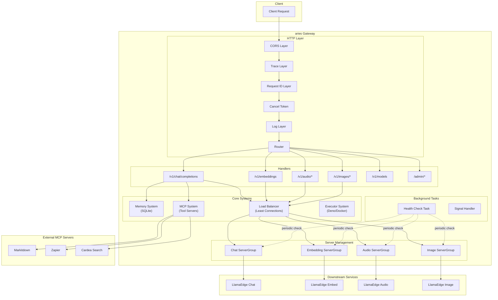

---

## 三、启动流程

### 3.1 启动时序图

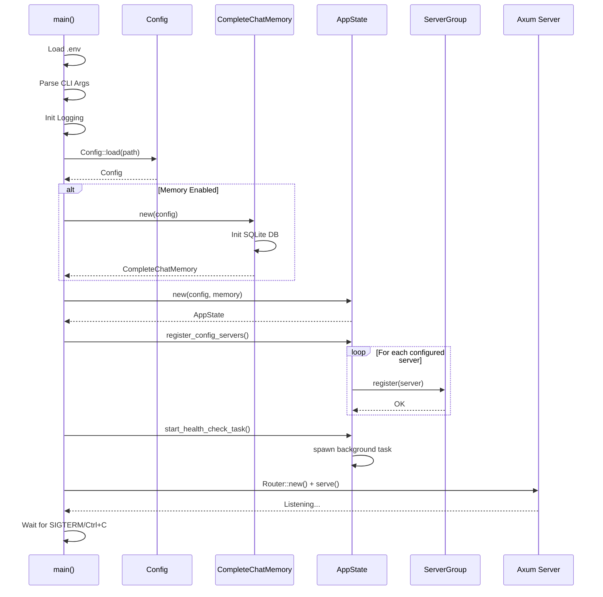

### 3.2 启动流程图

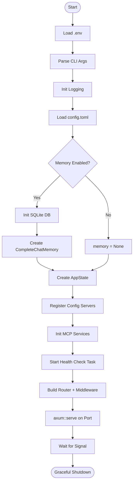

---

## 四、Chat 请求处理流程

### 4.1 完整时序图

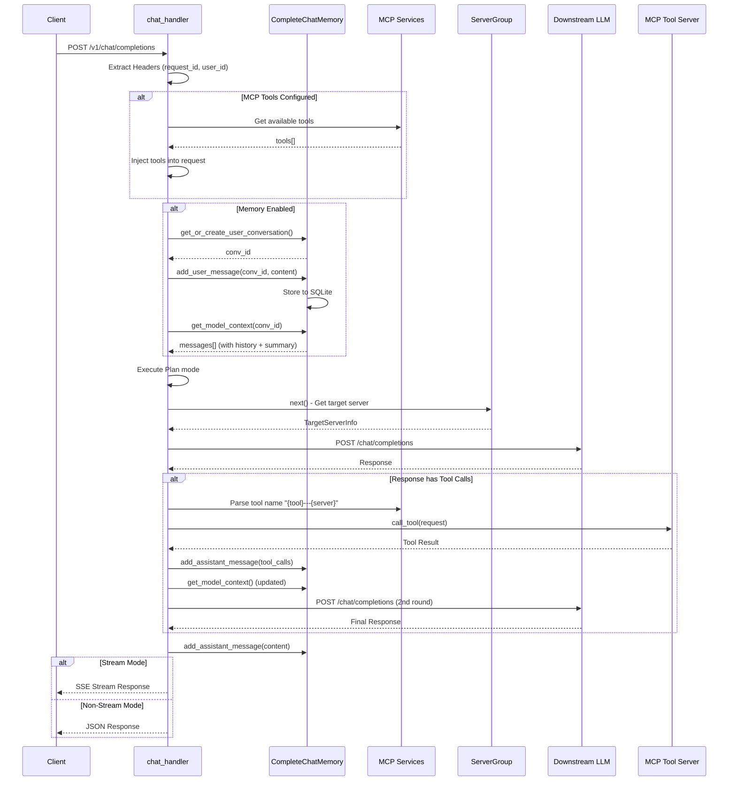

### 4.2 Chat Handler 流程图

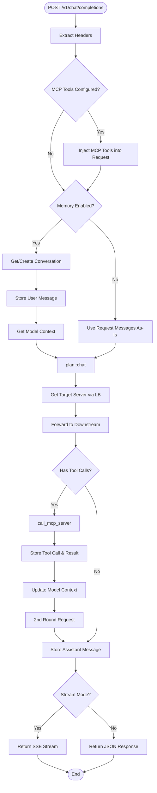

---

## 五、MCP 工具调用流程

### 5.1 时序图

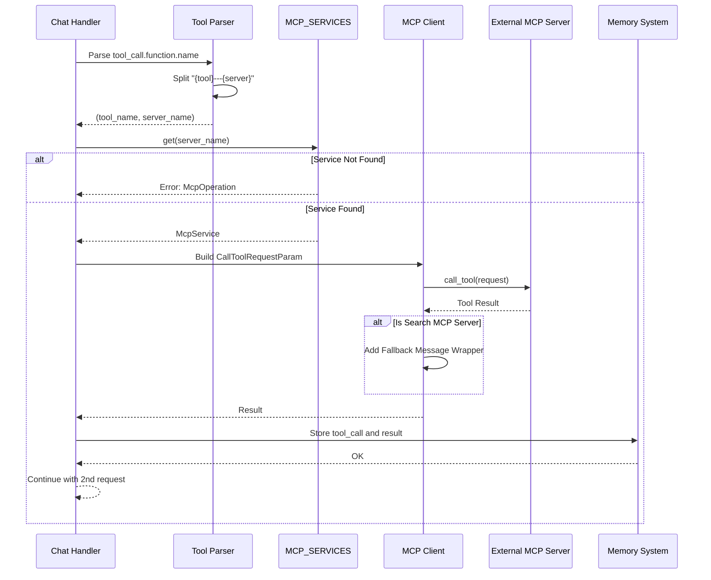

### 5.2 流程图


### 5.3 MCP 服务器类型

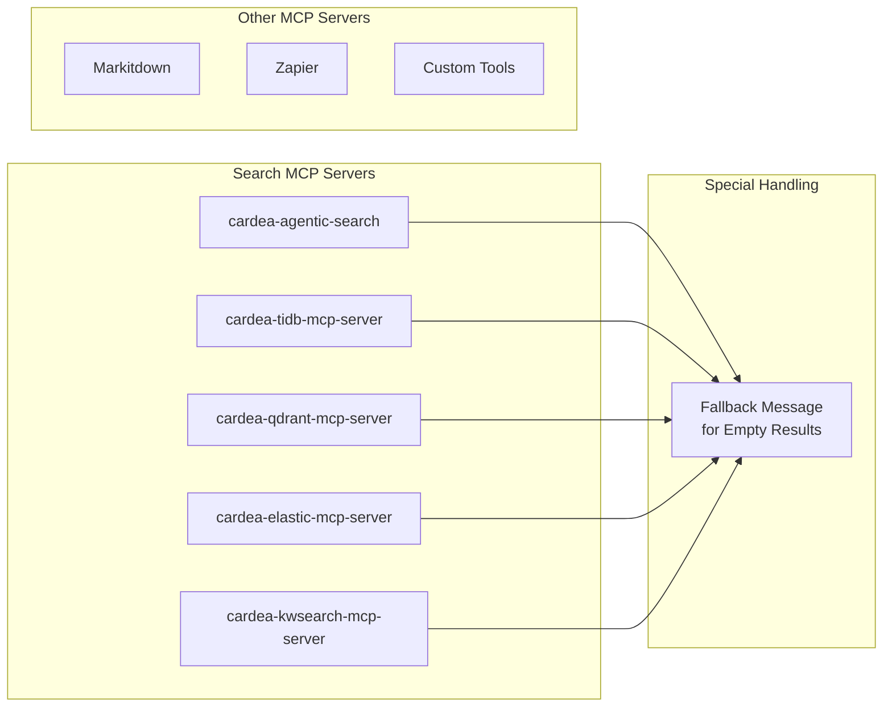

---

## 六、内存系统

### 6.1 架构图

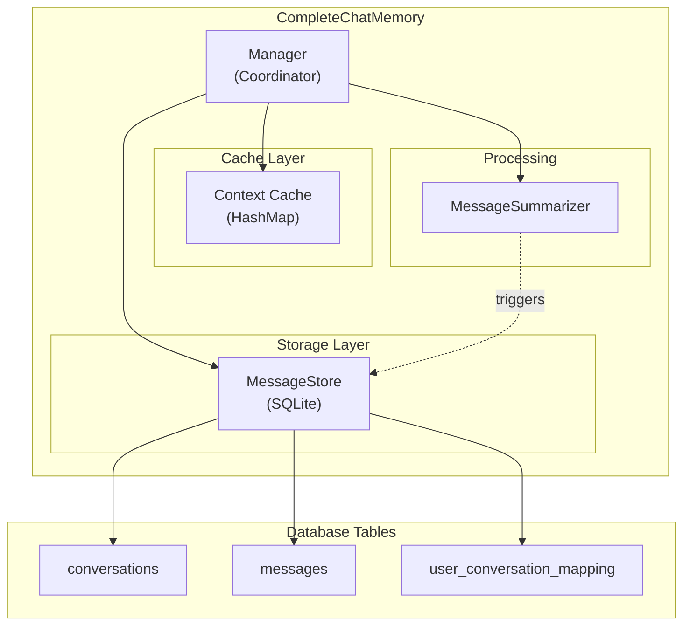

### 6.2 消息存储流程


### 6.3 数据模型

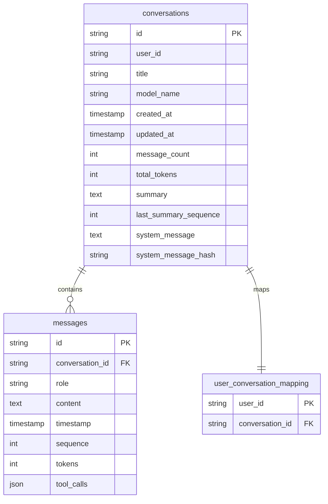

---

## 七、服务器管理与健康检查

### 7.1 服务器注册流程

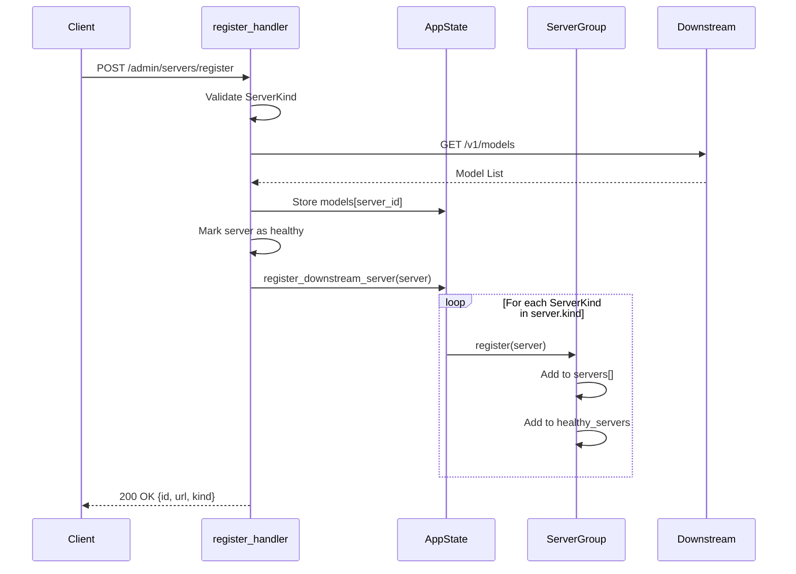

### 7.2 健康检查流程


### 7.3 健康检查时序图

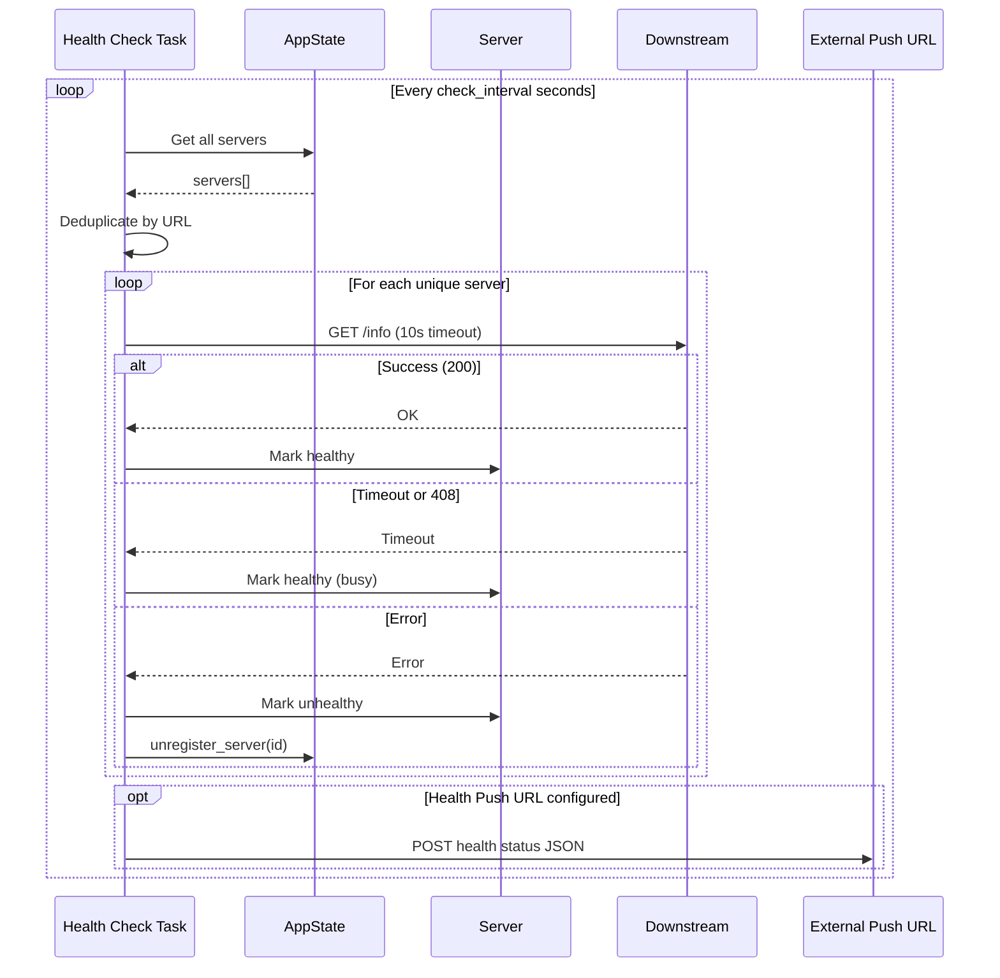

---

## 八、负载均衡

### 8.1 流程图


### 8.2 ServerGroup 结构

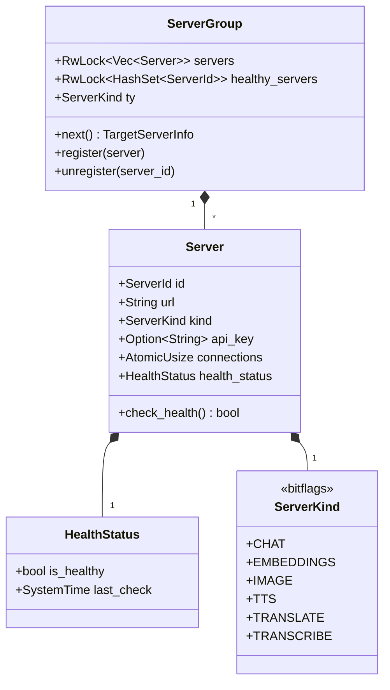

---

## 九、数据流向

### 9.1 请求数据流


### 9.2 内存数据流

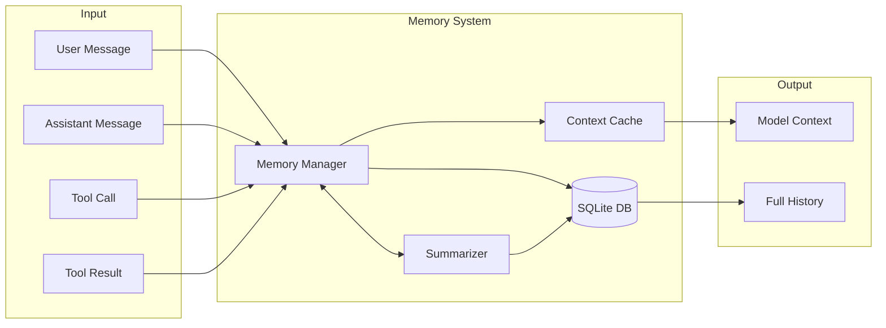

---

## 十、核心模块交互

### 10.1 AppState 结构

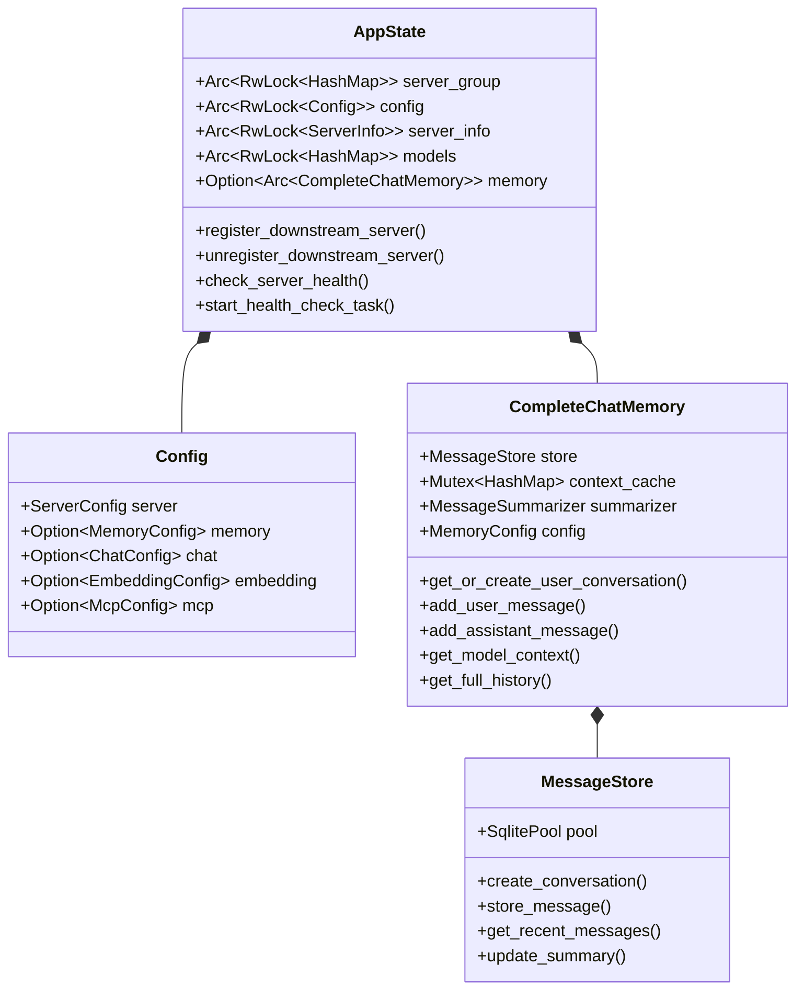

### 10.2 MCP 服务注册表

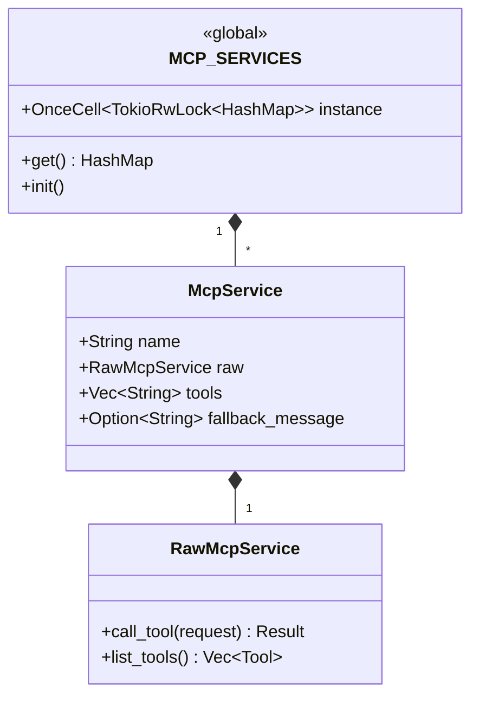

### 10.3 完整模块关系图

```mermaid
graph TB
    subgraph "Entry Point"
        MAIN[main.rs]
    end

    subgraph "HTTP Layer"
        HANDLERS[handlers.rs]
        ROUTER[Router]
    end

    subgraph "Chat Processing"
        CHAT_MOD[chat/mod.rs]
        CHAT_PLAN[chat/plan.rs]
        CHAT_PLANNER[chat/planner.rs]
        CHAT_TRACE[chat/trace.rs]
        CHAT_UTILS[chat/utils.rs]
    end

    subgraph "Memory System"
        MEM_MOD[memory/mod.rs]
        MEM_MGR[memory/manager.rs]
        MEM_STORE[memory/store.rs]
        MEM_SUMM[memory/summarizer.rs]
        MEM_TYPES[memory/types.rs]
    end

    subgraph "Server Management"
        SERVER[server.rs]
    end

    subgraph "MCP Integration"
        MCP[mcp.rs]
    end

    subgraph "Configuration"
        CONFIG[config.rs]
    end

    subgraph "Responses Storage"
        RESP_MOD[responses/mod.rs]
        RESP_DB[responses/db.rs]
        RESP_HANDLERS[responses/handlers.rs]
    end

    subgraph "Executor System"
        EXEC_MOD[executor/mod.rs]
        EXEC_MGR[executor/manager.rs]
        EXEC_TRAITS[executor/traits.rs]
        EXEC_TYPES[executor/types.rs]
        EXEC_DENO[executor/deno.rs]
        EXEC_DOCKER[executor/docker.rs]
    end

    subgraph "Skills System"
        SKILLS_MOD[skills/mod.rs]
        SKILLS_REG[skills/registry.rs]
        SKILLS_PARSER[skills/parser.rs]
        SKILLS_DETECTOR[skills/detector.rs]
        SKILLS_INJECTOR[skills/injector.rs]
        SKILLS_HANDLERS[skills/handlers.rs]
    end

    subgraph "CLI System"
        CLI_MOD[cli/mod.rs]
        CLI_SKILL[cli/skill.rs]
        CLI_INSTALLER[cli/skill/installer.rs]
        CLI_MARKET[cli/skill/marketplace.rs]
        CLI_LOCK[cli/skill/lockfile.rs]
    end

    MAIN --> CONFIG
    MAIN --> HANDLERS
    MAIN --> MEM_MOD
    MAIN --> SERVER
    MAIN --> MCP
    MAIN --> SKILLS_MOD
    MAIN --> CLI_MOD

    HANDLERS --> CHAT_MOD
    HANDLERS --> SERVER
    HANDLERS --> MEM_MOD
    HANDLERS --> SKILLS_HANDLERS

    CHAT_MOD --> CHAT_PLAN
    CHAT_MOD --> CHAT_PLANNER
    CHAT_MOD --> CHAT_TRACE
    CHAT_MOD --> CHAT_UTILS
    CHAT_MOD --> MCP
    CHAT_MOD --> SKILLS_DETECTOR
    CHAT_MOD --> SKILLS_INJECTOR

    CHAT_PLAN --> MEM_MOD
    CHAT_PLAN --> CHAT_PLANNER
    CHAT_PLAN --> CHAT_TRACE

    MEM_MOD --> MEM_MGR
    MEM_MOD --> MEM_STORE
    MEM_MOD --> MEM_SUMM
    MEM_MOD --> MEM_TYPES

    HANDLERS --> RESP_MOD
    RESP_MOD --> RESP_DB
    RESP_MOD --> RESP_HANDLERS

    MAIN --> EXEC_MOD
    EXEC_MOD --> EXEC_MGR
    EXEC_MOD --> EXEC_TRAITS
    EXEC_MOD --> EXEC_TYPES
    EXEC_MOD --> EXEC_DENO
    EXEC_MOD --> EXEC_DOCKER

    SKILLS_MOD --> SKILLS_REG
    SKILLS_MOD --> SKILLS_PARSER
    SKILLS_MOD --> SKILLS_DETECTOR
    SKILLS_MOD --> SKILLS_INJECTOR
    SKILLS_MOD --> SKILLS_HANDLERS
    SKILLS_REG --> EXEC_MOD

    CLI_MOD --> CLI_SKILL
    CLI_SKILL --> CLI_INSTALLER
    CLI_SKILL --> CLI_MARKET
    CLI_SKILL --> CLI_LOCK
```

---

## 十一、脚本执行器系统

### 11.1 架构概览

脚本执行器系统为 Skills 脚本提供沙盒化的执行环境，支持多种运行时后端。

```mermaid
graph TB
    subgraph "ScriptExecutorManager"
        MGR["Manager<br/>(路由调度)"]

        subgraph "Executor Backends"
            DENO["DenoExecutor<br/>(JS/TS)"]
            DOCKER["DockerExecutor<br/>(Python/Shell/Ruby)"]
            WASM["WasmEdgeExecutor<br/>(WASM) - 计划中"]
        end

        subgraph "Extension Mapping"
            EXT_JS[".js/.ts/.mjs/.mts/.jsx/.tsx"]
            EXT_PY[".py/.sh/.bash/.rb"]
            EXT_WASM[".wasm"]
        end
    end

    subgraph "Resource Controls"
        LIMITS["ResourceLimits<br/>(内存/超时/网络)"]
        FS["FilesystemPolicy<br/>(文件系统访问)"]
    end

    MGR --> DENO
    MGR --> DOCKER
    MGR --> WASM

    DENO --> EXT_JS
    DOCKER --> EXT_PY
    WASM --> EXT_WASM

    LIMITS --> MGR
    FS --> MGR
```

### 11.2 执行器类型对比

| 特性 | DenoExecutor | DockerExecutor | WasmEdgeExecutor |
|------|--------------|----------------|------------------|
| 支持语言 | JavaScript, TypeScript | Python, Shell, Ruby | WebAssembly |
| 隔离级别 | Runtime (权限系统) | Container (容器隔离) | Runtime (WASM 沙盒) |
| 启动速度 | 快 | 较慢 | 快 |
| 内存开销 | 低 | 高 | 低 |
| 网络控制 | `--allow-net` 标志 | 网络模式配置 | 原生隔离 |
| 状态 | ✅ 已实现 | ✅ 已实现 | 🔜 计划中 |

### 11.3 隔离级别

```mermaid
graph LR
    subgraph "IsolationLevel"
        NONE["None<br/>(无隔离)"]
        RUNTIME["Runtime<br/>(运行时隔离)"]
        CONTAINER["Container<br/>(容器隔离)"]
        VM["VirtualMachine<br/>(虚拟机隔离)"]
    end

    NONE -->|"安全性增强"| RUNTIME
    RUNTIME -->|"安全性增强"| CONTAINER
    CONTAINER -->|"安全性增强"| VM

    RUNTIME -.->|Deno| DENO_IMPL["权限标志控制"]
    CONTAINER -.->|Docker| DOCKER_IMPL["容器 + 资源限制"]
```

### 11.4 执行流程

```mermaid
sequenceDiagram
    participant Caller as 调用方
    participant Manager as ScriptExecutorManager
    participant Executor as Executor (Deno/Docker)
    participant Runtime as 运行时环境

    Caller->>Manager: execute(script, args, env, limits)
    Manager->>Manager: 解析脚本扩展名
    Manager->>Manager: 查找对应执行器

    alt 未找到执行器
        Manager-->>Caller: Error: NoExecutorFound
    else 找到执行器
        Manager->>Executor: execute(ExecuteRequest)

        Executor->>Executor: 构建命令参数
        Executor->>Executor: 配置资源限制
        Executor->>Executor: 设置安全策略

        Executor->>Runtime: 启动进程/容器

        alt 超时
            Runtime-->>Executor: Timeout
            Executor->>Runtime: 终止进程
            Executor-->>Manager: ScriptOutput{timed_out: true}
        else 正常完成
            Runtime-->>Executor: stdout, stderr, exit_code
            Executor-->>Manager: ScriptOutput
        end

        Manager-->>Caller: ScriptOutput
    end
```

### 11.5 资源限制配置

```mermaid
classDiagram
    class ResourceLimits {
        +u64 max_memory_bytes
        +Duration timeout
        +u64 max_output_bytes
        +bool network_access
        +FilesystemPolicy filesystem_access
        +default() ResourceLimits
        +strict() ResourceLimits
        +permissive() ResourceLimits
    }

    class FilesystemPolicy {
        <<enumeration>>
        None
        ReadOnly(Vec~PathBuf~)
        ReadWrite(Vec~PathBuf~)
        +allows_access() bool
        +allows_write() bool
    }

    ResourceLimits *-- FilesystemPolicy
```

**预设配置：**

| 配置 | 内存限制 | 超时 | 输出限制 | 网络访问 | 文件系统 |
|------|----------|------|----------|----------|----------|
| `default()` | 256MB | 30秒 | 1MB | 禁止 | None |
| `strict()` | 64MB | 10秒 | 256KB | 禁止 | None |
| `permissive()` | 1GB | 5分钟 | 10MB | 允许 | ReadWrite |

### 11.6 Deno 执行器

```mermaid
flowchart TD
    START([执行请求]) --> BUILD_FLAGS[构建权限标志]

    BUILD_FLAGS --> CHECK_FS{文件系统策略?}

    CHECK_FS -->|None| NO_FS[无文件访问权限]
    CHECK_FS -->|ReadOnly| READ_ONLY["--allow-read=paths"]
    CHECK_FS -->|ReadWrite| READ_WRITE["--allow-read=paths<br/>--allow-write=paths"]

    NO_FS --> CHECK_NET
    READ_ONLY --> CHECK_NET
    READ_WRITE --> CHECK_NET

    CHECK_NET{网络访问?}
    CHECK_NET -->|Yes| NET_FLAG["--allow-net"]
    CHECK_NET -->|No| CHECK_ENV
    NET_FLAG --> CHECK_ENV

    CHECK_ENV{环境变量?}
    CHECK_ENV -->|有指定| ENV_FLAG["--allow-env=vars"]
    CHECK_ENV -->|无| BUILD_CMD
    ENV_FLAG --> BUILD_CMD

    BUILD_CMD[构建 deno run 命令] --> SPAWN[启动子进程]
    SPAWN --> WAIT{等待完成}

    WAIT -->|超时| KILL[终止进程]
    WAIT -->|完成| COLLECT[收集输出]

    KILL --> TIMEOUT_OUT[返回超时结果]
    COLLECT --> RESULT[返回执行结果]
```

**DenoConfig 配置项：**

```toml
[skill.execution.deno]
deno_path = "deno"      # Deno 二进制路径
allow_net = false       # 默认网络访问
allow_env = false       # 默认环境变量访问
allow_hrtime = false    # 高精度时间
unstable = false        # 不稳定 API
cache = true            # 编译缓存
```

### 11.7 Docker 执行器

```mermaid
flowchart TD
    START([执行请求]) --> GET_IMAGE[获取对应镜像]
    GET_IMAGE --> CHECK_IMAGE{镜像存在?}

    CHECK_IMAGE -->|No| PULL{auto_pull?}
    PULL -->|Yes| DO_PULL[拉取镜像]
    PULL -->|No| ERROR[返回错误]
    DO_PULL --> CREATE

    CHECK_IMAGE -->|Yes| CREATE[创建容器]

    CREATE --> CONFIG[配置容器]

    subgraph "容器配置"
        CONFIG --> MOUNT["挂载脚本目录<br/>(只读)"]
        MOUNT --> MEMORY["内存限制<br/>(禁用 swap)"]
        MEMORY --> NETWORK["网络模式<br/>(默认 none)"]
        NETWORK --> SECURITY["安全选项<br/>(no-new-privileges)"]
    end

    SECURITY --> START_CONTAINER[启动容器]
    START_CONTAINER --> WAIT{等待完成}

    WAIT -->|超时| KILL[杀死容器]
    WAIT -->|完成| LOGS[收集日志]

    KILL --> LOGS
    LOGS --> REMOVE{auto_remove?}

    REMOVE -->|Yes| DO_REMOVE[删除容器]
    REMOVE -->|No| RESULT
    DO_REMOVE --> RESULT[返回结果]
```

**DockerConfig 配置项：**

```toml
[skill.execution.docker]
default_image = "alpine:latest"       # 默认镜像
auto_remove = true                    # 自动删除容器
read_only = true                      # 只读根文件系统
network_mode = "none"                 # 网络模式
container_prefix = "aries-exec" # 容器名前缀
auto_pull = true                      # 自动拉取镜像

[skill.execution.docker.images]       # 扩展名到镜像映射
py = "python:3.11-slim"
sh = "alpine:latest"
rb = "ruby:3.2-slim"
js = "node:20-slim"
```

### 11.8 全局管理器初始化

```mermaid
sequenceDiagram
    participant Main as main()
    participant Config as ExecutionConfig
    participant Manager as ScriptExecutorManager
    participant Deno as DenoExecutor
    participant Docker as DockerExecutor
    participant Global as EXECUTOR_MANAGER

    Main->>Config: 加载执行配置
    Main->>Manager: new(limits)

    alt Deno 配置存在
        Manager->>Deno: new(deno_config)
        alt 初始化成功
            Deno-->>Manager: DenoExecutor
            Manager->>Manager: register(deno)
        else 初始化失败
            Deno-->>Manager: Error
            Manager->>Manager: warn("Failed to init Deno")
        end
    end

    alt Docker 配置存在
        Manager->>Docker: with_config(docker_config)
        Docker->>Docker: 连接 Docker daemon
        alt 连接成功
            Docker-->>Manager: DockerExecutor
            Manager->>Manager: register(docker)
        else 连接失败
            Docker-->>Manager: Error
            Manager->>Manager: warn("Failed to init Docker")
        end
    end

    Manager->>Global: set(manager)
    Global-->>Main: &'static ScriptExecutorManager
```

### 11.9 错误处理

```mermaid
classDiagram
    class ExecutionError {
        <<enumeration>>
        ScriptNotFound(PathBuf)
        UnsupportedScript(String)
        NoExecutorFound(String)
        ExecutorUnavailable(String, String)
        Timeout(Duration)
        MemoryLimitExceeded
        OutputSizeLimitExceeded
        ExecutionFailed
        PermissionDenied(String)
        RuntimeError
        ConfigError(String)
        IoError
        Internal(String)
        +is_retryable() bool
        +is_resource_limit() bool
    }
```

**可重试错误：**
- `Timeout` - 超时错误
- `ExecutorUnavailable` - 执行器暂时不可用
- `IoError` - I/O 错误

**资源限制错误：**
- `Timeout` - 执行超时
- `MemoryLimitExceeded` - 内存超限
- `OutputSizeLimitExceeded` - 输出超限

### 11.10 类型定义

```mermaid
classDiagram
    class ExecuteRequest {
        +ScriptInfo script
        +Vec~String~ args
        +HashMap~String,String~ env
        +ResourceLimits limits
        +Option~PathBuf~ working_dir
        +Option~String~ stdin
        +new(script) ExecuteRequest
        +with_args(args) Self
        +with_env(env) Self
        +with_limits(limits) Self
    }

    class ScriptOutput {
        +String stdout
        +String stderr
        +i32 exit_code
        +Duration duration
        +ResourceUsage resource_usage
        +bool timed_out
        +success() bool
        +combined_output() String
    }

    class ResourceUsage {
        +u64 peak_memory_bytes
        +u64 cpu_time_ms
    }

    ExecuteRequest --> ScriptOutput : produces
    ScriptOutput *-- ResourceUsage
```

---

## 十二、Skills 系统

Skills 系统遵循 [Agent Skills Standard](https://agentskills.io/specification) 规范，为 LLM 提供可扩展的任务增强能力。

### 12.1 架构概览

```mermaid
graph TB
    subgraph "Skills System"
        REG["SkillRegistry<br/>(全局注册表)"]

        subgraph "Core Modules"
            LOADER["SkillLoader<br/>(文件系统加载)"]
            PARSER["SkillParser<br/>(SKILL.md 解析)"]
            DETECTOR["SkillDetector<br/>(请求检测)"]
            INJECTOR["SkillInjector<br/>(提示词注入)"]
        end

        subgraph "API Layer"
            HANDLERS["handlers.rs<br/>(REST API)"]
            MIDDLEWARE["middleware.rs<br/>(认证/限流)"]
        end

        subgraph "Support"
            VALIDATOR["validator.rs<br/>(名称验证)"]
            ERROR["error.rs<br/>(错误类型)"]
            TYPES["types.rs<br/>(类型定义)"]
        end
    end

    subgraph "Storage"
        LOCAL[".skills/<br/>(项目级)"]
        USER["~/.aries/skills/<br/>(用户级)"]
    end

    subgraph "External"
        MARKET["skillsmp.com<br/>(技能市场)"]
    end

    LOADER --> LOCAL
    LOADER --> USER
    LOADER --> REG
    PARSER --> LOADER

    HANDLERS --> REG
    MIDDLEWARE --> HANDLERS

    DETECTOR --> REG
    INJECTOR --> REG
```

### 12.2 模块结构

```mermaid
graph TB
    subgraph "skills/"
        MOD["mod.rs"]

        subgraph "Core"
            TYPES["types.rs"]
            PARSER["parser.rs"]
            LOADER["loader.rs"]
            REGISTRY["registry.rs"]
        end

        subgraph "Runtime"
            DETECTOR["detector.rs"]
            INJECTOR["injector.rs"]
        end

        subgraph "API"
            HANDLERS["handlers.rs"]
            MIDDLEWARE["middleware.rs"]
        end

        subgraph "Support"
            VALIDATOR["validator.rs"]
            ERROR["error.rs"]
        end
    end

    MOD --> TYPES
    MOD --> PARSER
    MOD --> LOADER
    MOD --> REGISTRY
    MOD --> DETECTOR
    MOD --> INJECTOR
    MOD --> HANDLERS
    MOD --> MIDDLEWARE
    MOD --> VALIDATOR
    MOD --> ERROR

    PARSER --> TYPES
    LOADER --> PARSER
    REGISTRY --> LOADER
    DETECTOR --> REGISTRY
    INJECTOR --> REGISTRY
    HANDLERS --> REGISTRY
```

### 12.3 两阶段加载流程

```mermaid
sequenceDiagram
    participant Client as 客户端
    participant Handler as Chat Handler
    participant Injector as SkillInjector
    participant Registry as SkillRegistry
    participant Detector as SkillDetector
    participant LLM as 下游 LLM

    Note over Handler,Registry: 阶段一：发现（Discovery）

    Handler->>Injector: inject_skills_discovery()
    Injector->>Registry: list_summaries()
    Registry-->>Injector: Vec<SkillSummary>
    Injector-->>Handler: 注入技能描述列表到系统提示词

    Handler->>LLM: 发送请求（含技能列表）
    LLM-->>Handler: 响应（可能含 <use_skill>）

    Note over Handler,Registry: 阶段二：激活（Activation）

    Handler->>Detector: detect_skill_request(response)
    Detector-->>Handler: Option<skill_name>

    alt 检测到技能请求
        Handler->>Registry: get_skill(name)
        Registry-->>Handler: LoadedSkill（完整内容）

        Handler->>Injector: inject_skill_content(skill)
        Injector-->>Handler: 注入完整技能内容

        Handler->>LLM: 发送请求（含完整技能）
        LLM-->>Handler: 最终响应
    end

    Handler-->>Client: 返回响应
```

### 12.4 技能检测与注入

```mermaid
flowchart TD
    START([LLM 响应]) --> DETECT[SkillDetector.detect]

    DETECT --> PARSE["解析 <use_skill> 标签"]
    PARSE --> FOUND{找到技能名?}

    FOUND -->|No| RETURN_NONE[返回 None]
    FOUND -->|Yes| VALIDATE[验证技能名格式]

    VALIDATE --> VALID{格式有效?}
    VALID -->|No| RETURN_NONE
    VALID -->|Yes| LOOKUP[查找注册表]

    LOOKUP --> EXISTS{技能存在?}
    EXISTS -->|No| RETURN_NONE
    EXISTS -->|Yes| INJECT[SkillInjector.inject]

    INJECT --> BUILD["构建注入内容：<br/>- 技能描述<br/>- 完整 SKILL.md<br/>- 脚本信息<br/>- 资源限制"]
    BUILD --> APPEND[追加到系统提示词]
    APPEND --> RETURN_SKILL[返回 LoadedSkill]

    RETURN_NONE --> END([继续处理])
    RETURN_SKILL --> END
```

### 12.5 核心类型

```mermaid
classDiagram
    class SkillRegistry {
        <<global>>
        +OnceCell~RwLock~HashMap~~ instance
        +load_from_directories(paths)
        +get_skill(name) Option~LoadedSkill~
        +list_summaries() Vec~SkillSummary~
        +reload_all()
    }

    class LoadedSkill {
        +SkillMetadata metadata
        +String content
        +PathBuf path
        +Vec~ScriptInfo~ scripts
        +execute_script(name, args) Result
    }

    class SkillMetadata {
        +String name
        +String description
        +Option~String~ license
        +Option~String~ compatibility
        +Option~HashMap~ metadata
        +Option~String~ allowed_tools
        +Option~String~ model
        +get_priority() Option~i32~
        +get_conflicts() Option~Vec~
        +get_execution_limits() Option~SkillResourceLimits~
    }

    class SkillSummary {
        +String name
        +String description
        +Vec~String~ allowed_tools
    }

    class ScriptInfo {
        +String name
        +PathBuf path
        +String extension
    }

    SkillRegistry "1" *-- "*" LoadedSkill
    LoadedSkill *-- SkillMetadata
    LoadedSkill *-- "*" ScriptInfo
    SkillRegistry ..> SkillSummary : produces
```

---

## 十三、CLI 子命令系统

### 13.1 命令结构

```mermaid
graph TB
    subgraph "CLI Entry"
        MAIN["main.rs"]
        CLI["Cli (clap)"]
    end

    subgraph "cli/"
        MOD["mod.rs"]
        SKILL_CMD["skill.rs"]

        subgraph "skill/"
            INSTALLER["installer.rs"]
            MARKETPLACE["marketplace.rs"]
            LOCKFILE["lockfile.rs"]
        end
    end

    MAIN --> CLI
    CLI --> MOD
    MOD --> SKILL_CMD
    SKILL_CMD --> INSTALLER
    SKILL_CMD --> MARKETPLACE
    SKILL_CMD --> LOCKFILE
```

```mermaid
classDiagram
    class Cli {
        +PathBuf config
        +Option~Command~ command
        +bool check_health
        +u64 check_health_interval
        +PathBuf web_ui
        +String log_destination
        +Option~String~ log_file
    }

    class Command {
        <<enumeration>>
        Skill(SkillCommand)
    }

    class SkillCommand {
        <<enumeration>>
        Install
        Search
        List
        Info
        Update
        Outdated
        Uninstall
    }

    Cli *-- Command
    Command *-- SkillCommand
```

### 13.2 技能管理命令

| 命令 | 说明 | 示例 |
|------|------|------|
| `skill install` | 安装技能 | `aries skill install skillsmp:code-review` |
| `skill search` | 搜索市场 | `aries skill search "code review"` |
| `skill list` | 列出已安装 | `aries skill list` |
| `skill list --remote` | 列出热门技能 | `aries skill list -r` |
| `skill info` | 查看详情 | `aries skill info code-review` |
| `skill update` | 更新技能 | `aries skill update --all` |
| `skill outdated` | 检查更新 | `aries skill outdated` |
| `skill uninstall` | 卸载技能 | `aries skill uninstall code-review` |

### 13.3 安装流程

```mermaid
sequenceDiagram
    participant User as 用户
    participant CLI as SkillCommand
    participant Installer as SkillInstaller
    participant Market as SkillsMarketplace
    participant FS as 文件系统

    User->>CLI: skill install skillsmp:code-review
    CLI->>CLI: 解析 SkillSource

    CLI->>Installer: install(source)

    alt skillsmp: 来源
        Installer->>Market: resolve_skill_id(name)
        Market-->>Installer: skill_id

        Installer->>Market: download_skill(id)
        Market-->>Installer: ZIP bytes
    else https:// 来源
        Installer->>Installer: download from URL
    end

    Installer->>Installer: 解压 ZIP
    Installer->>FS: 写入技能目录

    Installer->>FS: 创建 skill.lock
    Note over FS: skill.lock 包含：<br/>name, version, source,<br/>installed_at, checksum

    Installer-->>CLI: skill_name
    CLI-->>User: 安装成功
```

```mermaid
classDiagram
    class SkillSource {
        <<enumeration>>
        Skillsmp(name, version)
        Url(String)
        +parse(source) Result~SkillSource~
        +display_name() String
    }

    class SkillInstaller {
        +PathBuf install_dir
        +SkillsMarketplace marketplace
        +new(dir, config) Self
        +install(source) Result~String~
    }

    class SkillsMarketplace {
        +Client client
        +Option~String~ api_key
        +search(query, limit) Result~Vec~
        +get_skill_info(query) Result~MarketplaceSkill~
        +download_skill(id) Result~Bytes~
        +resolve_skill_id(name, version) Result~String~
    }

    class SkillLockFile {
        +String name
        +Option~String~ version
        +Option~String~ source
        +Option~String~ installed_at
        +Option~String~ checksum
        +new(name, source) Self
        +load(path) Result~Self~
        +save(path) Result
    }

    SkillInstaller --> SkillSource
    SkillInstaller --> SkillsMarketplace
    SkillInstaller --> SkillLockFile
```

---

## 十四、反思系统

反思系统为 Plan 模式提供自我纠错能力，通过 LLM 驱动的结果评估和动态重规划实现高质量任务执行。

### 14.1 架构概览

```mermaid
graph TB
    subgraph "Plan Mode Execution"
        EXEC[子任务执行]
        RESULT[执行结果]
    end

    subgraph "Reflection System"
        subgraph "Core Components"
            ENGINE[ReflectionEngine]
            CACHE[ReflectionCache]
            STRATEGY[AdaptiveStrategy]
        end

        subgraph "Validation"
            VALIDATOR[ResultValidator]
            JSON_V[JsonValidator]
            CODE_V[CodeValidator]
            SEMANTIC_V[SemanticValidator]
        end

        subgraph "Replanning"
            REPLANNER[DynamicReplanner]
            TRIGGER[ReplanTrigger]
        end

        subgraph "Reporting"
            REPORT[ReflectionReport]
            TRACE[反思追踪]
        end
    end

    EXEC --> RESULT
    RESULT --> CACHE
    CACHE -->|缓存命中| REPORT
    CACHE -->|缓存未命中| ENGINE

    ENGINE --> VALIDATOR
    VALIDATOR --> JSON_V
    VALIDATOR --> CODE_V
    VALIDATOR --> SEMANTIC_V

    ENGINE --> STRATEGY
    STRATEGY -->|调整参数| ENGINE

    ENGINE -->|评估结果| DECISION{决策}
    DECISION -->|Accept| REPORT
    DECISION -->|Retry| EXEC
    DECISION -->|Replan| TRIGGER

    TRIGGER --> REPLANNER
    REPLANNER -->|新计划| EXEC

    REPORT --> TRACE

    style ENGINE fill:#90EE90
    style CACHE fill:#90EE90
    style REPLANNER fill:#90EE90
```

### 14.2 模块结构

```mermaid
graph TB
    subgraph "src/reflection/"
        MOD["mod.rs<br/>(模块导出)"]

        ENGINE_RS["engine.rs<br/>(反思引擎)"]
        TYPES_RS["types.rs<br/>(核心类型)"]
        PROMPTS_RS["prompts.rs<br/>(LLM 提示词)"]
        CACHE_RS["cache.rs<br/>(反思缓存)"]
        STRATEGY_RS["strategy.rs<br/>(自适应策略)"]
        REPLANNER_RS["replanner.rs<br/>(动态重规划)"]
        REPORT_RS["report.rs<br/>(结构化报告)"]
        VALIDATOR_RS["validator.rs<br/>(验证框架)"]

        subgraph "validators/"
            V_MOD["mod.rs"]
            STRUCTURAL["structural.rs"]
            SEMANTIC["semantic.rs"]
        end
    end

    MOD --> ENGINE_RS
    MOD --> TYPES_RS
    MOD --> CACHE_RS
    MOD --> STRATEGY_RS
    MOD --> REPLANNER_RS
    MOD --> REPORT_RS
    MOD --> VALIDATOR_RS
    VALIDATOR_RS --> V_MOD
```

**代码统计：**

| 模块 | 代码行数 | 测试数量 |
|------|----------|----------|
| `engine.rs` | ~600 | 5 |
| `types.rs` | ~444 | 11 |
| `prompts.rs` | ~259 | 4 |
| `cache.rs` | ~834 | 22 |
| `strategy.rs` | ~760 | 17 |
| `replanner.rs` | ~1,418 | 35 |
| `report.rs` | ~827 | 22 |
| `validator.rs` | ~436 | 13 |
| `validators/*` | ~1,294 | 8 |
| **总计** | **~6,969** | **137** |

### 14.3 反思流程

```mermaid
sequenceDiagram
    participant Plan as Plan Mode
    participant Cache as ReflectionCache
    participant Engine as ReflectionEngine
    participant LLM as LLM Server
    participant Strategy as AdaptiveStrategy
    participant Trace as SubtaskTrace

    Plan->>Cache: get(task, result)

    alt 缓存命中
        Cache-->>Plan: cached ReflectionResult
        Plan->>Trace: set_reflection(summary, from_cache=true)
    else 缓存未命中
        Cache-->>Plan: None

        Plan->>Strategy: adapt_for_task(task)
        Strategy-->>Plan: AdaptedParams

        Plan->>Engine: reflect_on_subtask(subtask, result, trace, context)
        Engine->>LLM: 发送反思提示词
        LLM-->>Engine: 反思评估响应

        Engine->>Engine: 解析响应，生成 ReflectionResult

        Engine-->>Plan: ReflectionResult

        Plan->>Cache: put(task, result, reflection)
        Plan->>Strategy: record_outcome(task, passed, rounds, confidence)
        Plan->>Trace: set_reflection(summary, from_cache=false)
    end

    alt 结果通过
        Plan->>Plan: 继续执行下一子任务
    else 建议重试
        Plan->>Plan: 重试当前子任务
    else 触发重规划
        Plan->>Plan: 调用 DynamicReplanner
    end
```

### 14.4 动态重规划

```mermaid
flowchart TD
    START([子任务失败]) --> CHECK_TRIGGER[检查重规划触发条件]

    CHECK_TRIGGER --> TRIGGER_TYPE{触发类型?}

    TRIGGER_TYPE -->|连续失败| CONSECUTIVE["ConsecutiveFailures<br/>(count >= threshold)"]
    TRIGGER_TYPE -->|关键任务失败| CRITICAL["CriticalSubtaskFailed<br/>(影响多个依赖)"]
    TRIGGER_TYPE -->|反思建议| REFLECTION["ReflectionSuggested<br/>(RecommendedAction::Replan)"]
    TRIGGER_TYPE -->|时间超限| TIMEOUT["TimeBudgetExceeded<br/>(剩余时间不足)"]
    TRIGGER_TYPE -->|无触发| NO_TRIGGER[继续当前计划]

    CONSECUTIVE --> REPLAN
    CRITICAL --> REPLAN
    REFLECTION --> REPLAN
    TIMEOUT --> REPLAN

    REPLAN[调用 DynamicReplanner]
    REPLAN --> BUILD_CONTEXT[构建 ReplanContext]

    BUILD_CONTEXT --> LLM_CALL[LLM 生成新计划]
    LLM_CALL --> PARSE[解析 ReplanResult]

    PARSE --> APPLY[应用新计划]

    subgraph "ReplanResult"
        PRESERVED[保留的子任务]
        ADDED[新增的子任务]
        REMOVED[移除的子任务]
    end

    APPLY --> RECORD[记录 ReplanEvent 到 PlanTrace]
    RECORD --> CONTINUE[继续执行新计划]

    NO_TRIGGER --> END([结束])
    CONTINUE --> END
```

**重规划触发条件：**

| 触发器 | 条件 | 默认阈值 |
|--------|------|----------|
| `ConsecutiveFailures` | 连续失败次数达到阈值 | 2 次 |
| `CriticalSubtaskFailed` | 关键子任务失败（多个依赖） | 依赖数 > 2 |
| `ReflectionSuggested` | 反思系统建议重规划 | - |
| `TimeBudgetExceeded` | 剩余时间不足 | < 20% |

### 14.5 核心类型

```mermaid
classDiagram
    class ReflectionEngine {
        +Arc~RwLock~LlmServerInfo~~ server
        +ReflectionConfig config
        +reflect_on_subtask(subtask, result, trace, context) Result~ReflectionResult~
    }

    class ReflectionResult {
        +bool passed
        +f64 confidence
        +Vec~ReflectionIssue~ issues
        +Vec~String~ suggestions
        +RecommendedAction recommended_action
        +u32 reflection_rounds
        +passed() Self
        +failed(issues) Self
        +summary() String
    }

    class RecommendedAction {
        <<enumeration>>
        Accept
        AcceptWithFix(String)
        Retry
        RetryWithStrategy(String)
        Replan(ReplanRequest)
        RequestClarification(String)
        Abort(String)
    }

    class ReflectionCache {
        +CacheConfig config
        +HashMap entries
        +get(task, result) Option~ReflectionResult~
        +put(task, result, reflection)
        +cleanup_expired()
    }

    class AdaptiveStrategy {
        +AdaptiveConfig config
        +ReflectionStats stats
        +record_outcome(task, passed, rounds, confidence)
        +adapt_for_task(task, base_config) AdaptedParams
    }

    class DynamicReplanner {
        +ReplanConfig config
        +Arc~RwLock~LlmServerInfo~~ server
        +replan(context) Result~ReplanResult~
    }

    class ReplanTrigger {
        <<enumeration>>
        ConsecutiveFailures
        CriticalSubtaskFailed
        ReflectionSuggested
        TimeBudgetExceeded
        +should_replan(trace, config, graph) Option~Self~
        +description() String
    }

    ReflectionEngine --> ReflectionResult
    ReflectionResult --> RecommendedAction
    ReflectionCache --> ReflectionResult
    AdaptiveStrategy --> ReflectionResult
    DynamicReplanner --> ReplanTrigger
```

**追踪类型扩展（R5.5）：**

```mermaid
classDiagram
    class SubtaskTrace {
        +Option~SubtaskReflectionSummary~ reflection
        +set_reflection(summary)
        +get_reflection() Option
    }

    class SubtaskReflectionSummary {
        +bool passed
        +f64 confidence
        +usize issue_count
        +u32 reflection_rounds
        +String recommended_action
        +bool from_cache
        +from_result(result, from_cache) Self
    }

    class PlanTrace {
        +Option~PlanReflectionSummary~ reflection_report
        +Vec~ReplanEvent~ replan_history
        +compute_reflection_summary()
        +add_replan_event(event)
        +replan_count() usize
    }

    class PlanReflectionSummary {
        +u32 total_reflection_rounds
        +usize passed_subtasks
        +usize failed_subtasks
        +f64 avg_confidence
        +u32 replan_count
    }

    class ReplanEvent {
        +DateTime timestamp
        +String trigger
        +usize preserved_count
        +usize added_count
        +usize removed_count
    }

    SubtaskTrace --> SubtaskReflectionSummary
    PlanTrace --> PlanReflectionSummary
    PlanTrace --> ReplanEvent
```

---

## 附录：API 端点一览

```mermaid
graph LR
    subgraph "Chat API"
        A1["POST /v1/chat/completions"]
    end

    subgraph "Embedding API"
        B1["POST /v1/embeddings"]
    end

    subgraph "Audio API"
        C1["POST /v1/audio/transcriptions"]
        C2["POST /v1/audio/translations"]
        C3["POST /v1/audio/speech"]
    end

    subgraph "Image API"
        D1["POST /v1/images/generations"]
        D2["POST /v1/images/edits"]
    end

    subgraph "Info API"
        E1["GET /v1/models"]
        E2["GET /v1/info"]
    end

    subgraph "Memory API"
        F1["GET /v1/memory/conversations/{id}/history"]
        F2["GET /v1/memory/users/{id}/history"]
        F3["GET /v1/memory/users/{id}/conversations"]
    end

    subgraph "Admin API"
        G1["POST /admin/servers/register"]
        G2["POST /admin/servers/unregister"]
        G3["GET /admin/servers"]
    end

    subgraph "Responses API"
        H1["POST /v1/responses"]
        H2["GET /health"]
    end

    subgraph "Skills API"
        I1["GET /v1/skills"]
        I2["GET /v1/skills/names"]
        I3["GET /v1/skills/:name"]
        I4["PUT /v1/skills/:name/enabled"]
        I5["POST /v1/skills/:name/reload"]
        I6["POST /v1/skills/reload"]
    end
```

---

## 文档版本

- **版本**: 3.2
- **最后更新**: 2026-01-12
- **适用项目版本**: aries v0.9.0
- **本次更新**: 移除 Normal/React 模式相关内容，更新为单一 Plan 模式架构
