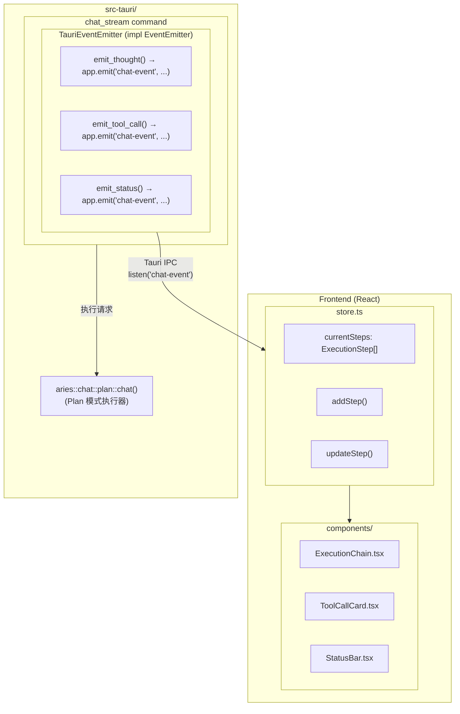

# 执行透明度实现方案

本文档基于 [agent_transparency_implementation.md](./agent_transparency_implementation.md) 的设计方案，结合当前代码现状，提供具体的实施计划。

## 1. 现状分析

### 1.1 后端能力（已具备）

Aries 核心库已实现完整的 SSE 事件系统：

| 模块 | 功能 |
|:-----|:-----|
| `src/chat/events.rs` | 定义事件类型：`thought`、`tool_call`、`tool_result`、`status`、`text`、`finish` |
| `src/chat/emitter.rs` | `EventEmitter` trait 和 `SseEventEmitter` 实现 |
| `src/chat/plan.rs` | Plan 模式执行器，已集成事件发射逻辑 |

### 1.2 当前问题

Tauri 后端的 `chat` 命令（`src-tauri/src/lib.rs:188-268`）存在以下问题：

```rust
// 当前实现：直接调用外部 LLM API
let chat_url = format!("{}/chat/completions", chat_config.url...);
let request_body = serde_json::json!({ "stream": false, ... });
```

- **绕过 Plan 模式**：直接请求外部 API，未使用 Aries 核心的任务规划能力
- **同步模式**：使用 `stream: false`，无法获取中间执行事件
- **无事件转发**：未利用 `EventEmitter` 发射执行过程事件

## 2. 实施方案

### 2.1 总体架构



### 2.2 分阶段实施

#### Phase 1: 基础事件桥接（后端）

**目标**：创建 `TauriEventEmitter`，将 Aries 事件转发到前端。

**修改文件**：`src-tauri/src/lib.rs`

```rust
use aries::chat::emitter::EventEmitter;
use aries::chat::events::*;
use tauri::Emitter;

/// Tauri 事件发射器，将执行事件转发到前端
pub struct TauriEventEmitter {
    app_handle: tauri::AppHandle,
}

#[derive(Clone, Serialize)]
#[serde(tag = "type", rename_all = "snake_case")]
pub enum ChatEvent {
    Status { phase: String, message: String },
    Thought { content: String, status: String },
    ToolCall { call_id: String, tool_name: String, args: serde_json::Value },
    ToolResult { call_id: String, result: String, is_error: bool },
    Text { content: String },
    Finish { stop_reason: String },
}

#[async_trait::async_trait]
impl EventEmitter for TauriEventEmitter {
    async fn emit_status(&self, phase: ExecutionPhase, message: &str, ...) {
        let _ = self.app_handle.emit("chat-event", ChatEvent::Status {
            phase: format!("{:?}", phase),
            message: message.to_string(),
        });
    }

    async fn emit_thought(&self, content: &str, status: ThoughtStatus, ...) {
        let _ = self.app_handle.emit("chat-event", ChatEvent::Thought {
            content: content.to_string(),
            status: format!("{:?}", status),
        });
    }

    // ... 其他方法类似
}
```

#### Phase 2: 重构 chat 命令（后端）

**目标**：调用 Plan 模式执行器，替代直接 API 调用。

**新增命令**：`chat_stream`

```rust
#[tauri::command]
async fn chat_stream(
    app_handle: tauri::AppHandle,
    state: tauri::State<'_, Arc<AppState>>,
    request: ChatRequest,
) -> Result<ChatResponse, String> {
    // 创建 Tauri 事件发射器
    let emitter = Arc::new(TauriEventEmitter::new(app_handle.clone()));

    // 构建 ChatCompletionRequest
    let chat_request = build_chat_request(&request);

    // 调用 Plan 模式（需要适配，因为原函数使用 Axum 提取器）
    // 方案 A: 创建独立的 plan_chat_with_emitter 函数
    // 方案 B: 使用 reqwest 调用本地 Aries 服务端点

    let result = aries::chat::plan::chat_with_emitter(
        state.inner().clone(),
        chat_request,
        emitter,
    ).await?;

    Ok(ChatResponse { content: result })
}
```

**注意**：`aries::chat::plan::chat` 当前使用 Axum 提取器，需要在 Aries 核心库中添加一个不依赖 Axum 的入口函数。

#### Phase 3: 前端状态管理

**修改文件**：`frontend/src/store.ts`

```typescript
interface ExecutionStep {
  id: string;
  type: 'thought' | 'tool_call' | 'tool_result' | 'status';
  content?: string;
  toolName?: string;
  args?: any;
  result?: any;
  status: 'running' | 'completed' | 'error';
  timestamp: number;
}

interface AriesState {
  // 现有状态...
  currentSteps: ExecutionStep[];
  addStep: (step: Omit<ExecutionStep, 'id' | 'timestamp'>) => void;
  updateStep: (id: string, updates: Partial<ExecutionStep>) => void;
  clearSteps: () => void;
}

export const useAriesStore = create<AriesState>((set, get) => ({
  // 现有实现...
  currentSteps: [],

  addStep: (step) => {
    const newStep: ExecutionStep = {
      ...step,
      id: Math.random().toString(36).substring(7),
      timestamp: Date.now(),
    };
    set((state) => ({ currentSteps: [...state.currentSteps, newStep] }));
  },

  updateStep: (id, updates) => {
    set((state) => ({
      currentSteps: state.currentSteps.map((step) =>
        step.id === id ? { ...step, ...updates } : step
      ),
    }));
  },

  clearSteps: () => set({ currentSteps: [] }),
}));
```

#### Phase 4: 前端事件监听

**修改文件**：`frontend/src/store.ts` 中的 `sendMessage`

```typescript
import { listen } from '@tauri-apps/api/event';

sendMessage: async (content) => {
  const { chatConfig } = get();
  if (!chatConfig?.model) {
    // 错误处理...
    return;
  }

  set({ isLoading: true });
  get().addMessage(content, 'user');
  get().clearSteps();

  // 监听执行事件
  const unlisten = await listen<ChatEvent>('chat-event', (event) => {
    const payload = event.payload;

    switch (payload.type) {
      case 'status':
        get().addStep({
          type: 'status',
          content: payload.message,
          status: 'running',
        });
        break;

      case 'thought':
        get().addStep({
          type: 'thought',
          content: payload.content,
          status: payload.status === 'Done' ? 'completed' : 'running',
        });
        break;

      case 'tool_call':
        get().addStep({
          type: 'tool_call',
          toolName: payload.tool_name,
          args: payload.args,
          status: 'running',
        });
        break;

      case 'tool_result':
        // 找到对应的 tool_call 并更新
        const steps = get().currentSteps;
        const toolCallStep = steps.find(
          (s) => s.type === 'tool_call' && s.status === 'running'
        );
        if (toolCallStep) {
          get().updateStep(toolCallStep.id, {
            result: payload.result,
            status: payload.is_error ? 'error' : 'completed',
          });
        }
        break;
    }
  });

  try {
    const response = await invoke<{ content: string }>('chat_stream', {
      request: { message: content, model: chatConfig.model }
    });
    get().addMessage(response.content, 'assistant');
  } catch (error) {
    // 错误处理...
  } finally {
    unlisten();
    set({ isLoading: false });
  }
},
```

#### Phase 5: UI 组件开发

**新增文件**：

1. `frontend/src/components/ExecutionChain.tsx` - 执行步骤容器
2. `frontend/src/components/StepItem.tsx` - 单个步骤项
3. `frontend/src/components/ToolCallCard.tsx` - 工具调用卡片
4. `frontend/src/components/StatusBar.tsx` - 状态栏

**ExecutionChain.tsx 示例**：

```tsx
import { useAriesStore } from '../store';
import { StepItem } from './StepItem';

export function ExecutionChain() {
  const { currentSteps, isLoading } = useAriesStore();

  if (!isLoading && currentSteps.length === 0) return null;

  return (
    <div className="flex flex-col gap-2 px-4 py-3 bg-muted/30 rounded-xl border border-border">
      <div className="text-xs text-muted-foreground uppercase tracking-wider">
        Execution Steps
      </div>
      <div className="flex flex-col gap-1">
        {currentSteps.map((step) => (
          <StepItem key={step.id} step={step} />
        ))}
      </div>
    </div>
  );
}
```

## 3. 核心库适配需求

当前 `aries::chat::plan::chat` 函数签名：

```rust
pub(crate) async fn chat(
    State(state): State<Arc<AppState>>,
    Extension(cancel_token): Extension<CancellationToken>,
    headers: HeaderMap,
    Json(mut request): Json<ChatCompletionRequest>,
    conv_id: Option<String>,
    request_id: impl AsRef<str>,
) -> ServerResult<axum::response::Response>
```

**需要在 Aries 核心库中添加**：

```rust
// src/chat/plan.rs 或新文件 src/chat/api.rs

/// 不依赖 Axum 的 Plan 模式入口
pub async fn execute_plan(
    state: Arc<AppState>,
    request: ChatCompletionRequest,
    emitter: Arc<dyn EventEmitter>,
    cancel_token: CancellationToken,
) -> ServerResult<String> {
    // 复用现有 plan 逻辑，但使用传入的 emitter
}
```

## 4. 实施顺序

| 阶段 | 任务 | 依赖 | 预期产出 |
|:-----|:-----|:-----|:---------|
| 1 | 核心库添加 `execute_plan` 函数 | 无 | 可独立调用的 Plan 模式入口 |
| 2 | Tauri 实现 `TauriEventEmitter` | Phase 1 | 事件桥接层 |
| 3 | Tauri 实现 `chat_stream` 命令 | Phase 1, 2 | 流式聊天命令 |
| 4 | 前端 store 添加步骤管理 | 无 | 状态管理基础设施 |
| 5 | 前端事件监听集成 | Phase 3, 4 | 事件接收能力 |
| 6 | UI 组件开发 | Phase 4 | 可视化组件 |
| 7 | 集成测试与优化 | 全部 | 完整功能 |

## 5. 验证标准

- [ ] 用户发送消息后，能在 UI 上看到"正在规划..."等状态
- [ ] 工具调用时，能看到工具名称和参数
- [ ] 工具执行完成后，能看到结果或错误信息
- [ ] 最终回复正常显示在对话气泡中
- [ ] 步骤列表在新消息发送时自动清空

## 6. 风险与缓解

| 风险 | 影响 | 缓解措施 |
|:-----|:-----|:---------|
| 核心库修改影响现有 API | 高 | 添加新函数而非修改现有函数 |
| 事件量大导致 UI 卡顿 | 中 | 对 thought 事件做节流处理 |
| 取消请求时事件残留 | 低 | 在 `finally` 中确保清理监听器 |

## 7. 任务清单

### Phase 1: 核心库适配 ✅

- [x] **1.1** 分析 `src/chat/plan.rs` 中 `chat` 函数的实现逻辑
- [x] **1.2** 分析 `EventEmitter` trait 的完整接口定义
- [x] **1.3** 创建 `execute_plan` 公开函数，解耦 Axum 依赖
  - [x] 提取核心执行逻辑为独立函数
  - [x] 支持传入自定义 `EventEmitter` 实现
  - [x] 支持传入 `CancellationToken` 用于取消控制
- [ ] **1.4** 添加单元测试验证 `execute_plan` 功能
- [x] **1.5** 更新 `src/lib.rs` 导出新的公开 API

### Phase 2: Tauri 事件桥接 ✅

- [x] **2.1** 在 `src-tauri/Cargo.toml` 添加 `async-trait` 依赖
- [x] **2.2** 定义 `ChatEvent` 枚举类型（使用 `StreamEvent` 替代）
  - [x] `Status` 变体：phase, message
  - [x] `Thought` 变体：content, status
  - [x] `ToolCall` 变体：call_id, tool_name, args
  - [x] `ToolResult` 变体：call_id, result, is_error
  - [x] `Text` 变体：content
  - [x] `Finish` 变体：stop_reason
- [x] **2.3** 实现 `TauriEventEmitter` 结构体
  - [x] 实现 `new(app_handle, request_id)` 构造函数
  - [x] 实现 `EventEmitter` trait 所有方法
  - [x] 每个方法调用 `app_handle.emit("plan-event-{request_id}", ...)`
- [x] **2.4** 添加编译测试确保 trait 实现正确

### Phase 3: Tauri chat_stream 命令 ✅

- [x] **3.1** 创建 `chat_stream` 命令函数签名
- [x] **3.2** 实现请求构建逻辑
  - [x] 将 `ChatStreamRequest` 转换为 `ExecutePlanRequest`
  - [x] 处理模型和会话 ID 配置
- [x] **3.3** 集成 `TauriEventEmitter` 与 `execute_plan`
- [x] **3.4** 处理错误情况并返回合适的错误信息
- [x] **3.5** 在 `invoke_handler` 中注册新命令
- [x] **3.6** 保留旧 `chat` 命令作为回退

### Phase 4: 前端状态管理 ✅

- [x] **4.1** 定义 `ExecutionStep` 接口类型（在 `types/execution.ts`）
  - [x] id, type, content, toolName, args, result, status, timestamp
- [x] **4.2** 在 `AriesState` 中添加状态字段
  - [x] `execution: ExecutionState`（包含 steps, phase, statusMessage 等）
- [x] **4.3** 实现 `addExecutionStep` action
  - [x] 自动生成 id 和 timestamp（通过 `createExecutionStep`）
- [x] **4.4** 实现 `completeExecution` / `failExecution` actions
  - [x] 按状态更新执行结果
- [x] **4.5** 实现 `resetExecution` action

### Phase 5: 前端事件监听 ✅

- [x] **5.1** 添加 `@tauri-apps/api` 的 event 模块导入
- [x] **5.2** 定义 `StreamEvent` TypeScript 类型（与后端对应，在 `types/execution.ts`）
- [x] **5.3** 创建 `useExecutionEvents` hook
  - [x] 设置事件监听器 `listen('plan-event-{requestId}', ...)`
  - [x] 根据事件类型分发处理
  - [x] 在清理时调用 `unlisten()`
- [x] **5.4** 实现各事件类型的处理逻辑
  - [x] `status` → 更新状态和进度
  - [x] `thought` → 添加思考步骤
  - [x] `tool_call` → 添加工具调用步骤
  - [x] `tool_result` → 添加工具结果步骤
  - [x] `finish` → 完成或失败执行

### Phase 6: UI 组件开发 ✅

- [x] **6.1** 创建 `ExecutionPanel.tsx` 容器组件
  - [x] 从 props 获取 `steps` 和 `isExecuting`
  - [x] 条件渲染：无步骤且不执行时隐藏
  - [x] 渲染步骤列表
  - [x] 显示执行阶段和进度
- [x] **6.2** 在 `ExecutionPanel.tsx` 中实现步骤项渲染
  - [x] `ThoughtStepItem` - 思考步骤（紫色图标）
  - [x] `ToolCallStepItem` - 工具调用步骤（蓝色图标）
  - [x] `ToolResultStepItem` - 工具结果步骤（绿色/红色图标）
  - [x] `StatusStepItem` - 状态步骤
- [x] **6.3** 工具调用卡片功能
  - [x] 显示工具名称
  - [x] 显示参数 JSON
  - [x] 显示执行结果
  - [x] 错误状态显示
  - [x] 执行时长显示
- [x] **6.4** 创建 `ThoughtBubble.tsx` 思考气泡（可选增强）
  - [x] 显示 AI 思考过程（Markdown 渲染）
  - [x] 支持流式更新动画（打字机效果）
- [x] **6.5** 集成到 `App.tsx` 主界面
  - [x] 在消息列表中嵌入 `ExecutionPanel`
  - [x] 添加 Plan mode 切换按钮

### Phase 7: 集成测试与优化

- [x] **7.1** 编译测试：验证 Rust 和 TypeScript 代码编译通过
- [ ] **7.2** 端到端测试：发送消息并验证步骤显示
  - [ ] 单个工具调用
  - [ ] 多个连续工具调用
  - [ ] 工具调用失败情况
- [ ] **7.3** 测试取消请求场景
  - [ ] 验证事件监听器正确清理
  - [ ] 验证 UI 状态正确重置
- [ ] **7.4** 性能优化
  - [ ] 对高频 thought 事件做节流（throttle）
  - [ ] 使用 `React.memo` 优化步骤项重渲染
- [ ] **7.5** 样式微调
  - [ ] 响应式布局适配
  - [ ] 动画效果添加
  - [ ] 深色/浅色主题兼容
