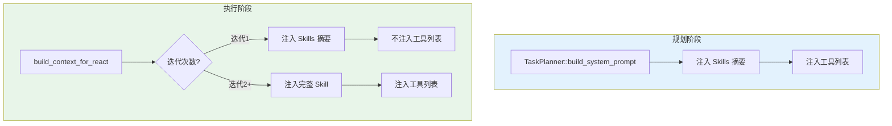
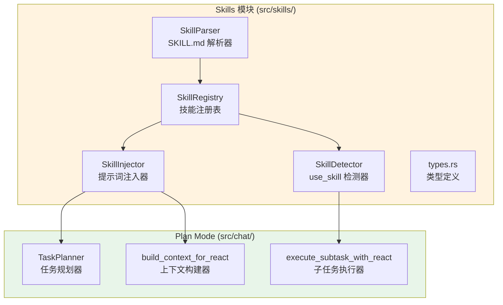
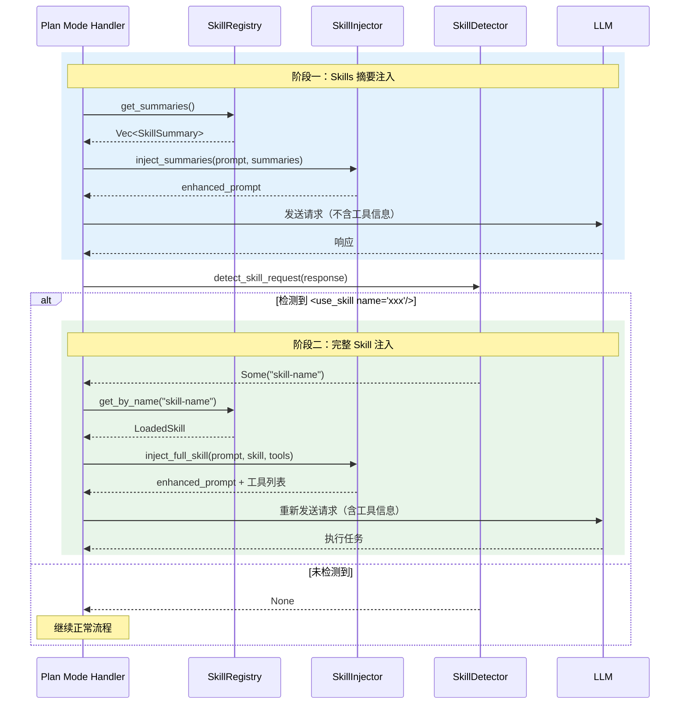

# Plan Mode Skills 实现规划

本文档详细说明在 Plan Mode 中实现 Agent Skills 支持的完整规划和任务清单。

> **参考标准**：本实现遵循 [Agent Skills 标准](https://agentskills.io/specification)

- [Plan Mode Skills 实现规划](#plan-mode-skills-实现规划)
  - [〇、Agent Skills 标准合规性](#〇agent-skills-标准合规性)
    - [标准要点](#标准要点)
    - [合规性总结](#合规性总结)
  - [一、实现目标](#一实现目标)
    - [1.1 核心目标](#11-核心目标)
    - [1.2 范围限定](#12-范围限定)
    - [1.3 不在范围内](#13-不在范围内)
  - [二、现有代码分析](#二现有代码分析)
    - [2.1 Plan Mode 核心模块](#21-plan-mode-核心模块)
    - [2.2 关键数据结构](#22-关键数据结构)
    - [2.3 关键函数](#23-关键函数)
    - [2.4 Prompt 注入点](#24-prompt-注入点)
  - [三、架构设计](#三架构设计)
    - [3.1 整体架构图](#31-整体架构图)
    - [3.2 Skills 模块结构](#32-skills-模块结构)
    - [3.3 两阶段加载机制](#33-两阶段加载机制)
  - [四、详细任务清单](#四详细任务清单)
    - [阶段一：Skills 基础设施（第 1-2 周）](#阶段一skills-基础设施第-1-2-周)
      - [任务 1.1：创建 Skills 模块目录结构](#任务-11创建-skills-模块目录结构)
      - [任务 1.2：实现类型定义 (`types.rs`)](#任务-12实现类型定义-typesrs)
      - [任务 1.3：实现 SKILL.md 解析器 (`parser.rs`)](#任务-13实现-skillmd-解析器-parserrs)
      - [任务 1.4：实现 name 字段验证器 (`validator.rs`)](#任务-14实现-name-字段验证器-validatorrs)
      - [任务 1.5：实现 SkillRegistry (`registry.rs`)](#任务-15实现-skillregistry-registryrs)
      - [任务 1.6：实现资源加载器 (`loader.rs`)](#任务-16实现资源加载器-loaderrs)
      - [任务 1.7：实现 Skills 配置 (`config.rs` 修改)](#任务-17实现-skills-配置-configrs-修改)
      - [任务 1.8：实现 Skills 初始化 (`main.rs` 修改)](#任务-18实现-skills-初始化-mainrs-修改)
    - [阶段二：规划阶段集成（第 3 周）](#阶段二规划阶段集成第-3-周)
      - [任务 2.1：扩展 TaskPlanner (`planner.rs` 修改)](#任务-21扩展-taskplanner-plannerrs-修改)
      - [任务 2.2：修改规划阶段 System Prompt](#任务-22修改规划阶段-system-prompt)
      - [任务 2.3：扩展 SubTask 结构体](#任务-23扩展-subtask-结构体)
      - [任务 2.4：修改 Plan Mode Handler (`plan.rs` 修改)](#任务-24修改-plan-mode-handler-planrs-修改)
    - [阶段三：执行阶段集成（第 4-5 周）](#阶段三执行阶段集成第-4-5-周)
      - [任务 3.1：实现 SkillDetector (`detector.rs`)](#任务-31实现-skilldetector-detectorrs)
      - [任务 3.2：实现 SkillInjector (`injector.rs`)](#任务-32实现-skillinjector-injectorrs)
      - [任务 3.3：修改 build\_context\_for\_react (`plan.rs` 修改)](#任务-33修改-build_context_for_react-planrs-修改)
      - [任务 3.3.1：实现 References 自动注入 ✅](#任务-331实现-references-自动注入-)
      - [任务 3.3.2：实现内部工具支持 ✅](#任务-332实现内部工具支持-)
      - [任务 3.4：修改 execute\_subtask\_with\_react (`plan.rs` 修改)](#任务-34修改-execute_subtask_with_react-planrs-修改)
      - [任务 3.5：实现工具过滤](#任务-35实现工具过滤)
      - [任务 3.6：扩展执行跟踪 (`trace.rs` 修改) ✅](#任务-36扩展执行跟踪-tracers-修改-)
    - [阶段四：测试与优化（第 6 周）](#阶段四测试与优化第-6-周)
      - [任务 4.1：编写单元测试 ✅](#任务-41编写单元测试-)
      - [任务 4.2：编写集成测试 ✅](#任务-42编写集成测试-)
      - [任务 4.3：端到端测试 ✅](#任务-43端到端测试-)
      - [任务 4.4：文档更新 ✅](#任务-44文档更新-)
  - [五、具体实现细节](#五具体实现细节)
    - [5.1 SKILL.md 文件解析](#51-skillmd-文件解析)
    - [5.2 SkillRegistry 实现](#52-skillregistry-实现)
    - [5.3 SkillDetector 实现](#53-skilldetector-实现)
    - [5.4 SkillInjector 实现](#54-skillinjector-实现)
  - [六、代码修改清单](#六代码修改清单)
    - [6.1 新增文件](#61-新增文件)
    - [6.2 修改文件](#62-修改文件)
  - [七、配置系统](#七配置系统)
    - [7.1 配置项](#71-配置项)
    - [7.2 配置文件示例](#72-配置文件示例)
  - [八、测试计划](#八测试计划)
    - [8.1 单元测试](#81-单元测试)
    - [8.2 集成测试](#82-集成测试)
    - [8.3 端到端测试](#83-端到端测试)
  - [九、风险与缓解](#九风险与缓解)
  - [十、验收标准](#十验收标准)
    - [功能验收](#功能验收)
    - [标准合规性验收](#标准合规性验收)
    - [质量验收](#质量验收)
    - [兼容性验收](#兼容性验收)
  - [附录 A：示例 Skill 文件](#附录-a示例-skill-文件)
    - [A.1 基础示例（符合 Agent Skills 标准）](#a1-基础示例符合-agent-skills-标准)
    - [A.2 完整目录结构示例](#a2-完整目录结构示例)
    - [A.3 最小化示例](#a3-最小化示例)
  - [附录 B: Prompt 模板](#附录-b-prompt-模板)
    - [B.1 规划阶段 System Prompt](#b1-规划阶段-system-prompt)
    - [B.2 执行阶段迭代1 System Prompt](#b2-执行阶段迭代1-system-prompt)
    - [B.3 执行阶段迭代2+ System Prompt](#b3-执行阶段迭代2-system-prompt)
  - [文档版本](#文档版本)
    - [版本历史](#版本历史)

---

## 〇、Agent Skills 标准合规性

本实现遵循 [Agent Skills 标准](https://agentskills.io/specification)。

### 标准要点

| 字段 | 必填 | 限制 |
|------|------|------|
| `name` | ✅ | 1-64 字符，小写字母/数字/连字符，必须匹配目录名 |
| `description` | ✅ | 1-1024 字符 |
| `license` | ❌ | 许可证信息 |
| `compatibility` | ❌ | ≤500 字符，环境要求 |
| `metadata` | ❌ | 键值对映射 |
| `allowed-tools` | ❌ | 空格分隔列表 |

### 合规性总结

| 方面 | 状态 |
|------|------|
| SKILL.md 格式（含所有标准字段） | ✅ 100% |
| 目录结构（scripts/references/assets） | ✅ 100% |
| 渐进式加载（两阶段） | ✅ 100% |
| name 验证（含目录匹配） | ✅ 100% |
| allowed-tools（空格分隔） | ✅ 100% |

---

## 一、实现目标

### 1.1 核心目标

在 Plan Mode 中支持 Agent Skills 能力，使 LLM 能够：

1. **在规划阶段识别 Skills**：TaskPlanner 了解可用 Skills，为子任务推荐合适的 Skill
2. **在执行阶段使用 Skills**：子任务执行时通过两阶段加载机制使用 Skills
3. **工具访问控制**：根据 Skill 的 `allowed-tools` 限制可用工具

### 1.2 范围限定

- **Plan Mode 执行**：Aries 采用 Plan 模式进行智能任务规划和执行
- **兼容 Claude Code 格式**：使用标准的 SKILL.md 文件格式
- **两阶段加载**：阶段一注入摘要，阶段二注入完整内容

### 1.3 不在范围内

- 动态 Skill 创建/修改 API
- Skill 市场或远程 Skill 加载

---

## 二、现有代码分析

### 2.1 Plan Mode 核心模块

| 文件 | 功能 | 行数 |
|------|------|------|
| `src/chat/plan.rs` | Plan Mode 主处理器 | ~1449 |
| `src/chat/planner.rs` | 任务规划引擎 | ~706 |
| `src/chat/trace.rs` | 执行跟踪系统 | ~1069 |
| `src/chat/xml_parser.rs` | XML 标签解析 | ~300 |
| `src/chat/shared.rs` | 时间预算管理 | ~100 |

### 2.2 关键数据结构

```rust
// src/chat/planner.rs
pub struct SubTask {
    pub id: usize,
    pub description: String,
    pub dependencies: Vec<usize>,
    pub required_tools: Vec<String>,
    pub status: SubTaskStatus,
    pub result: Option<String>,
    // 需要新增：pub recommended_skill: Option<String>,
}

pub struct TaskPlan {
    pub plan_id: String,
    pub original_goal: String,
    pub subtasks: Vec<SubTask>,
    pub execution_order: Vec<usize>,
}

pub struct ToolDescription {
    pub name: String,
    pub description: String,
}
```

### 2.3 关键函数

| 函数 | 位置 | 功能 |
|------|------|------|
| `TaskPlanner::build_system_prompt()` | planner.rs:385 | 构建规划阶段 System Prompt |
| `build_context_for_react()` | plan.rs:884 | 构建子任务执行上下文 |
| `execute_subtask_with_react()` | plan.rs:501 | 执行子任务的 React 循环 |
| `execute_tool_call()` | plan.rs:728 | 执行 MCP 工具调用 |
| `get_available_tools()` | plan.rs:474 | 获取可用工具列表 |

### 2.4 Prompt 注入点



---

## 三、架构设计

### 3.1 整体架构图



### 3.2 Skills 模块结构

```
src/skills/
├── mod.rs              # 模块导出
├── types.rs            # 类型定义 (SkillMetadata, LoadedSkill, SkillSummary)
├── parser.rs           # SKILL.md 解析器
├── registry.rs         # SkillRegistry 实现
├── detector.rs         # use_skill 标签检测
├── injector.rs         # Prompt 注入器
├── loader.rs           # 资源加载器 (scripts/references/assets)
├── validator.rs        # name 字段验证器
└── error.rs            # Skills 相关错误类型
```

### 3.3 两阶段加载机制



---

## 四、详细任务清单

### 阶段一：Skills 基础设施（第 1-2 周）

#### 任务 1.1：创建 Skills 模块目录结构

- [x] 创建 `src/skills/` 目录
- [x] 创建 `src/skills/mod.rs` 模块导出文件
- [x] 创建 `src/skills/loader.rs` 资源加载器文件
- [x] 创建 `src/skills/validator.rs` 验证器文件
- [x] 在 `src/lib.rs` 或 `src/main.rs` 中注册模块

#### 任务 1.2：实现类型定义 (`types.rs`)

- [x] 定义 `SkillMetadata` 结构体（符合 Agent Skills 标准）
  ```rust
  #[derive(Debug, Clone, Deserialize, Serialize)]
  pub struct SkillMetadata {
      // 必填字段（标准定义）
      pub name: String,              // 1-64字符，必须匹配目录名
      pub description: String,       // 1-1024字符

      // 可选字段（标准定义）
      pub license: Option<String>,
      pub compatibility: Option<String>,  // ≤500字符
      pub metadata: Option<HashMap<String, String>>,

      // 实验性字段（标准定义）
      #[serde(rename = "allowed-tools")]
      pub allowed_tools: Option<String>,  // 空格分隔（非逗号）

      // 扩展字段（非标准，保持 Claude Code 兼容）
      pub model: Option<String>,
  }
  ```
- [x] 定义 `LoadedSkill` 结构体
  ```rust
  pub struct LoadedSkill {
      pub metadata: SkillMetadata,
      pub content: String,        // Markdown 内容
      pub raw_content: String,    // 原始文件内容
      pub skill_dir: PathBuf,     // Skill 目录路径
      pub file_path: String,
      pub enabled: bool,
      pub loaded_at: DateTime<Utc>,
  }
  ```
- [x] 定义 `SkillSummary` 结构体（用于阶段一）
  ```rust
  pub struct SkillSummary {
      pub name: String,
      pub description: String,
  }
  ```
- [x] 定义 `ScriptInfo` 结构体（脚本信息）
  ```rust
  pub struct ScriptInfo {
      pub name: String,
      pub path: PathBuf,
      pub executable: bool,
  }
  ```
- [x] 实现 `SkillMetadata::get_allowed_tools()` 方法（使用空格分隔）
  ```rust
  impl SkillMetadata {
      /// 解析 allowed-tools 字符串为工具列表
      /// 标准格式：空格分隔（非逗号）
      pub fn get_allowed_tools(&self) -> Vec<String> {
          self.allowed_tools
              .as_ref()
              .map(|s| s.split_whitespace().map(|t| t.to_string()).collect())
              .unwrap_or_default()
      }
  }
  ```

#### 任务 1.3：实现 SKILL.md 解析器 (`parser.rs`)

- [x] 实现 `SkillParser::parse(content: &str, skill_dir: &Path)` 函数
- [x] 实现 YAML Front Matter 分离逻辑
- [x] 调用 `validator.rs` 进行字段验证
- [x] 验证 `description` 长度（1-1024 字符）
- [x] 验证 `compatibility` 长度（≤500 字符，如果提供）
- [x] 添加解析错误处理
- [x] 编写单元测试

#### 任务 1.4：实现 name 字段验证器 (`validator.rs`)

- [x] 实现 `validate_name(name: &str, parent_dir: Option<&str>) -> ServerResult<()>`
- [x] 长度检查：1-64 字符
- [x] 字符检查：仅小写字母、数字、连字符
- [x] 不能以连字符开头或结尾
- [x] 不能包含连续连字符（`--`）
- [x] 必须匹配父目录名（如果提供）
  ```rust
  fn validate_name(name: &str, parent_dir: Option<&str>) -> ServerResult<()> {
      // 长度检查：1-64 字符
      if name.is_empty() || name.len() > 64 {
          return Err(ServerError::InvalidSkillName("..."));
      }

      // 字符检查：仅小写字母、数字、连字符
      let re = regex::Regex::new(r"^[a-z0-9-]+$").unwrap();
      if !re.is_match(name) {
          return Err(ServerError::InvalidSkillName("..."));
      }

      // 不能以连字符开头或结尾
      if name.starts_with('-') || name.ends_with('-') {
          return Err(ServerError::InvalidSkillName("..."));
      }

      // 不能包含连续连字符
      if name.contains("--") {
          return Err(ServerError::InvalidSkillName("..."));
      }

      // 必须匹配父目录名（如果提供）
      if let Some(dir) = parent_dir {
          if name != dir {
              return Err(ServerError::InvalidSkillName(
                  format!("name '{}' must match parent directory '{}'", name, dir)
              ));
          }
      }

      Ok(())
  }
  ```
- [x] 编写单元测试（覆盖所有边界情况）

#### 任务 1.5：实现 SkillRegistry (`registry.rs`)

- [x] 定义全局 `SKILLS_REGISTRY: OnceCell<Arc<SkillRegistry>>`
- [x] 实现 `SkillRegistry::new(skills_dir: String)`
- [x] 实现 `load_all()` 方法（扫描目录加载所有 SKILL.md）
  - 扫描时识别 Skill 目录结构（包含 SKILL.md 的目录）
  - 验证 name 与目录名匹配
- [x] 实现 `get_summaries()` 方法（返回摘要列表）
- [x] 实现 `get_by_name(name: &str)` 方法（返回完整 Skill）
- [x] 实现 `reload_all()` 方法（重新加载）
- [x] 实现 `enable(name)` / `disable(name)` 方法
- [x] 编写单元测试

#### 任务 1.6：实现资源加载器 (`loader.rs`)

- [x] 实现 `SkillLoader` 结构体
- [x] 实现 `load_references(skill_dir: &Path) -> Vec<String>` 方法
  - 扫描 `references/` 目录
  - 读取 `.md`, `.txt` 文件内容
- [x] 实现 `list_scripts(skill_dir: &Path) -> Vec<ScriptInfo>` 方法
  - 扫描 `scripts/` 目录
  - 检查文件是否可执行
- [x] 实现 `load_asset(skill_dir: &Path, asset_name: &str) -> Option<Vec<u8>>` 方法
  - 从 `assets/` 目录加载资源文件
- [x] 实现 `load_asset_string(skill_dir: &Path, asset_name: &str) -> Option<String>` 方法
  - 从 `assets/` 目录加载文本资源文件
- [x] 实现 `has_resources(skill_dir: &Path) -> bool` 方法
  - 检查 Skill 是否有附加资源
- [x] 实现 `run_script()` 方法
  - 执行 scripts/ 目录中的脚本（.js, .py, .sh）
  - 支持超时控制和参数传递
  ```rust
  // src/skills/loader.rs

  pub struct SkillLoader;

  impl SkillLoader {
      /// 加载 Skill 的参考文档
      pub async fn load_references(skill_dir: &Path) -> Vec<String> {
          let refs_dir = skill_dir.join("references");
          if !refs_dir.exists() {
              return Vec::new();
          }

          let mut references = Vec::new();
          if let Ok(entries) = std::fs::read_dir(&refs_dir) {
              for entry in entries.flatten() {
                  let path = entry.path();
                  if path.is_file() {
                      let ext = path.extension()
                          .and_then(|e| e.to_str())
                          .unwrap_or("");
                      if ext == "md" || ext == "txt" {
                          if let Ok(content) = tokio::fs::read_to_string(&path).await {
                              references.push(content);
                          }
                      }
                  }
              }
          }
          references
      }

      /// 列出可用脚本
      pub async fn list_scripts(skill_dir: &Path) -> Vec<ScriptInfo> {
          let scripts_dir = skill_dir.join("scripts");
          if !scripts_dir.exists() {
              return Vec::new();
          }

          let mut scripts = Vec::new();
          if let Ok(entries) = std::fs::read_dir(&scripts_dir) {
              for entry in entries.flatten() {
                  let path = entry.path();
                  if path.is_file() {
                      let name = path.file_name()
                          .and_then(|n| n.to_str())
                          .unwrap_or("")
                          .to_string();
                      let executable = is_executable(&path);
                      scripts.push(ScriptInfo { name, path, executable });
                  }
              }
          }
          scripts
      }

      /// 加载资产文件
      pub async fn load_asset(skill_dir: &Path, asset_name: &str) -> Option<Vec<u8>> {
          let asset_path = skill_dir.join("assets").join(asset_name);
          tokio::fs::read(&asset_path).await.ok()
      }
  }
  ```
- [x] 编写单元测试

#### 任务 1.7：实现 Skills 配置 (`config.rs` 修改)

- [x] 在 `Config` 中添加 `skill: Option<SkillConfig>` 字段
- [x] 创建 `SkillConfig` 结构体
  ```rust
  pub struct SkillConfig {
      pub enabled: bool,              // 是否启用 Skills
      pub directories: Vec<String>,   // Skills 目录列表
  }
  ```
- [x] 添加默认值函数
- [x] 更新配置文件文档

#### 任务 1.8：实现 Skills 初始化 (`main.rs` 修改)

- [x] 在应用启动时初始化 `SkillRegistry`
- [x] 根据配置加载 Skills
- [x] 添加启动日志

---

### 阶段二：规划阶段集成（第 3 周）

#### 任务 2.1：扩展 TaskPlanner (`planner.rs` 修改)

- [x] 在 `TaskPlanner` 中添加 `skills_summaries: Vec<SkillSummary>` 字段
- [x] 添加 `with_skills(summaries: Vec<SkillSummary>)` 构建方法
- [x] 修改 `build_system_prompt()` 注入 Skills 摘要

#### 任务 2.2：修改规划阶段 System Prompt

- [x] 在 System Prompt 中添加 Skills 摘要表格
- [x] 更新任务分解规则，包含 `recommended_skill` 字段
- [x] 更新输出格式说明

#### 任务 2.3：扩展 SubTask 结构体

- [x] 在 `SubTask` 中添加 `recommended_skill: Option<String>` 字段
- [x] 修改 XML 解析逻辑提取 `recommended_skill`
- [x] 更新 `TaskPlan` 序列化/反序列化

#### 任务 2.4：修改 Plan Mode Handler (`plan.rs` 修改)

- [x] 在 `chat()` 函数中获取 Skills 摘要
- [x] 将 Skills 摘要传递给 TaskPlanner
- [x] 添加 Skills 相关日志

---

### 阶段三：执行阶段集成（第 4-5 周）

#### 任务 3.1：实现 SkillDetector (`detector.rs`)

- [x] 实现 `detect_skill_request(response: &str) -> Option<String>`
  - 匹配 `<use_skill>skill-name</use_skill>` 标签
- [x] 实现 `remove_skill_tags(response: &str) -> String`
- [x] 编写单元测试

#### 任务 3.2：实现 SkillInjector (`injector.rs`)

- [x] 实现 `inject_skill_summaries(base_prompt: &str, summaries: &[SkillSummary]) -> String`
- [x] 实现 `inject_full_skill(base_prompt: &str, skill: &LoadedSkill, tools: &[ToolDescription]) -> String`
- [x] 实现工具过滤逻辑（根据 `allowed-tools`）
- [x] 编写单元测试

#### 任务 3.3：修改 build_context_for_react (`plan.rs` 修改)

- [x] 添加参数：`skills_summaries: Option<&[SkillSummary]>`
- [x] 添加参数：`active_skill: Option<&LoadedSkill>`
- [x] 实现两阶段逻辑：
  - 无 active_skill 时：注入 Skills 摘要，提示使用 `<use_skill>` 标签
  - 有 active_skill 时：注入完整 Skill 内容和工具

#### 任务 3.3.1：实现 References 自动注入 ✅

- [x] 在 Skill 激活时自动加载 `references/` 目录内容
- [x] 将参考文档附加到 Skill 内容之后
- [x] 支持 `.md` 和 `.txt` 文件格式

#### 任务 3.3.2：实现内部工具支持 ✅

- [x] 实现 `internal__skill_run_script` 工具
  - 执行 Skill `scripts/` 目录中的脚本
  - 支持脚本权限控制（`allow-scripts` 元数据字段）
  - 支持超时控制（`script-timeout` 元数据字段）
  - 支持命令行参数传递
- [x] 实现 `internal__skill_load_asset` 工具
  - 从 `assets/` 目录加载资源文件
  - 支持模板变量替换（`{{variable}}` 语法）
  - 支持格式解析（`json`、`yaml`、`markdown`）
- [x] 在 `get_available_tools()` 中注册内部工具
- [x] 在 `execute_internal_tool()` 中实现工具调用逻辑
- [x] 在 `build_tools_json()` 中添加自定义参数 schema

#### 任务 3.4：修改 execute_subtask_with_react (`plan.rs` 修改)

- [x] 在迭代循环中检测 `<use_skill>` 标签
- [x] 检测到后加载完整 Skill 内容
- [x] 重新构建上下文并发送请求
- [x] 添加 Skill 使用的跟踪记录

#### 任务 3.5：实现工具过滤

- [x] 在 `build_tools_json()` 中添加过滤参数
- [x] 根据 Skill 的 `allowed-tools` 过滤工具列表
- [x] 支持工具名模式匹配（如 `Bash(git:*)`）

#### 任务 3.6：扩展执行跟踪 (`trace.rs` 修改) ✅

- [x] 在 `IterationTrace` 中添加：
  ```rust
  pub skill_requested: Option<String>,  // 请求的 Skill
  pub skill_loaded: bool,               // 是否加载了 Skill
  ```
- [x] 在 `SubtaskTrace` 中添加：
  ```rust
  pub active_skill: Option<String>,     // 使用的 Skill
  ```
- [x] 更新 `summary()` 方法包含 Skill 信息

---

### 阶段四：测试与优化（第 6 周）

#### 任务 4.1：编写单元测试 ✅

- [x] `types.rs` 测试（新增 8 个测试：序列化/反序列化、边界情况）
- [x] `parser.rs` 测试（新增 15 个测试：各种边界情况、错误处理）
- [x] `registry.rs` 测试（新增 10 个测试：错误处理、并发、状态管理）
- [x] `detector.rs` 测试（新增 14 个测试：空输入、畸形标签、边界情况）
- [x] `injector.rs` 测试（新增 12 个测试：空内容、顺序保持、格式验证）

#### 任务 4.2：编写集成测试 ✅

- [x] 规划阶段 + Skills 测试（2 个测试：技能摘要注入、空技能列表处理）
- [x] 执行阶段两阶段加载测试（2 个测试：Phase 1 摘要注入、Phase 2 完整内容注入）
- [x] 工具过滤测试（3 个测试：技能 allowed-tools 过滤、多模式过滤、无限制过滤）
- [x] 错误处理测试（2 个测试：可重试错误、不可重试错误）
- [x] 追踪集成测试（2 个测试：迭代追踪、子任务追踪）
- [x] 完整工作流测试（2 个测试：完整技能工作流、技能检测与清理）

#### 任务 4.3：端到端测试 ✅

- [x] 创建测试用 SKILL.md 文件（weather-query、code-review、simple-task）
- [x] 测试完整的用户请求流程（两阶段加载工作流、完整工作流集成）
- [x] 测试多子任务使用不同 Skills（multi-skill 子任务执行）
- [x] 性能测试（技能加载、注入、检测性能基准）
- [x] 错误处理测试（无效技能、边界情况）
- [x] 并发访问测试
- [x] 资源加载测试（scripts、references、assets）

#### 任务 4.4：文档更新 ✅

- [x] 更新 `skills-architecture.md`
- [x] 更新 `skill-development-guide.md`
- [x] 更新 `plan-mode-skills-integration.md`
- [x] 添加 API 文档

---

## 五、具体实现细节

### 5.1 SKILL.md 文件解析

```rust
// src/skills/parser.rs

use crate::error::{ServerError, ServerResult};
use super::types::{LoadedSkill, SkillMetadata};

pub struct SkillParser;

impl SkillParser {
    /// 解析 SKILL.md 文件内容
    pub fn parse(content: &str, file_path: String) -> ServerResult<LoadedSkill> {
        let (front_matter, markdown) = Self::split_front_matter(content)?;

        let metadata: SkillMetadata = serde_yaml::from_str(&front_matter)
            .map_err(|e| ServerError::Operation(
                format!("Failed to parse YAML front matter: {}", e)
            ))?;

        Self::validate_name(&metadata.name)?;

        Ok(LoadedSkill {
            metadata,
            content: markdown,
            raw_content: content.to_string(),
            file_path,
            enabled: true,
            loaded_at: chrono::Utc::now(),
        })
    }

    fn split_front_matter(content: &str) -> ServerResult<(String, String)> {
        let content = content.trim();

        if !content.starts_with("---") {
            return Err(ServerError::Operation(
                "SKILL.md must start with YAML front matter (---)".into()
            ));
        }

        let rest = &content[3..];
        let end_index = rest.find("---").ok_or_else(|| {
            ServerError::Operation(
                "SKILL.md front matter not properly closed".into()
            )
        })?;

        let front_matter = rest[..end_index].trim().to_string();
        let markdown = rest[end_index + 3..].trim().to_string();

        Ok((front_matter, markdown))
    }

    fn validate_name(name: &str) -> ServerResult<()> {
        let re = regex::Regex::new(r"^[a-z0-9-]{1,64}$").unwrap();
        if !re.is_match(name) {
            return Err(ServerError::Operation(format!(
                "Invalid skill name '{}': must be 1-64 lowercase letters, numbers, or hyphens",
                name
            )));
        }
        Ok(())
    }
}
```

### 5.2 SkillRegistry 实现

```rust
// src/skills/registry.rs

use std::collections::HashMap;
use std::path::Path;
use std::sync::Arc;
use tokio::sync::RwLock;
use once_cell::sync::OnceCell;

use crate::error::{ServerError, ServerResult};
use super::parser::SkillParser;
use super::types::{LoadedSkill, SkillSummary};

/// 全局 Skills 注册表
pub static SKILLS_REGISTRY: OnceCell<Arc<SkillRegistry>> = OnceCell::new();

pub struct SkillRegistry {
    skills: RwLock<HashMap<String, LoadedSkill>>,
    summaries: RwLock<Vec<SkillSummary>>,
    skills_dirs: Vec<String>,
}

impl SkillRegistry {
    pub fn new(skills_dirs: Vec<String>) -> Self {
        Self {
            skills: RwLock::new(HashMap::new()),
            summaries: RwLock::new(Vec::new()),
            skills_dirs,
        }
    }

    /// 加载所有 Skills
    pub async fn load_all(&self) -> ServerResult<usize> {
        let mut count = 0;

        for dir in &self.skills_dirs {
            let expanded_dir = shellexpand::tilde(dir).to_string();
            let path = Path::new(&expanded_dir);

            if !path.exists() {
                continue;
            }

            count += self.load_from_directory(path).await?;
        }

        self.update_summaries().await;
        Ok(count)
    }

    async fn load_from_directory(&self, dir: &Path) -> ServerResult<usize> {
        let mut count = 0;

        if let Ok(entries) = std::fs::read_dir(dir) {
            for entry in entries.flatten() {
                let path = entry.path();

                // 检查是否是 SKILL.md 文件
                if path.is_file() && path.file_name()
                    .map(|n| n.to_string_lossy().to_uppercase() == "SKILL.MD")
                    .unwrap_or(false)
                {
                    if let Ok(skill) = self.load_skill_file(&path).await {
                        let mut skills = self.skills.write().await;
                        skills.insert(skill.metadata.name.clone(), skill);
                        count += 1;
                    }
                }

                // 递归加载子目录
                if path.is_dir() {
                    count += Box::pin(self.load_from_directory(&path)).await?;
                }
            }
        }

        Ok(count)
    }

    async fn load_skill_file(&self, path: &Path) -> ServerResult<LoadedSkill> {
        let content = tokio::fs::read_to_string(path).await
            .map_err(|e| ServerError::Operation(format!(
                "Failed to read {}: {}", path.display(), e
            )))?;

        SkillParser::parse(&content, path.to_string_lossy().to_string())
    }

    async fn update_summaries(&self) {
        let skills = self.skills.read().await;
        let summaries: Vec<SkillSummary> = skills
            .values()
            .filter(|s| s.enabled)
            .map(|s| SkillSummary {
                name: s.metadata.name.clone(),
                description: s.metadata.description.clone(),
            })
            .collect();

        let mut summary_lock = self.summaries.write().await;
        *summary_lock = summaries;
    }

    /// 获取 Skills 摘要列表（用于阶段一注入）
    pub async fn get_summaries(&self) -> Vec<SkillSummary> {
        let summaries = self.summaries.read().await;
        summaries.clone()
    }

    /// 根据名称获取完整 Skill
    pub async fn get_by_name(&self, name: &str) -> Option<LoadedSkill> {
        let skills = self.skills.read().await;
        skills.get(name).cloned()
    }

    /// 检查 Skills 是否可用
    pub async fn is_available(&self) -> bool {
        let summaries = self.summaries.read().await;
        !summaries.is_empty()
    }
}
```

### 5.3 SkillDetector 实现

```rust
// src/skills/detector.rs

use regex::Regex;

pub struct SkillDetector;

impl SkillDetector {
    /// 检测 LLM 响应中的 Skill 请求
    ///
    /// 匹配格式：<use_skill name="skill-name"/>
    pub fn detect_skill_request(response: &str) -> Option<String> {
        let re = Regex::new(r#"<use_skill\s+name="([^"]+)"\s*/>"#).unwrap();
        re.captures(response).map(|c| c[1].to_string())
    }

    /// 从响应中移除 Skill 请求标签
    pub fn remove_skill_tags(response: &str) -> String {
        let re = Regex::new(r#"<use_skill\s+name="[^"]+"\s*/>"#).unwrap();
        re.replace_all(response, "").trim().to_string()
    }
}

#[cfg(test)]
mod tests {
    use super::*;

    #[test]
    fn test_detect_skill_request() {
        let response = r#"<use_skill name="weather-query"/>

我需要使用天气查询技能"#;

        assert_eq!(
            SkillDetector::detect_skill_request(response),
            Some("weather-query".to_string())
        );
    }

    #[test]
    fn test_no_skill_request() {
        let response = "这是一个普通的响应";
        assert_eq!(SkillDetector::detect_skill_request(response), None);
    }

    #[test]
    fn test_remove_skill_tags() {
        let response = r#"<use_skill name="weather-query"/>

我需要使用天气查询技能"#;

        assert_eq!(
            SkillDetector::remove_skill_tags(response),
            "我需要使用天气查询技能"
        );
    }
}
```

### 5.4 SkillInjector 实现

```rust
// src/skills/injector.rs

use super::types::{LoadedSkill, SkillSummary};
use crate::chat::planner::ToolDescription;

pub struct SkillInjector;

impl SkillInjector {
    /// 阶段一：注入 Skills 摘要列表（不含工具信息）
    pub fn inject_skill_summaries(
        base_prompt: &str,
        summaries: &[SkillSummary],
    ) -> String {
        if summaries.is_empty() {
            return base_prompt.to_string();
        }

        let skills_table: Vec<String> = summaries
            .iter()
            .map(|s| format!("| {} | {} |", s.name, s.description))
            .collect();

        let skills_section = format!(
            r#"
## 可用 Skills

以下是可用的专业技能。如果需要使用某个 Skill，请在响应开头使用 `<use_skill name="skill-name"/>` 标签。

| Skill | 描述 |
|-------|------|
{}

当你决定使用某个 Skill 时，请在响应开头使用标签，例如：
<use_skill name="weather-query"/>
然后系统会加载该 Skill 的完整指令和可用工具供你使用。

如果任务不需要使用任何 Skill，你可以直接给出 <final_answer>。"#,
            skills_table.join("\n")
        );

        format!("{}\n{}", base_prompt, skills_section)
    }

    /// 阶段二：注入完整 Skill 内容（含工具信息）
    pub fn inject_full_skill(
        base_prompt: &str,
        skill: &LoadedSkill,
        available_tools: &[ToolDescription],
    ) -> String {
        // 根据 allowed-tools 过滤工具
        let filtered_tools = Self::filter_tools(available_tools, skill);

        let tools_section = if filtered_tools.is_empty() {
            String::new()
        } else {
            let tools_list: Vec<String> = filtered_tools
                .iter()
                .map(|t| format!("- {}: {}", t.name, t.description))
                .collect();
            format!(
                "\n## 可用工具\n\n{}\n",
                tools_list.join("\n")
            )
        };

        let skill_section = format!(
            r#"
## 当前任务：{}

### Skill 指令

{}

---

请按照上述指令执行任务。
{}"#,
            skill.metadata.name,
            skill.content,
            tools_section
        );

        format!("{}\n{}", base_prompt, skill_section)
    }

    /// 根据 Skill 的 allowed-tools 过滤工具列表
    fn filter_tools<'a>(
        available_tools: &'a [ToolDescription],
        skill: &LoadedSkill,
    ) -> Vec<&'a ToolDescription> {
        let allowed = skill.metadata.get_allowed_tools();

        if allowed.is_empty() {
            // 没有限制，返回所有工具
            return available_tools.iter().collect();
        }

        available_tools
            .iter()
            .filter(|tool| {
                allowed.iter().any(|pattern| {
                    Self::matches_tool_pattern(&tool.name, pattern)
                })
            })
            .collect()
    }

    /// 匹配工具名称模式
    /// 支持格式：
    /// - 精确匹配: "weather"
    /// - 前缀匹配: "Bash(git:*)"
    fn matches_tool_pattern(tool_name: &str, pattern: &str) -> bool {
        if pattern.contains('*') {
            // 通配符匹配
            let pattern = pattern.replace("*", ".*");
            let re = regex::Regex::new(&format!("^{}$", pattern)).unwrap();
            re.is_match(tool_name)
        } else {
            // 精确匹配或包含匹配
            tool_name == pattern || tool_name.contains(pattern)
        }
    }
}
```

---

## 六、代码修改清单

### 6.1 新增文件

| 文件路径 | 功能 | 优先级 |
|---------|------|-------|
| `src/skills/mod.rs` | 模块导出 | P0 |
| `src/skills/types.rs` | 类型定义（符合 Agent Skills 标准） | P0 |
| `src/skills/parser.rs` | SKILL.md 解析器 | P0 |
| `src/skills/validator.rs` | name 字段验证器（符合标准规则） | P0 |
| `src/skills/registry.rs` | SkillRegistry | P0 |
| `src/skills/loader.rs` | 资源加载器（scripts/references/assets） | P0 |
| `src/skills/detector.rs` | use_skill 检测 | P0 |
| `src/skills/injector.rs` | Prompt 注入 | P0 |
| `src/skills/error.rs` | 错误类型 | P1 |

### 6.2 修改文件

| 文件路径 | 修改内容 | 优先级 |
|---------|---------|-------|
| `src/main.rs` | 添加 Skills 模块初始化 | P0 |
| `src/lib.rs` | 注册 skills 模块 | P0 |
| `src/config.rs` | 添加 Skills 配置项 | P0 |
| `src/error.rs` | 添加 Skills 相关错误 | P1 |
| `src/chat/planner.rs` | 注入 Skills 摘要到规划 Prompt | P0 |
| `src/chat/planner.rs` | SubTask 添加 recommended_skill | P1 |
| `src/chat/plan.rs` | 集成两阶段 Skills 加载 | P0 |
| `src/chat/plan.rs` | 修改 build_context_for_react | P0 |
| `src/chat/trace.rs` | 添加 Skill 跟踪字段 | P2 |

---

## 七、配置系统

### 7.1 配置项

```rust
// src/config.rs 新增

#[derive(Debug, Clone, Deserialize)]
pub struct SkillConfig {
    /// 是否启用 Skills（仅在 Plan Mode 生效）
    #[serde(default = "default_skills_enabled")]
    pub enabled: bool,

    /// Skills 目录列表
    #[serde(default = "default_skills_directories")]
    pub directories: Vec<String>,
}

fn default_skills_enabled() -> bool { true }

fn default_skills_directories() -> Vec<String> {
    vec![
        ".skills".to_string(),
        "~/.aries/skills".to_string(),
    ]
}
```

### 7.2 配置文件示例

```toml
# config.toml

[server]
max_plan_subtasks = 5
plan_timeout_secs = 300

# Skills 配置
[skill]
enabled = true
directories = [
    ".skills",
    "~/.aries/skills",
    "/usr/local/share/aries/skills"
]
```

---

## 八、测试计划

### 8.1 单元测试

| 模块 | 测试内容 | 文件 |
|------|---------|------|
| parser | YAML 解析、边界情况 | `src/skills/parser.rs` |
| validator | name 验证（长度、字符、连字符规则、目录匹配） | `src/skills/validator.rs` |
| registry | 加载、查询、启用/禁用 | `src/skills/registry.rs` |
| loader | 资源加载（references/scripts/assets） | `src/skills/loader.rs` |
| detector | 标签检测、移除 | `src/skills/detector.rs` |
| injector | Prompt 注入、工具过滤（空格分隔） | `src/skills/injector.rs` |

### 8.2 集成测试

| 测试场景 | 描述 |
|---------|------|
| 规划阶段 Skills 注入 | 验证 TaskPlanner 收到 Skills 摘要 |
| 执行阶段两阶段加载 | 验证迭代1仅摘要，迭代2+含完整内容 |
| 工具过滤 | 验证 allowed-tools 正确过滤（空格分隔） |
| 多 Skill 切换 | 验证不同子任务使用不同 Skills |
| name 与目录匹配 | 验证 name 必须匹配父目录名 |
| 资源加载 | 验证 scripts/references/assets 目录加载 |
| 标准合规性 | 验证所有 Agent Skills 标准字段 |

### 8.3 端到端测试

| 测试场景 | 输入 | 期望输出 |
|---------|------|---------|
| 天气查询 | "北京天气怎么样" | 使用 weather-query Skill，调用天气 MCP |
| 代码审查 | "帮我审查这段代码" | 使用 code-review Skill，调用 git diff |
| 无 Skill 匹配 | "你好" | 不使用任何 Skill，直接响应 |

---

## 九、风险与缓解

| 风险 | 影响 | 缓解措施 |
|------|------|---------|
| LLM 不识别 use_skill 标签 | Skill 无法触发 | 优化 Prompt 模板，添加更多示例 |
| 工具过滤过于严格 | 任务无法完成 | 添加宽松匹配模式，日志告警 |
| Skills 加载失败 | 功能降级 | 容错处理，继续无 Skill 运行 |
| Prompt 过长 | Token 超限 | 控制摘要长度，分批注入 |
| 循环调用 Skill | 死循环 | 限制同一 Skill 最多调用次数 |

---

## 十、验收标准

### 功能验收

- [x] SKILL.md 文件能正确解析
- [x] SkillRegistry 能加载和管理 Skills
- [x] 规划阶段能识别并推荐 Skills
- [x] 执行阶段能正确触发两阶段加载
- [x] 工具过滤按 allowed-tools 工作（空格分隔）
- [x] 跟踪系统记录 Skill 使用情况
- [x] 资源加载器支持 scripts/references/assets 目录

### 标准合规性验收

- [x] name 字段验证符合标准（1-64字符、小写+数字+连字符、无连续连字符、匹配目录名）
- [x] description 字段验证（1-1024 字符）
- [x] compatibility 字段验证（≤500 字符）
- [x] license 字段支持（可选）
- [x] metadata 字段支持（可选，键值对）
- [x] allowed-tools 使用空格分隔（非逗号）
- [x] 目录结构支持（SKILL.md + scripts/ + references/ + assets/）

### 质量验收

- [x] 单元测试覆盖率 > 80%（279 个测试通过）
- [x] 无 clippy 警告
- [x] 文档完整（API + 用户指南）
- [x] 性能无明显下降（< 5% 增加）

### 兼容性验收

- [x] 现有配置文件向后兼容
- [x] 无 Skills 时系统正常运行
- [x] Claude Code SKILL.md 格式兼容（model 扩展字段）

---

## 附录 A：示例 Skill 文件

### A.1 基础示例（符合 Agent Skills 标准）

```markdown
---
name: weather-query
description: 查询天气信息，获取指定城市的当前天气、天气预报。当用户询问天气、气温、是否下雨、需要带伞等问题时使用。
license: MIT
compatibility: 需要 weather-mcp-server 服务运行
allowed-tools: weather---weather-mcp-server forecast---weather-mcp-server
metadata:
  author: aries
  version: "1.0"
---

# 天气查询 Skill

当用户询问天气相关问题时，按照以下流程执行：

## 工作流程

1. **识别城市**：从用户问题中提取城市名称
   - 如果用户未指定城市，询问用户想查询哪个城市的天气
   - 支持中文城市名和英文城市名

2. **调用天气工具**：使用 MCP 工具查询天气
   - `weather---weather-mcp-server`：查询当前天气
   - `forecast---weather-mcp-server`：查询天气预报

3. **格式化输出**：将天气信息以友好的格式呈现给用户

## 输出格式

## [城市名] 天气

**当前天气**

- 天气状况：[晴/多云/雨等]
- 温度：[温度]°C
- 湿度：[湿度]%

**建议**

- [根据天气给出穿衣/出行建议]

## 注意事项

- 如果 MCP 工具调用失败，告知用户并建议稍后重试
- 温度单位默认使用摄氏度
```

### A.2 完整目录结构示例

```text
weather-query/                    # 目录名必须与 name 字段匹配
├── SKILL.md                      # 必需：技能说明 + 元数据
├── scripts/                      # 可选：可执行脚本
│   ├── fetch-weather.sh          # Shell 脚本
│   └── parse-forecast.py         # Python 脚本
├── references/                   # 可选：参考文档
│   ├── api-docs.md               # API 文档
│   └── weather-codes.txt         # 天气代码说明
└── assets/                       # 可选：模板和资源
    ├── output-template.md        # 输出格式模板
    └── city-codes.json           # 城市代码映射
```

### A.3 最小化示例

```markdown
---
name: simple-skill
description: 一个简单的 Skill 示例，仅包含必填字段。
---

# Simple Skill

这是一个最简单的 Skill 示例，仅包含必填的 `name` 和 `description` 字段。
```

---

## 附录 B: Prompt 模板

### B.1 规划阶段 System Prompt

```text
你是一个专业的任务规划专家。你的任务是将用户的复杂请求分解为可执行的子任务。

## 可用 Skills

以下是可用的专业技能，可以在子任务中推荐使用：

| Skill | 描述 |
|-------|------|
| weather-query | 查询天气信息，获取指定城市的当前天气、天气预报 |
| code-review | 审查代码变更，检查潜在问题和改进建议 |

## 可用工具

{tools_list}

## 输出格式

请以 XML 格式输出任务计划：

<task_plan>
  <subtask id="0">
    <description>子任务描述</description>
    <dependencies>[]</dependencies>
    <required_tools>["tool1"]</required_tools>
    <recommended_skill>skill-name</recommended_skill>
  </subtask>
</task_plan>
```

### B.2 执行阶段迭代1 System Prompt

```text
你是一个智能助手，正在执行任务计划中的子任务。

## 当前子任务

ID: {subtask_id}
描述: {subtask_description}

## 前置任务结果

{previous_results}

## 可用 Skills

以下是可用的专业技能。如果需要使用某个 Skill，请在响应开头使用标签。

| Skill | 描述 |
|-------|------|
{skills_table}

当你决定使用某个 Skill 时，请在响应开头使用标签：
<use_skill name="skill-name"/>

如果任务不需要使用任何 Skill，你可以直接给出 <final_answer>。
```

### B.3 执行阶段迭代2+ System Prompt

```text
你是一个智能助手，正在执行任务计划中的子任务。

## 当前子任务

ID: {subtask_id}
描述: {subtask_description}

## 前置任务结果

{previous_results}

## 当前使用的 Skill：{skill_name}

### Skill 指令

{skill_content}

---

## 可用工具

{filtered_tools_list}

## 响应格式

使用以下 XML 标签格式化响应：
- <thought>你的思考过程</thought>
- <action>工具名称</action>
- <action_input>{"param": "value"}</action_input>
- <final_answer>最终答案</final_answer>
```

---

## 文档版本

- **版本**: 1.2
- **创建日期**: 2024
- **最后更新**: 2025-01-08
- **适用项目版本**: aries (feat-sandbox)
- **Agent Skills 标准版本**: [agentskills.io/specification](https://agentskills.io/specification)

### 版本历史

| 版本 | 日期       | 变更说明                             |
|------|------------|--------------------------------------|
| 1.0  | 2024       | 初始版本                             |
| 1.1  | 2024-12-30 | 调整实现规划以符合 Agent Skills 标准 |
| 1.2  | 2025-01-08 | 添加内部工具支持（skill_run_script, skill_load_asset） |
