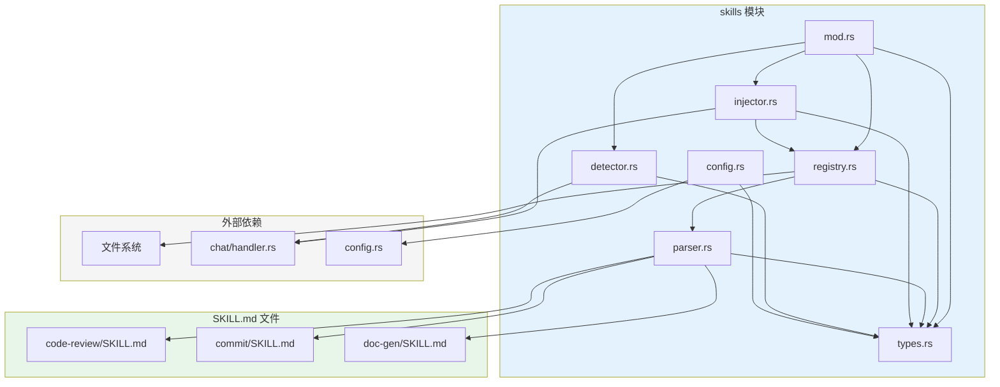
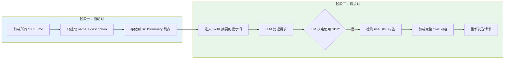
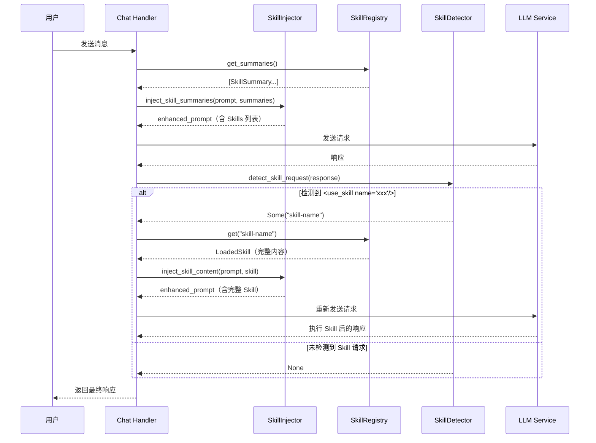
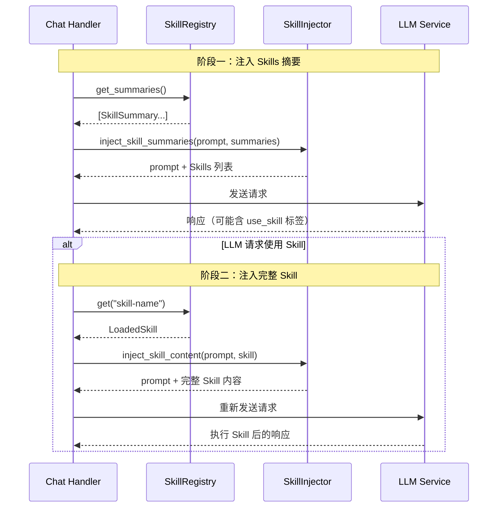

# Skills 模块架构设计

- [Skills 模块架构设计](#skills-模块架构设计)
  - [一、设计目标](#一设计目标)
    - [1.1 核心目标](#11-核心目标)
    - [1.2 设计原则](#12-设计原则)
    - [1.3 与 Claude Code Skills 的兼容性](#13-与-claude-code-skills-的兼容性)
  - [二、模块结构](#二模块结构)
    - [2.1 目录结构](#21-目录结构)
    - [2.2 模块依赖关系](#22-模块依赖关系)
  - [三、SKILL.md 文件规范](#三skillmd-文件规范)
    - [3.1 文件格式（兼容 Claude Code）](#31-文件格式兼容-claude-code)
    - [3.2 元数据字段说明](#32-元数据字段说明)
      - [标准字段（Agent Skills Standard）](#标准字段agent-skills-standard)
      - [扩展字段（通过 metadata）](#扩展字段通过-metadata)
    - [3.3 description 字段的重要性](#33-description-字段的重要性)
    - [3.4 Markdown 内容部分](#34-markdown-内容部分)
  - [四、Skill 示例](#四skill-示例)
    - [4.1 代码审查 Skill](#41-代码审查-skill)
    - [4.2 Git 提交 Skill](#42-git-提交-skill)
    - [4.3 文档生成 Skill](#43-文档生成-skill)
  - [五、核心类型定义](#五核心类型定义)
    - [5.1 Skill 元数据](#51-skill-元数据)
    - [5.2 已加载的 Skill](#52-已加载的-skill)
  - [六、Skill 触发机制](#六skill-触发机制)
    - [6.1 两阶段加载机制](#61-两阶段加载机制)
    - [6.2 语义匹配触发流程](#62-语义匹配触发流程)
    - [6.3 Skill 请求检测](#63-skill-请求检测)
  - [七、SkillRegistry 实现](#七skillregistry-实现)
    - [7.1 注册表设计](#71-注册表设计)
    - [7.2 SKILL.md 解析器](#72-skillmd-解析器)
  - [八、系统提示词集成](#八系统提示词集成)
    - [8.1 两阶段集成流程](#81-两阶段集成流程)
    - [8.2 阶段一：注入 Skills 描述列表](#82-阶段一注入-skills-描述列表)
    - [8.3 阶段二：注入完整 Skill 内容](#83-阶段二注入完整-skill-内容)
    - [8.4 提示词注入器实现](#84-提示词注入器实现)
  - [九、CLI 技能管理](#九cli-技能管理)
    - [9.1 命令行界面](#91-命令行界面)
    - [9.2 技能市场客户端](#92-技能市场客户端)
    - [9.3 版本锁定文件](#93-版本锁定文件)
  - [十、配置系统](#十配置系统)
    - [10.1 Skill 配置](#101-skill-配置)
    - [10.2 配置文件示例](#102-配置文件示例)
  - [十一、错误类型扩展](#十一错误类型扩展)
  - [十二、初始化流程](#十二初始化流程)
    - [12.1 Skills 系统初始化](#121-skills-系统初始化)
    - [12.2 main.rs 集成](#122-mainrs-集成)
  - [十三、API 端点](#十三api-端点)
    - [13.1 Skills 管理 API](#131-skills-管理-api)
    - [13.2 路由配置](#132-路由配置)
  - [十四、与 Claude Code 的对比](#十四与-claude-code-的对比)
    - [14.1 机制对比](#141-机制对比)
    - [14.2 文件格式兼容性](#142-文件格式兼容性)
  - [十五、总结](#十五总结)
    - [15.1 架构优势](#151-架构优势)
    - [15.2 实施建议](#152-实施建议)

## 一、设计目标

### 1.1 核心目标

- **兼容 Claude Code**：采用与 Claude Code 相同的 SKILL.md 文件格式
- **语义匹配触发**：LLM 根据 `description` 自动判断何时使用 Skill（而非命令触发）
- **两阶段加载**：先加载描述，匹配后再加载完整内容（减少上下文占用）
- **提示词驱动**：Skills 是提示词指令，不是代码执行逻辑

### 1.2 设计原则

| 原则 | 说明 |
|------|------|
| **语义触发** | LLM 根据用户请求与 Skill 描述的语义相似性自动选择 |
| **渐进式加载** | 启动时只加载 name + description，匹配后加载完整内容 |
| **工具限制** | 通过 `allowed-tools` 字段限制 Skill 可用的工具 |
| **文件兼容** | SKILL.md 格式与 Claude Code 完全兼容 |

### 1.3 与 Claude Code Skills 的兼容性


**关键区别**：Claude Code 使用模型内置能力，aries 通过提示词工程模拟相同行为。

## 二、模块结构

### 2.1 目录结构

```
aries/
├── src/
│   ├── skills/                  # Skills 运行时模块
│   │   ├── mod.rs               # 模块导出
│   │   ├── types.rs             # 类型定义（SkillMetadata, LoadedSkill 等）
│   │   ├── registry.rs          # Skill 注册表
│   │   ├── loader.rs            # 文件系统加载器
│   │   ├── parser.rs            # SKILL.md 文件解析器
│   │   ├── injector.rs          # 系统提示词注入器
│   │   ├── detector.rs          # Skill 请求检测器
│   │   ├── validator.rs         # Skill 名称验证器
│   │   ├── error.rs             # 错误类型定义
│   │   ├── handlers.rs          # API 端点处理器
│   │   ├── middleware.rs        # API 认证和速率限制中间件
│   │   └── e2e_tests.rs         # 端到端测试
│   │
│   └── cli/                     # CLI 子命令模块
│       ├── mod.rs               # CLI 入口
│       └── skill/               # Skill 管理子命令
│           ├── mod.rs           # 子命令路由
│           ├── installer.rs     # 技能安装器（ZIP 解压）
│           ├── marketplace.rs   # skillsmp.com 市场客户端
│           └── lockfile.rs      # skill.lock 版本锁定文件
│
├── .skills/                     # 项目级 Skills 目录
│   ├── code-review/
│   │   └── SKILL.md
│   └── ...
│
├── ~/.aries/skills/       # 用户级 Skills 目录
│   └── ...
│
└── config.toml                  # 配置文件
```

### 2.2 模块依赖关系



## 三、SKILL.md 文件规范

### 3.1 文件格式（兼容 Claude Code）

```markdown
---
name: skill-name
description: 清晰的描述，包含触发关键词。当用户需要 X 或 Y 时使用。
allowed-tools: Read Grep Bash(git:*)
model: claude-opus-4-5-20251101
---

# Skill 标题

## 说明

具体的逐步指导...

## 示例

具体的使用示例...
```

### 3.2 元数据字段说明

#### 标准字段（Agent Skills Standard）

| 字段 | 类型 | 必填 | 说明 |
|------|------|------|------|
| `name` | String | **是** | Skill 唯一标识符，只能包含小写字母、数字、连字符，最多 64 字符 |
| `description` | String | **是** | 清晰的描述，最多 1024 字符，**用于语义匹配触发** |
| `license` | String | 否 | 许可证标识（如 MIT, Apache-2.0） |
| `compatibility` | String | 否 | 兼容性要求（系统依赖、网络访问等），最多 500 字符 |
| `allowed-tools` | String | 否 | 限制此 Skill 可用的工具列表（空格分隔） |
| `model` | String | 否 | 此 Skill 活跃时使用的模型（Claude Code 兼容） |
| `metadata` | Map | 否 | 扩展字段容器（见下方） |

#### 扩展字段（通过 metadata）

扩展字段存储在 `metadata` HashMap 中，使用逗号分隔的字符串格式：

| 键名 | 格式 | 说明 |
|------|------|------|
| `execution-limits` | `key=value,...` | 脚本执行资源限制（max_memory_bytes, timeout_secs, network_access） |
| `allowed-scripts` | `pattern,...` | 允许执行的脚本模式（支持 glob，如 `*.js, process.py`） |
| `references` | `pattern,...` | 自动加载的参考文档模式（如 `api-docs.md, *.txt`） |
| `priority` | `number` | 多技能冲突时的优先级（数值越大优先级越高） |
| `conflicts` | `name,...` | 与此技能冲突的其他技能名称 |

**示例**：

```yaml
---
name: code-review
description: 审查代码变更
license: MIT
metadata:
  priority: "10"
  conflicts: "quick-review"
  execution-limits: "timeout_secs=60,network_access=false"
  allowed-scripts: "*.js, *.ts"
---
```

### 3.3 description 字段的重要性

`description` 是 Skill 触发的**核心字段**。LLM 根据 `description` 判断何时应该使用该 Skill。

**编写指南**：

好的 `description` 应回答两个问题：
1. **这个 Skill 做什么？** 列举具体能力
2. **何时使用？** 包含用户会自然说出的触发词

| 质量 | 示例 |
|------|------|
| ❌ 不好 | `description: 帮助处理文档` |
| ✅ 好 | `description: 从 PDF 文件提取文本和表格，填充表单，合并文档。处理 PDF 文件、表单或文档提取时使用。` |

### 3.4 Markdown 内容部分

Markdown 内容是 Skill 的完整指令，在 LLM 选择使用该 Skill 后加载。

推荐结构：

```markdown
# Skill 标题

## 说明

逐步指导 LLM 如何完成任务...

### 工作流程

1. 第一步
2. 第二步
3. ...

### 输出格式

期望的输出格式...

### 注意事项

- 注意事项 1
- 注意事项 2

## 示例

<example>
user: 用户输入示例
assistant: 助手响应示例
</example>
```

## 四、Skill 示例

### 4.1 代码审查 Skill

```markdown
---
name: code-review
description: 审查代码变更，检查潜在问题和改进建议。当审查代码、检查 PR、或需要代码质量反馈时使用。
allowed-tools: Read Grep Bash(git:*)
---

# Code Review Skill

## 说明

当用户请求代码审查时，请按照以下流程执行：

### 工作流程

1. **获取变更**：运行 `git diff` 获取待审查的代码变更
2. **阅读上下文**：使用 Read 工具阅读相关文件，理解代码上下文
3. **分析代码**：检查以下方面：
   - 代码逻辑是否正确
   - 是否存在潜在 bug
   - 代码风格是否一致
   - 是否有安全隐患
   - 性能是否有优化空间
4. **输出报告**：按照指定格式输出审查报告

### 输出格式

## 代码审查报告

### 概述
[变更的简要描述]

### 问题发现

#### 严重问题
- [问题描述]
  - 位置：[文件:行号]
  - 建议：[修复建议]

#### 建议改进
- [改进建议]

### 总结
[整体评价和建议]

### 注意事项

- 保持客观和建设性
- 优先关注逻辑问题和安全问题
- 避免过于关注代码风格的细节

## 示例

<example>
user: 帮我审查一下当前的代码变更
assistant: 我来审查当前的代码变更。

[运行 git diff 获取变更]
[使用 Read 工具阅读相关文件]

## 代码审查报告

### 概述
本次变更新增了用户认证功能...

### 问题发现

#### 严重问题
- 密码未经哈希直接存储
  - 位置：src/auth.rs:42
  - 建议：使用 bcrypt 或 argon2 进行密码哈希

### 总结
整体实现思路正确，但存在安全隐患需要修复。
</example>
```

### 4.2 Git 提交 Skill

```markdown
---
name: commit
description: 从 git diffs 生成清晰的提交消息，创建规范的 Git 提交。当编写提交消息、创建 commit、或审查暂存更改时使用。
allowed-tools: Bash(git:*)
---

# Git Commit Skill

## 说明

当用户请求创建 Git 提交时，请按照以下流程执行：

### 工作流程

1. **检查状态**：运行 `git status` 查看当前仓库状态
2. **获取变更**：运行 `git diff --staged` 获取暂存的代码变更
3. **分析变更**：理解变更的目的和范围
4. **生成提交信息**：根据变更内容生成符合 Conventional Commits 规范的提交信息
5. **确认后执行**：等待用户确认后执行 `git commit`

### 提交信息格式

<type>(<scope>): <description>

[optional body]

[optional footer]

Type 类型：
- `feat`: 新功能
- `fix`: Bug 修复
- `docs`: 文档变更
- `style`: 代码格式（不影响逻辑）
- `refactor`: 重构
- `test`: 测试相关
- `chore`: 构建/工具变更

### 注意事项

- 提交信息应清晰描述"为什么"而不仅是"做了什么"
- 不要提交包含敏感信息的文件（.env, credentials 等）
- 保持提交原子性，一个提交只做一件事

## 示例

<example>
user: 帮我创建一个 commit
assistant: 我来帮你创建一个 Git 提交。

[运行 git status 检查状态]
[运行 git diff --staged 获取暂存变更]

根据变更内容，我建议的提交信息是：

feat(auth): add user login functionality

- Add login endpoint with JWT token generation
- Implement password validation
- Add rate limiting for login attempts

是否继续创建这个提交？
</example>
```

### 4.3 文档生成 Skill

```markdown
---
name: doc-gen
description: 为代码生成文档，包括函数说明、API 文档、README 等。当需要编写文档、生成 API 说明、或创建 README 时使用。
allowed-tools: Read Write Glob
---

# Documentation Generator Skill

## 说明

当用户请求生成文档时，请按照以下流程执行：

### 工作流程

1. **了解范围**：询问用户需要为哪些代码生成文档（如果未指定）
2. **阅读代码**：使用 Read 和 Glob 工具阅读相关代码
3. **分析结构**：理解代码的结构、功能和 API
4. **生成文档**：根据代码生成相应的文档
5. **确认保存**：询问用户是否保存到文件

### 文档类型

根据代码类型生成适当的文档：

- **函数/方法**：描述、参数、返回值、示例
- **结构体/类**：描述、字段、方法、使用示例
- **模块**：概述、主要组件、使用指南
- **API 端点**：请求/响应格式、参数说明、示例

### 输出格式

使用 Markdown 格式，包含：
- 标题和描述
- 代码示例
- 参数/返回值表格
- 注意事项

## 示例

<example>
user: 帮我为 src/auth.rs 生成文档
assistant: 我来为 src/auth.rs 生成文档。

[使用 Read 工具读取 src/auth.rs]

根据代码分析，我生成了以下文档：

# Auth 模块文档

## 概述

auth 模块提供用户认证相关功能...

## 主要函数

### `login(credentials: Credentials) -> Result<Token>`

验证用户凭据并返回 JWT token。

**参数：**

| 名称 | 类型 | 描述 |
|------|------|------|
| credentials | Credentials | 用户凭据 |

**返回：**
- `Ok(Token)`: 认证成功，返回 JWT token
- `Err(AuthError)`: 认证失败

---

是否需要将此文档保存到文件？
</example>
```

## 五、核心类型定义

### 5.1 Skill 元数据

```rust
use serde::{Deserialize, Serialize};
use std::collections::HashMap;

/// Skill 元数据（从 YAML Front Matter 解析）
/// 遵循 Agent Skills Standard 规范
#[derive(Debug, Clone, Serialize, Deserialize)]
pub struct SkillMetadata {
    /// Skill 唯一名称（小写字母、数字、连字符，最多 64 字符）
    pub name: String,

    /// 清晰的描述，用于语义匹配触发（最多 1024 字符）
    pub description: String,

    /// 许可证标识（可选）
    pub license: Option<String>,

    /// 兼容性要求（可选，最多 500 字符）
    pub compatibility: Option<String>,

    /// 扩展字段容器（Agent Skills Standard 扩展机制）
    pub metadata: Option<HashMap<String, String>>,

    /// 允许使用的工具列表（空格分隔）
    #[serde(rename = "allowed-tools")]
    pub allowed_tools: Option<String>,

    /// 指定使用的模型（Claude Code 兼容）
    pub model: Option<String>,
}

impl SkillMetadata {
    /// 解析 allowed-tools 字符串为工具列表（空格分隔）
    pub fn get_allowed_tools(&self) -> Vec<String> {
        self.allowed_tools
            .as_ref()
            .map(|s| s.split_whitespace().map(|t| t.to_string()).collect())
            .unwrap_or_default()
    }

    /// 获取优先级（从 metadata 扩展字段）
    pub fn get_priority(&self) -> Option<i32> {
        self.metadata.as_ref()?.get("priority")?.parse().ok()
    }

    /// 获取冲突列表（从 metadata 扩展字段）
    pub fn get_conflicts(&self) -> Option<Vec<String>> {
        self.metadata.as_ref()?.get("conflicts").map(|v| {
            v.split(',').map(|s| s.trim().to_string()).collect()
        })
    }

    /// 获取执行限制（从 metadata 扩展字段）
    pub fn get_execution_limits(&self) -> Option<SkillResourceLimits> {
        self.metadata.as_ref()?.get("execution-limits")
            .and_then(|v| SkillResourceLimits::parse(v))
    }

    /// 获取允许的脚本模式（从 metadata 扩展字段）
    pub fn get_allowed_scripts(&self) -> Option<Vec<String>> {
        self.metadata.as_ref()?.get("allowed-scripts").map(|v| {
            v.split(',').map(|s| s.trim().to_string()).collect()
        })
    }

    /// 检查脚本是否被允许执行
    pub fn is_script_allowed(&self, script_name: &str) -> bool {
        match self.get_allowed_scripts() {
            None => true, // 无限制，允许所有
            Some(patterns) => patterns.iter().any(|p| glob_match(p, script_name))
        }
    }
}
```

### 5.2 已加载的 Skill

```rust
/// 已加载的 Skill
#[derive(Debug, Clone, Serialize)]
pub struct LoadedSkill {
    /// 元数据
    pub metadata: SkillMetadata,

    /// 完整的 Markdown 内容（不含 front matter）
    pub content: String,

    /// 原始文件内容
    pub raw_content: String,

    /// 文件路径
    pub file_path: String,

    /// 是否启用
    pub enabled: bool,

    /// 加载时间
    pub loaded_at: chrono::DateTime<chrono::Utc>,
}

/// Skill 摘要（用于第一阶段加载）
#[derive(Debug, Clone, Serialize)]
pub struct SkillSummary {
    /// Skill 名称
    pub name: String,

    /// Skill 描述（用于语义匹配）
    pub description: String,
}

/// Skill 状态
#[derive(Debug, Clone, Copy, PartialEq, Eq, Serialize, Deserialize)]
pub enum SkillStatus {
    /// 已加载，可用
    Active,
    /// 已禁用
    Disabled,
    /// 加载失败
    Error,
}
```

## 六、Skill 触发机制

### 6.1 两阶段加载机制



### 6.2 语义匹配触发流程



### 6.3 Skill 请求检测

LLM 通过在响应中使用 `<use_skill>` 标签来请求使用某个 Skill：

```rust
// src/skills/detector.rs

use regex::Regex;

/// Skill 请求检测器
pub struct SkillDetector;

impl SkillDetector {
    /// 检测 LLM 响应中的 Skill 请求
    ///
    /// 匹配格式：<use_skill name="skill-name"/>
    pub fn detect_skill_request(response: &str) -> Option<String> {
        let re = Regex::new(r#"<use_skill\s+name="([^"]+)"\s*/>"#).unwrap();
        re.captures(response).map(|c| c[1].to_string())
    }

    /// 从响应中移除 Skill 请求标签
    pub fn remove_skill_tags(response: &str) -> String {
        let re = Regex::new(r#"<use_skill\s+name="[^"]+"\s*/>"#).unwrap();
        re.replace_all(response, "").to_string()
    }
}
```

## 七、SkillRegistry 实现

### 7.1 注册表设计

```rust
use std::{
    collections::HashMap,
    path::{Path, PathBuf},
};
use once_cell::sync::OnceCell;
use tokio::sync::RwLock;

use crate::skills::{
    error::{SkillError, SkillResult},
    parser::SkillParser,
    types::{LoadedSkill, SkillSummary},
};

/// 全局 Skills 注册表
pub static SKILLS_REGISTRY: OnceCell<SkillRegistry> = OnceCell::new();

/// Skills 注册表
pub struct SkillRegistry {
    /// 已加载的 Skills（按名称索引）
    skills: RwLock<HashMap<String, LoadedSkill>>,

    /// Skills 目录路径
    skills_dir: PathBuf,
}

impl SkillRegistry {
    /// 创建新的注册表
    pub fn new(skills_dir: PathBuf) -> Self {
        Self {
            skills: RwLock::new(HashMap::new()),
            skills_dir,
        }
    }

    /// 初始化全局注册表
    pub fn init_global(skills_dir: PathBuf) -> SkillResult<&'static SkillRegistry> {
        let registry = SkillRegistry::new(skills_dir);
        SKILLS_REGISTRY
            .set(registry)
            .map_err(|_| SkillError::RegistryNotInitialized)?;

        Ok(SKILLS_REGISTRY
            .get()
            .expect("Registry was just initialized"))
    }

    /// 获取全局注册表实例
    pub fn global() -> SkillResult<&'static SkillRegistry> {
        SKILLS_REGISTRY
            .get()
            .ok_or(SkillError::RegistryNotInitialized)
    }

    /// 从目录加载所有 Skills
    pub async fn load_all(&self) -> SkillResult<usize> {
        let skills_dir = &self.skills_dir;

        if !skills_dir.exists() {
            return Ok(0);
        }

        let mut loaded_count = 0;
        let entries = std::fs::read_dir(skills_dir)?;

        for entry in entries.flatten() {
            let path = entry.path();

            if path.is_dir() {
                let skill_md_path = path.join("SKILL.md");

                if skill_md_path.exists() {
                    match self.load_skill(&path).await {
                        Ok(skill) => {
                            let name = skill.metadata.name.clone();
                            self.skills.write().await.insert(name, skill);
                            loaded_count += 1;
                        }
                        Err(e) => {
                            tracing::warn!("Failed to load skill from {:?}: {}", path, e);
                        }
                    }
                }
            }
        }

        Ok(loaded_count)
    }

    /// 加载单个 Skill
    async fn load_skill(&self, skill_dir: &Path) -> SkillResult<LoadedSkill> {
        let skill_md_path = skill_dir.join("SKILL.md");
        let content = tokio::fs::read_to_string(&skill_md_path).await?;
        SkillParser::parse(&content, skill_dir)
    }

    /// 根据名称获取 Skill
    pub async fn get(&self, name: &str) -> Option<LoadedSkill> {
        self.skills.read().await.get(name).cloned()
    }

    /// 检查 Skill 是否存在
    pub async fn exists(&self, name: &str) -> bool {
        self.skills.read().await.contains_key(name)
    }

    /// 获取 Skills 摘要列表（用于第一阶段注入）
    /// 仅返回已启用的 Skills
    pub async fn get_summaries(&self) -> Vec<SkillSummary> {
        self.skills
            .read()
            .await
            .values()
            .filter(|s| s.enabled)
            .map(SkillSummary::from)
            .collect()
    }

    /// 获取所有 Skill 名称
    pub async fn list_names(&self) -> Vec<String> {
        self.skills.read().await.keys().cloned().collect()
    }

    /// 获取已加载 Skills 数量
    pub async fn count(&self) -> usize {
        self.skills.read().await.len()
    }

    /// 启用或禁用 Skill
    pub async fn set_enabled(&self, name: &str, enabled: bool) -> SkillResult<()> {
        let mut skills = self.skills.write().await;

        if let Some(skill) = skills.get_mut(name) {
            skill.enabled = enabled;
            Ok(())
        } else {
            Err(SkillError::NotFound(name.to_string()))
        }
    }

    /// 重新加载指定 Skill
    pub async fn reload(&self, name: &str) -> SkillResult<()> {
        let skill_dir = self.skills_dir.join(name);

        if !skill_dir.exists() {
            return Err(SkillError::NotFound(name.to_string()));
        }

        let skill = self.load_skill(&skill_dir).await?;
        self.skills.write().await.insert(name.to_string(), skill);

        Ok(())
    }

    /// 重新加载所有 Skills
    pub async fn reload_all(&self) -> SkillResult<usize> {
        self.skills.write().await.clear();
        self.load_all().await
    }
}
```

### 7.2 SKILL.md 解析器

```rust
use crate::error::{ServerError, ServerResult};
use super::types::{LoadedSkill, SkillMetadata};

/// SKILL.md 文件解析器
pub struct SkillParser;

impl SkillParser {
    /// 解析 SKILL.md 文件内容
    pub fn parse(content: &str, file_path: String) -> ServerResult<LoadedSkill> {
        // 分离 YAML Front Matter 和 Markdown 内容
        let (front_matter, markdown) = Self::split_front_matter(content)?;

        // 解析元数据
        let metadata: SkillMetadata = serde_yaml::from_str(&front_matter)
            .map_err(|e| ServerError::Operation(format!("Failed to parse YAML front matter: {}", e)))?;

        // 验证 name 格式
        Self::validate_name(&metadata.name)?;

        Ok(LoadedSkill {
            metadata,
            content: markdown,
            raw_content: content.to_string(),
            file_path,
            enabled: true,
            loaded_at: chrono::Utc::now(),
        })
    }

    /// 分离 YAML Front Matter 和 Markdown 内容
    fn split_front_matter(content: &str) -> ServerResult<(String, String)> {
        let content = content.trim();

        if !content.starts_with("---") {
            return Err(ServerError::Operation(
                "SKILL.md must start with YAML front matter (---)".into(),
            ));
        }

        let rest = &content[3..];
        let end_index = rest.find("---").ok_or_else(|| {
            ServerError::Operation("SKILL.md front matter not properly closed (missing ---)".into())
        })?;

        let front_matter = rest[..end_index].trim().to_string();
        let markdown = rest[end_index + 3..].trim().to_string();

        Ok((front_matter, markdown))
    }

    /// 验证 name 格式（小写字母、数字、连字符）
    fn validate_name(name: &str) -> ServerResult<()> {
        if name.len() > 64 {
            return Err(ServerError::Operation(
                "Skill name must be at most 64 characters".into(),
            ));
        }

        if !name.chars().all(|c| c.is_ascii_lowercase() || c.is_ascii_digit() || c == '-') {
            return Err(ServerError::Operation(
                "Skill name must contain only lowercase letters, numbers, and hyphens".into(),
            ));
        }

        Ok(())
    }
}
```

## 八、系统提示词集成

### 8.1 两阶段集成流程



### 8.2 阶段一：注入 Skills 描述列表

在每次请求时，将可用 Skills 的摘要注入到系统提示词中。

> **注意**：阶段一的目标是让 LLM 判断是否需要使用 Skill，因此**不需要注入 MCP 工具信息**。
> 工具信息只在 LLM 选择使用 Skill 后（阶段二）才需要注入。这样可以：
>
> - 减少阶段一的上下文占用
> - 避免 LLM 在未选择 Skill 时直接调用工具
> - 保持两阶段加载的设计一致性

```markdown
## 可用 Skills

以下是可用的专业技能。当用户的请求与某个 Skill 的描述匹配时，
你可以通过在响应中使用 `<use_skill name="skill-name"/>` 标签来请求使用该 Skill。

| Skill | 描述 |
|-------|------|
| code-review | 审查代码变更，检查潜在问题和改进建议。当审查代码、检查 PR、或需要代码质量反馈时使用。 |
| commit | 从 git diffs 生成清晰的提交消息，创建规范的 Git 提交。当编写提交消息、创建 commit、或审查暂存更改时使用。 |
| doc-gen | 为代码生成文档，包括函数说明、API 文档、README 等。当需要编写文档、生成 API 说明、或创建 README 时使用。 |

当你决定使用某个 Skill 时，请在响应开头使用标签，例如：
<use_skill name="code-review"/>
然后系统会加载该 Skill 的完整指令和可用工具供你使用。

如果任务不需要使用任何 Skill，你可以直接回答用户的问题。
```

### 8.3 阶段二：注入完整 Skill 内容

当检测到 LLM 请求使用某个 Skill 时，加载并注入完整内容：

```markdown
# 当前任务：code-review

## Skill 指令

[完整的 SKILL.md 内容]

---

请按照上述指令执行任务。
```

### 8.4 提示词注入器实现

```rust
use super::registry::SkillRegistry;
use super::types::{LoadedSkill, SkillSummary};

/// 系统提示词注入器
pub struct SkillInjector;

impl SkillInjector {
    /// 阶段一：注入 Skills 摘要列表
    pub fn inject_skill_summaries(base_prompt: &str, summaries: &[SkillSummary]) -> String {
        if summaries.is_empty() {
            return base_prompt.to_string();
        }

        let skills_table: Vec<String> = summaries
            .iter()
            .map(|s| format!("| {} | {} |", s.name, s.description))
            .collect();

        // 注意：阶段一不注入 MCP 工具信息，只注入 Skills 摘要
        // 工具信息在阶段二（选择 Skill 后）才注入
        let skills_section = format!(
            r#"## 可用 Skills

以下是可用的专业技能。当用户的请求与某个 Skill 的描述匹配时，
你可以通过在响应中使用 `<use_skill name="skill-name"/>` 标签来请求使用该 Skill。

| Skill | 描述 |
|-------|------|
{}

当你决定使用某个 Skill 时，请在响应开头使用标签，例如：
<use_skill name="code-review"/>
然后系统会加载该 Skill 的完整指令和可用工具供你使用。

如果任务不需要使用任何 Skill，你可以直接回答用户的问题。"#,
            skills_table.join("\n")
        );

        format!("{}\n\n{}", base_prompt, skills_section)
    }

    /// 阶段二：注入完整 Skill 内容
    pub fn inject_skill_content(base_prompt: &str, skill: &LoadedSkill) -> String {
        let skill_section = format!(
            r#"# 当前任务：{}

## Skill 指令

{}

---

请按照上述指令执行任务。"#,
            skill.metadata.name,
            skill.content
        );

        format!("{}\n\n{}", base_prompt, skill_section)
    }
}
```

## 九、CLI 技能管理

### 9.1 命令行界面

aries 提供完整的 CLI 子命令用于技能管理：

```bash
# 从技能市场安装
aries skill install skillsmp:code-review
aries skill install skillsmp:code-review@2.0.0

# 从 URL 安装
aries skill install https://example.com/skills/my-skill.zip

# 搜索技能市场
aries skill search "code review"
aries skill search "code review" --category development

# 列出已安装技能
aries skill list
aries skill list --remote  # 显示市场热门技能

# 查看技能详情
aries skill info code-review
aries skill info skillsmp:code-review

# 更新技能
aries skill update code-review
aries skill update --all

# 检查可更新技能
aries skill outdated

# 卸载技能
aries skill uninstall code-review
aries skill uninstall code-review --yes  # 跳过确认
```

### 9.2 技能市场客户端

```rust
/// skillsmp.com 市场客户端
pub struct SkillsMarketplace {
    client: reqwest::Client,
    api_key: Option<String>,
}

impl SkillsMarketplace {
    /// 搜索技能
    pub async fn search(&self, query: &str, limit: usize) -> ServerResult<Vec<MarketplaceSkill>>;

    /// 获取技能信息
    pub async fn get_skill_info(&self, query: &str) -> ServerResult<MarketplaceSkill>;

    /// 下载技能包
    pub async fn download_skill(&self, skill_id: &str) -> ServerResult<Bytes>;

    /// 解析技能名称到 ID
    pub async fn resolve_skill_id(&self, name: &str, version: Option<&str>) -> ServerResult<String>;
}
```

### 9.3 版本锁定文件

安装远程技能时自动生成 `skill.lock` 文件：

```yaml
# skill.lock - Auto-generated, do not edit manually
# https://github.com/secondstate/aries

name: code-review
version: 2.1.0
source: skillsmp:code-review@2.1.0
installed_at: 2024-01-15T10:30:00+00:00
checksum: ~  # 预留：完整性校验
```

```rust
/// 技能锁定文件结构
#[derive(Debug, Clone, Serialize, Deserialize)]
pub struct SkillLockFile {
    pub name: String,
    pub version: Option<String>,
    pub source: Option<String>,
    pub installed_at: Option<String>,
    pub checksum: Option<String>,
}
```

## 十、配置系统

### 10.1 Skill 配置

```rust
use serde::{Deserialize, Serialize};

/// Skills 总配置
#[derive(Debug, Clone, Serialize, Deserialize, Default)]
pub struct SkillConfig {
    /// 是否启用 Skills 系统
    #[serde(default = "default_enabled")]
    pub enabled: bool,

    /// Skills 目录路径列表
    #[serde(default)]
    pub directories: Vec<String>,

    /// Skills API 配置（认证和速率限制）
    pub api: Option<SkillApiConfig>,

    /// 技能市场配置
    pub market: Option<SkillMarketConfig>,

    /// 脚本执行配置
    pub execution: Option<SkillExecutionConfig>,
}

/// Skills API 配置
#[derive(Debug, Clone, Serialize, Deserialize)]
pub struct SkillApiConfig {
    /// API 密钥（或通过 SKILLS_API_KEY 环境变量设置）
    pub api_key: String,
    /// 速率限制请求数（默认 100，0 禁用）
    pub rate_limit_requests: u32,
    /// 速率限制窗口秒数（默认 60）
    pub rate_limit_window_secs: u64,
}

/// 技能市场配置
#[derive(Debug, Clone, Serialize, Deserialize)]
pub struct SkillMarketConfig {
    /// 市场 API URL（默认 https://skillsmp.com/api/v1）
    pub url: Option<String>,
    /// API 密钥（或通过 SKILLSMP_API_KEY 环境变量设置）
    pub api_key: Option<String>,
    /// 下载缓存目录
    pub cache_dir: Option<String>,
}
```

### 10.2 配置文件示例

```toml
[skill]
enabled = true
directories = [
    ".skills",                    # 项目级技能
    "~/.aries/skills"       # 用户级技能
]

# Skills API 认证和速率限制
[skill.api]
# api_key = "sk-your-secret-key"  # 或设置 SKILLS_API_KEY 环境变量
# rate_limit_requests = 100       # 每窗口最大请求数
# rate_limit_window_secs = 60     # 速率限制窗口

# 技能市场配置
[skill.market]
# url = "https://skillsmp.com/api/v1"
# api_key = "your-api-key"        # 或设置 SKILLSMP_API_KEY 环境变量
# cache_dir = "~/.aries/cache/skills"

# 脚本执行配置
[skill.execution]
enabled = true

[skill.execution.limits]
max_memory_bytes = 268435456      # 256MB
timeout = "30s"
max_output_bytes = 1048576        # 1MB
network_access = false
```

## 十一、错误类型扩展

```rust
#[derive(Debug, thiserror::Error)]
pub enum ServerError {
    // ... 现有错误类型 ...

    /// Skill 未找到
    #[error("Skill '{0}' not found")]
    SkillNotFound(String),

    /// Skill 已禁用
    #[error("Skill '{0}' is disabled")]
    SkillDisabled(String),

    /// Skill 文件解析失败
    #[error("Failed to parse skill file '{file_path}': {message}")]
    SkillParseError {
        file_path: String,
        message: String,
    },

    /// Skill 名称格式无效
    #[error("Invalid skill name '{0}': must contain only lowercase letters, numbers, and hyphens")]
    SkillInvalidName(String),
}
```

## 十二、初始化流程

### 12.1 Skills 系统初始化

```rust
use crate::config::Config;
use crate::error::ServerResult;
use super::registry::SkillRegistry;

/// 初始化 Skills 系统
pub async fn init_skills_system(config: &Config) -> ServerResult<()> {
    let skills_config = config.skills.as_ref();

    let enabled = skills_config.map(|c| c.enable).unwrap_or(true);
    if !enabled {
        tracing::info!("Skills system is disabled");
        return Ok(());
    }

    let skills_dir = skills_config
        .map(|c| c.skills_dir.clone())
        .unwrap_or_else(|| "skills".to_string());

    SkillRegistry::init_global(skills_dir)?;

    let auto_load = skills_config.map(|c| c.auto_load).unwrap_or(true);
    if auto_load {
        let registry = SkillRegistry::global()?;
        registry.load_all().await?;

        if let Some(config) = skills_config {
            for name in &config.disabled_skills {
                let _ = registry.disable(name).await;
            }
        }
    }

    tracing::info!("Skills system initialized");
    Ok(())
}
```

### 12.2 main.rs 集成

```rust
mod skills;

use skills::init::init_skills_system;

#[tokio::main]
async fn main() -> Result<(), Box<dyn std::error::Error>> {
    // ... 现有初始化代码 ...

    // 初始化 Skills 系统
    init_skills_system(&config).await?;

    // ... 启动服务器 ...
}
```

## 十三、API 端点

### 13.1 Skills 管理 API

```rust
use axum::{extract::Path, Json};
use crate::skills::{SkillRegistry, SkillSummary, SkillError};

/// 列出所有 Skills 摘要
pub async fn list_skills() -> Result<Json<Vec<SkillSummary>>, SkillError> {
    let registry = SkillRegistry::global()?;
    let summaries = registry.get_summaries().await;
    Ok(Json(summaries))
}

/// 获取所有 Skill 名称
pub async fn list_skill_names() -> Result<Json<Vec<String>>, SkillError> {
    let registry = SkillRegistry::global()?;
    let names = registry.list_names().await;
    Ok(Json(names))
}

/// 获取 Skill 详情
pub async fn get_skill(Path(name): Path<String>) -> Result<Json<SkillDetailResponse>, SkillError> {
    let registry = SkillRegistry::global()?;
    let skill = registry
        .get(&name)
        .await
        .ok_or_else(|| SkillError::NotFound(name))?;

    Ok(Json(SkillDetailResponse {
        metadata: skill.metadata,
        content: skill.content,
        enabled: skill.enabled,
    }))
}

/// 启用或禁用 Skill
pub async fn set_skill_enabled(
    Path(name): Path<String>,
    Json(body): Json<SetEnabledRequest>,
) -> Result<Json<serde_json::Value>, SkillError> {
    let registry = SkillRegistry::global()?;
    registry.set_enabled(&name, body.enabled).await?;
    Ok(Json(serde_json::json!({
        "status": if body.enabled { "enabled" } else { "disabled" },
        "skill": name
    })))
}

/// 重新加载指定 Skill
pub async fn reload_skill(Path(name): Path<String>) -> Result<Json<serde_json::Value>, SkillError> {
    let registry = SkillRegistry::global()?;
    registry.reload(&name).await?;
    Ok(Json(serde_json::json!({"status": "reloaded", "skill": name})))
}

/// 重新加载所有 Skills
pub async fn reload_all_skills() -> Result<Json<serde_json::Value>, SkillError> {
    let registry = SkillRegistry::global()?;
    let count = registry.reload_all().await?;
    Ok(Json(serde_json::json!({"status": "reloaded", "count": count})))
}

#[derive(serde::Serialize)]
pub struct SkillDetailResponse {
    pub metadata: SkillMetadata,
    pub content: String,
    pub enabled: bool,
}

#[derive(serde::Deserialize)]
pub struct SetEnabledRequest {
    pub enabled: bool,
}
```

### 13.2 路由配置

```rust
use crate::handlers::skills;

let skills_routes = Router::new()
    .route("/skills", get(skills::list_skills))
    .route("/skills/names", get(skills::list_skill_names))
    .route("/skills/:name", get(skills::get_skill))
    .route("/skills/:name/enabled", put(skills::set_skill_enabled))
    .route("/skills/:name/reload", post(skills::reload_skill))
    .route("/skills/reload", post(skills::reload_all_skills));
```

## 十四、与 Claude Code 的对比

### 14.1 机制对比

| 方面 | Claude Code | aries |
|------|-------------|-------------|
| **触发方式** | Claude 内置语义理解自动匹配 | 通过提示词引导 LLM 选择 |
| **用户确认** | 显示确认提示 | 可选实现 |
| **发现机制** | 启动时加载 name + description | 相同 |
| **激活机制** | Claude 内部处理 | 检测 `<use_skill>` 标签 |
| **文件格式** | SKILL.md（YAML + Markdown） | **完全兼容** |

### 14.2 文件格式兼容性

aries 的 SKILL.md 文件可以直接在 Claude Code 中使用，反之亦然。

**兼容的字段：**
- `name`
- `description`
- `allowed-tools`
- `model`

**未使用的字段（Claude Code 特有）：**
- 无（我们支持所有 Claude Code 的字段）

## 十五、总结

### 15.1 架构优势

| 优势 | 说明 |
|------|------|
| **完全兼容 Claude Code** | SKILL.md 文件格式与 Claude Code 一致 |
| **语义触发** | LLM 根据描述自动选择 Skill，无需手动命令 |
| **两阶段加载** | 减少上下文占用，提高效率 |
| **工具限制** | 通过 `allowed-tools` 增强安全性 |
| **热加载** | 支持运行时重新加载 Skills |

### 15.2 实施建议

1. **Phase 1**：核心模块
   - types.rs（类型定义）
   - parser.rs（SKILL.md 解析器）
   - registry.rs（文件加载器）

2. **Phase 2**：触发机制
   - detector.rs（Skill 请求检测）
   - injector.rs（两阶段提示词注入）
   - 修改 Chat Handler

3. **Phase 3**：管理功能
   - API 端点
   - 配置系统

4. **Phase 4**：示例 Skills
   - code-review
   - commit
   - doc-gen

---

*文档版本: 4.0*
*创建日期: 2025-12-29*
*最后更新: 2026-01-09*
*适用项目版本: aries (feat-sandbox)*
